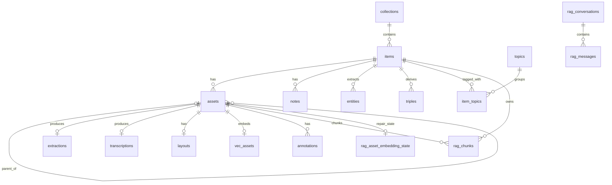

# EntropIA Pro/Lite SQLite

**Español:** [SQLite.md](./SQLite.md)

Operational guide to the current SQLite schema, its runtime creation, and diagnostic queries. The migration horizon is **`0029_rag_chunks`**; there is no `0030` migration.

## Current contract at a glance

| Layer | Authority | What it creates |
|---|---|---|
| Migrated schema | `packages/store/src/runner.ts`, migrations `0001`..`0029`, and `schema_full.sql` | Business tables, `vec_assets`, `rag_chunks`, FTS, and migration indexes/triggers |
| Rust startup/runtime | `lib.rs`, `nlp/embeddings.rs`, `sync/schema.rs` | `app_settings`, compatible repairs, `rag_asset_embedding_state`, and nine `sync_*` tables |
| SQLite/FTS5 internals | SQLite | `sqlite_sequence` and shadow tables for `fts_items`/`rag_chunks_fts` |

`packages/store/src/schema.ts` is a partial ORM model. It does not replace migrated DDL or DDL created by Rust.

## Windows locations

Tauri resolves `app.path().app_data_dir()` from the effective `identifier` and opens `entropia.sqlite` inside that directory.

| Variant | Configuration | Path |
|---|---|---|
| Pro | `tauri.conf.json`: `com.entropia.pro.desktop` | `%APPDATA%\com.entropia.pro.desktop\entropia.sqlite` |
| Lite | `tauri.lite.conf.json`: `com.entropia.lite` | `%APPDATA%\com.entropia.lite\entropia.sqlite` |
| Explicit development | `tauri.dev.conf.json`: `com.entropia.pro.desktop.dev` | `%APPDATA%\com.entropia.pro.desktop.dev\entropia.sqlite` |
| Recognized legacy | `com.entropia.app` constant in `lib.rs` | `%APPDATA%\com.entropia.app\entropia.sqlite` |

The backend does not use the legacy path as the active database. Before opening the current database, it migrates or merges the legacy directory, compares the richness of both databases when both exist, preserves a backup before replacing the current one, and rewrites legacy asset paths. The `.legacy-app-dir-merged` marker prevents repeating the full merge.

Open a variant with `sqlite3`:

```powershell
sqlite3 "$env:APPDATA\com.entropia.pro.desktop\entropia.sqlite"
sqlite3 "$env:APPDATA\com.entropia.lite\entropia.sqlite"
sqlite3 "$env:APPDATA\com.entropia.pro.desktop.dev\entropia.sqlite"
```

## Creation sequence

1. Rust resolves the directory, migrates the legacy directory, and opens UI/worker connections with `PRAGMA journal_mode=WAL` and `PRAGMA foreign_keys=ON`.
2. Rust applies idempotent repairs for old databases and ensures `layouts`, `app_settings`, `vec_assets`, `rag_asset_embedding_state`, and the sync schema as their subsystems start.
3. The frontend runs `runMigrations()` in lexicographic order from `0001_initial` through `0029_rag_chunks` and records each name in `_migrations`.
4. `0020_layouts` is applied programmatically to normalize the legacy table and add `blocks`; `0025`, `0027`, and `0029` use `BEGIN IMMEDIATE` because they contain rebuilds or sensitive multi-statement DDL.
5. Sync runs `ensure_capture` again after migrations to create triggers on every table now available.

`apps/desktop/src-tauri/tests/fixtures/schema_full.sql` represents the migrated result of a fresh install. It excludes runtime-only tables (`app_settings`, `rag_asset_embedding_state`, `sync_*`) and the shadow tables SQLite creates when materializing FTS5.

## Table classification

### Migrated business tables

`collections`, `items`, `assets`, `notes`, `topics`, `item_topics`, `annotations`, `entities`, `triples`, `extractions`, `transcriptions`, `layouts`, `llm_results`, `rag_conversations`, `rag_messages`.

### Migrated technical tables

`_migrations`, `vec_assets`, `rag_chunks`, `fts_items`, `rag_chunks_fts`.

### Created or managed by Rust at runtime

`app_settings`, `rag_asset_embedding_state`, `sync_meta`, `sync_oplog`, `sync_row_versions`, `sync_conflicts`, `sync_pending_rows`, `sync_pending_blobs`, `sync_pending_fts`, `sync_topic_aliases`, `sync_blob_index`.

### SQLite/FTS5 internals

- `sqlite_sequence`, due to `_migrations` using `AUTOINCREMENT`.
- `fts_items_config`, `fts_items_data`, `fts_items_docsize`, `fts_items_idx`.
- `rag_chunks_fts_config`, `rag_chunks_fts_content`, `rag_chunks_fts_data`, `rag_chunks_fts_docsize`, `rag_chunks_fts_idx`.

Shadow tables are FTS5 implementation details, not business entities. An old database may also retain `vec_items` or `embeddings_fallback`; they are legacy leftovers outside the current runtime contract. The historical `0021_drop_unused_processing_table` migration removes `jobs`, but **`0021` is not the current horizon**.

## Column tree

The tree uses the canonical order of a fresh install; a `layouts` table upgraded from a legacy shape may retain `blocks` at the end due to `ALTER TABLE`. Implicit `rowid` is not repeated except where it is part of the FTS contract.

```text
entropia.sqlite
├── migrated: business
│   ├── collections: id, name, description, created_at, updated_at
│   ├── items: id, title, collection_id, metadata, created_at, updated_at, search_text
│   ├── assets: id, item_id, path, type, size, created_at, sort_index, parent_asset_id, page_number
│   ├── notes: id, item_id, content, created_at, updated_at, asset_id
│   ├── topics: id, name, created_at
│   ├── item_topics: id, item_id, topic_id, created_at
│   ├── annotations: id, asset_id, page, kind, color, x, y, width, height, created_at, updated_at
│   ├── entities: id, item_id, entity_type, value, start_offset, end_offset, confidence, source, model_name, created_at, latitude, longitude, geo_status, asset_id, manual_lat, manual_lon
│   ├── triples: id, item_id, subject, predicate, object, created_at, asset_id
│   ├── extractions: id, asset_id, text_content, method, confidence, created_at
│   ├── transcriptions: id, asset_id, text_content, language, duration_ms, model, segments, confidence, created_at
│   ├── layouts: id, asset_id, regions, blocks, model, image_width, image_height, created_at
│   ├── llm_results: id, target_id, target_type, job_type, result, created_at
│   ├── rag_conversations: id, title, created_at, updated_at
│   └── rag_messages: id, conversation_id, sort_index, role, content, sources, model, created_at
├── migrated: technical/RAG
│   ├── _migrations: id, name, applied_at
│   ├── vec_assets: asset_id, item_id, embedding, embedding_model, embedding_contract, dimensions
│   ├── rag_chunks: id, asset_id, item_id, source_kind, source_id, chunk_ordinal, text_content, start_char, end_char, source_text_hash, chunking_contract, embedding, embedding_model, embedding_contract, dimensions
│   ├── fts_items: item_id, title, metadata, extracted_text
│   └── rag_chunks_fts: chunk_id, text_content
├── Rust runtime
│   ├── app_settings: key, value
│   ├── rag_asset_embedding_state: asset_id, item_id, rag_incomplete, failure_count, next_retry_at_ms, last_error, updated_at_ms
│   ├── sync_meta: key, value
│   ├── sync_oplog: seq, table_name, row_id, op, changed_at
│   ├── sync_row_versions: table_name, row_id, server_seq
│   ├── sync_conflicts: id, table_name, row_id, reason, loser_payload, winner_summary, created_at, acknowledged
│   ├── sync_pending_rows: table_name, row_id, server_seq, deleted, changed_at, device_id, payload, retry_count, parked_schema_head
│   ├── sync_pending_blobs: asset_id, sha256, rel_path, size, retry_count, last_error, last_attempt_at
│   ├── sync_pending_fts: item_id
│   ├── sync_topic_aliases: remote_id, local_id
│   └── sync_blob_index: asset_id, sha256, size, file_mtime_ms, uploaded
└── FTS5 shadow
    ├── fts_items_config: k, v
    ├── fts_items_data: id, block
    ├── fts_items_docsize: id, sz
    ├── fts_items_idx: segid, term, pgno
    ├── rag_chunks_fts_config: k, v
    ├── rag_chunks_fts_content: id, c0, c1
    ├── rag_chunks_fts_data: id, block
    ├── rag_chunks_fts_docsize: id, sz
    └── rag_chunks_fts_idx: segid, term, pgno
```

## PKs, FKs, and constraints

| Table | PK | Physical FKs and main constraints |
|---|---|---|
| `_migrations` | `id` AUTOINCREMENT | `name UNIQUE NOT NULL` |
| `collections` | `id` | `name`, `created_at`, `updated_at` NOT NULL |
| `items` | `id` | `collection_id -> collections.id`; `search_text` is GENERATED STORED |
| `assets` | `id` | `item_id -> items.id`; `parent_asset_id -> assets.id ON DELETE CASCADE`; partial UNIQUE `(parent_asset_id, page_number)` when parent is not NULL |
| `notes` | `id` | `item_id -> items.id`; `asset_id` is a conceptual reference without a physical FK |
| `topics` | `id` | `name UNIQUE NOT NULL` |
| `item_topics` | `id` | both FKs use `ON DELETE CASCADE`; UNIQUE `(item_id, topic_id)` |
| `annotations` | `id` | `asset_id -> assets.id ON DELETE CASCADE`; `kind IN ('rectangle','underline','crop','erase','rotation')` |
| `entities` | `id` | `item_id -> items.id ON DELETE CASCADE`; conceptual `asset_id`; `entity_type` has a CHECK; offsets/confidence/geo_status have defaults |
| `triples` | `id` | `item_id -> items.id ON DELETE CASCADE`; conceptual `asset_id` |
| `extractions` | `id` | `asset_id -> assets.id ON DELETE CASCADE`; UNIQUE `(asset_id)` |
| `transcriptions` | `id` | `asset_id -> assets.id ON DELETE CASCADE`; UNIQUE `(asset_id)` |
| `layouts` | `id` | `asset_id -> assets.id ON DELETE CASCADE`; UNIQUE `(asset_id)`, therefore 0..1 layout per asset; `blocks DEFAULT '[]'` |
| `llm_results` | `id` | conceptual `target_id`; `target_type IN ('asset','item','collection','unknown')` |
| `rag_conversations` | `id` | timestamps and title are NOT NULL |
| `rag_messages` | `id` | `conversation_id -> rag_conversations.id ON DELETE CASCADE`; `role IN ('user','assistant')` |
| `vec_assets` | `asset_id` | no physical FK; `item_id`, embedding, and contract are NOT NULL |
| `rag_chunks` | `id` | FKs to `assets` and `items`, both CASCADE; `source_kind IN ('extraction','transcription')`; offsets/dimensions have CHECKs; UNIQUE `(asset_id, source_kind, source_id, chunk_ordinal)` |
| `rag_asset_embedding_state` | `asset_id` | no physical FK; flags/counters/timestamps default to `0` |
| `app_settings`, `sync_meta` | `key` | `value NOT NULL` |
| `sync_oplog` | `seq` AUTOINCREMENT | `op IN ('I','U','D')` |
| `sync_row_versions` | `(table_name, row_id)` | no physical FKs |
| `sync_pending_rows` | `(table_name, row_id)` | retry defaults; no physical FKs |
| `sync_conflicts` | `id` | `acknowledged DEFAULT 0` |
| `sync_pending_blobs` | `asset_id` | `retry_count DEFAULT 0` |
| `sync_pending_fts` | `item_id` | no physical FK |
| `sync_topic_aliases` | `remote_id` | `local_id NOT NULL` |
| `sync_blob_index` | `asset_id` | `uploaded DEFAULT 0` |

`rag_chunks.source_id` logically points to `extractions.id` or `transcriptions.id` according to `source_kind`, but has no physical FK. The same applies to several auxiliary and sync references: runtime code owns their integrity.

## Relevant indexes

### Business and processing

- Items/assets: `idx_items_search(search_text)`, `idx_items_collection(collection_id)`, `idx_assets_item(item_id)`, `idx_assets_item_sort(item_id, sort_index)`, `idx_assets_parent_asset_id(parent_asset_id)`, `idx_assets_parent_page(parent_asset_id, page_number)` partial UNIQUE.
- Asset derivatives: `idx_extractions_asset_id`, `idx_extractions_asset_id_unique` UNIQUE, `idx_transcriptions_asset_id`, `idx_transcriptions_asset_id_unique` UNIQUE, `idx_layouts_asset_id`, `idx_layouts_asset_id_unique` UNIQUE, `annotations_asset_id_idx`, `annotations_asset_page_idx`.
- Semantics: `idx_notes_item`, `idx_notes_asset_id`, `idx_entities_item_id`, `idx_entities_type`, `idx_entities_geo_status`, `idx_entities_asset_id`, `triples_item_id_idx`, `idx_triples_asset_id`.
- Topics/LLM: `idx_item_topics_item_topic` UNIQUE, `idx_item_topics_topic_id`, `idx_llm_results_target`, `idx_llm_results_target_typed`.

### RAG, state, and sync

- `idx_rag_messages_conversation(conversation_id, sort_index)`.
- `idx_vec_assets_item_id(item_id)`.
- `idx_rag_chunks_asset_id(asset_id)`, `idx_rag_chunks_item_id(item_id)`, `idx_rag_chunks_embedding_contract(embedding_model, embedding_contract, dimensions)`.
- `idx_rag_asset_embedding_state_due(rag_incomplete, next_retry_at_ms)`.
- `idx_sync_oplog_row(table_name, row_id)`.

SQLite also creates automatic indexes for PK/UNIQUE constraints; they are omitted because their `sqlite_autoindex_*` names are implementation details.

## Runtime triggers

| Family | Count | Scope | Behavior |
|---|---:|---|---|
| `collection_activity_*` | 33 | 11 tables x INSERT/UPDATE/DELETE | Monotonically updates `collections.updated_at` for `items`, `assets`, `notes`, `extractions`, `layouts`, `transcriptions`, `annotations`, `entities`, `triples`, `vec_assets`, `llm_results` |
| `rag_chunks_fts_*` | 2 | INSERT and DELETE on `rag_chunks` | Inserts/deletes the corresponding document in `rag_chunks_fts` |
| `trg_sync_*` | 48 | 16 tables x INSERT/UPDATE/DELETE | Appends operations to `sync_oplog` when capture is enabled and a pull is not being applied |

The exact sync allowlist is: `collections`, `items`, `assets`, `notes`, `annotations`, `extractions`, `transcriptions`, `layouts`, `entities`, `triples`, `topics`, `item_topics`, `llm_results`, `rag_conversations`, `rag_messages`, `vec_assets`.

`rag_chunks` and `rag_asset_embedding_state` are **not in the sync allowlist**: chunks and repair state are derived/local. FTS and `sync_*` tables are not synced either. Sync triggers require `sync_meta.capture_enabled='1'` and `sync_meta.applying<>'1'`; without a `device_id`, `ensure_capture` clears `sync_oplog`. The current template version is `triggers_version='2'`.

`rag_chunks_fts` has no UPDATE trigger. Runtime replaces chunks through delete/insert; manually updating `rag_chunks.text_content` would leave FTS stale and must be avoided or paired with explicit reindexing.

## FTS5 contracts

### `fts_items`: contentless and aligned by `rowid`

`fts_items` uses `content=''` and the `unicode61 remove_diacritics 1` tokenizer. Its declared columns are not retrievable content: they may read as NULL in a contentless table. The contract is `fts_items.rowid = items.rowid`; identity/title/metadata reads must JOIN `items` by `rowid`.

```sql
SELECT
  i.id AS item_id,
  i.title,
  bm25(fts_items) AS rank
FROM fts_items
JOIN items i ON i.rowid = fts_items.rowid
WHERE fts_items MATCH 'archivo OR documento'
ORDER BY bm25(fts_items)
LIMIT 20;
```

Do not use `SELECT item_id, title FROM fts_items` to retrieve payload and do not delete by `item_id`. Inserts write explicit `rowid`; when drift occurs, the safe procedure is `INSERT INTO fts_items(fts_items) VALUES('delete-all')` followed by a rebuild. `0004` establishes the baseline and `0018` corrects existing databases.

### `rag_chunks_fts`: content-bearing chunk-level FTS

`rag_chunks_fts` stores `chunk_id` and `text_content`; it joins to `rag_chunks.id` and uses the same tokenizer.

```sql
SELECT
  rc.id AS chunk_id,
  rc.asset_id,
  rc.item_id,
  rc.source_kind,
  rc.chunk_ordinal,
  snippet(rag_chunks_fts, 1, '[', ']', '...', 20) AS preview
FROM rag_chunks_fts
JOIN rag_chunks rc ON rc.id = rag_chunks_fts.chunk_id
WHERE rag_chunks_fts MATCH 'archivo OR documento'
ORDER BY bm25(rag_chunks_fts)
LIMIT 20;
```

## ERD

```text
collections 1 ── N items 1 ── N assets
                                ├── 0..1 extractions
                                ├── 0..1 transcriptions
                                ├── 0..1 layouts
                                ├── 0..1 vec_assets
                                ├── 0..N annotations
                                ├── 0..N rag_chunks
                                ├── 0..1 rag_asset_embedding_state (conceptual/runtime)
                                └── 0..N child assets (parent_asset_id)

items ──< notes / entities / triples / rag_chunks
items >──< topics via item_topics
rag_conversations 1 ── N rag_messages

fts_items.rowid ── items.rowid
rag_chunks_fts.chunk_id ── rag_chunks.id
```



Relationships involving `rag_asset_embedding_state`, FTS, and several auxiliary `asset_id` columns are conceptual; the constraints table above distinguishes physical enforcement.

## Structural inspection

These queries inspect the database you actually opened; they do not assume that every runtime layer has already initialized.

```sql
.tables
.schema

SELECT type, name, tbl_name
FROM sqlite_master
WHERE name NOT LIKE 'sqlite_autoindex_%'
ORDER BY type, name;

SELECT name, applied_at
FROM _migrations
ORDER BY name DESC
LIMIT 10;

SELECT name
FROM _migrations
WHERE name = '0029_rag_chunks';

PRAGMA table_xinfo(items);
PRAGMA foreign_key_list(assets);
PRAGMA index_list(rag_chunks);
```

This guide's inventory is derived from the migrated fixture and authoritative runtime DDL; it does not claim to have queried a specific user's database. A real database may lack runtime tables whose subsystem has not initialized yet or may contain legacy leftovers.

## Operational queries

### Assets and processing

```sql
SELECT
  a.id,
  a.item_id,
  a.parent_asset_id,
  a.page_number,
  a.path,
  a.type,
  a.sort_index,
  CASE WHEN e.asset_id IS NOT NULL THEN 1 ELSE 0 END AS has_extraction,
  CASE WHEN t.asset_id IS NOT NULL THEN 1 ELSE 0 END AS has_transcription,
  CASE WHEN l.asset_id IS NOT NULL THEN 1 ELSE 0 END AS has_layout
FROM assets a
LEFT JOIN extractions e ON e.asset_id = a.id
LEFT JOIN transcriptions t ON t.asset_id = a.id
LEFT JOIN layouts l ON l.asset_id = a.id
WHERE a.item_id = 'ITEM_ID'
ORDER BY a.sort_index, a.page_number, a.created_at;
```

### Content and semantic enrichment

```sql
SELECT id, title, collection_id, metadata, search_text, created_at, updated_at
FROM items
WHERE id = 'ITEM_ID';

SELECT id, asset_id, model, image_width, image_height, regions, blocks, created_at
FROM layouts
WHERE asset_id = 'ASSET_ID';

SELECT
  id,
  item_id,
  asset_id,
  entity_type,
  value,
  confidence,
  latitude,
  longitude,
  manual_lat,
  manual_lon,
  geo_status,
  source,
  model_name
FROM entities
WHERE item_id = 'ITEM_ID'
ORDER BY confidence DESC, value;

SELECT id, asset_id, page, kind, color, x, y, width, height, created_at, updated_at
FROM annotations
WHERE asset_id = 'ASSET_ID'
ORDER BY page, created_at;
```

### RAG conversations and messages

```sql
SELECT
  c.id AS conversation_id,
  c.title,
  m.id AS message_id,
  m.sort_index,
  m.role,
  m.model,
  m.created_at,
  m.content,
  m.sources
FROM rag_conversations c
LEFT JOIN rag_messages m ON m.conversation_id = c.id
WHERE c.id = 'CONVERSATION_ID'
ORDER BY m.sort_index;
```

### Chunks and embedding contracts

```sql
SELECT
  id,
  asset_id,
  item_id,
  source_kind,
  source_id,
  chunk_ordinal,
  start_char,
  end_char,
  length(text_content) AS text_chars,
  length(embedding) AS embedding_bytes,
  embedding_model,
  embedding_contract,
  dimensions,
  chunking_contract
FROM rag_chunks
WHERE asset_id = 'ASSET_ID'
ORDER BY source_kind, source_id, chunk_ordinal;
```

```sql
SELECT
  asset_id,
  item_id,
  length(embedding) AS embedding_bytes,
  embedding_model,
  embedding_contract,
  dimensions
FROM vec_assets
WHERE asset_id = 'ASSET_ID';
```

### RAG repair state

```sql
SELECT
  asset_id,
  item_id,
  rag_incomplete,
  failure_count,
  next_retry_at_ms,
  datetime(next_retry_at_ms / 1000, 'unixepoch', 'localtime') AS next_retry_local,
  last_error,
  updated_at_ms
FROM rag_asset_embedding_state
WHERE rag_incomplete = 1
ORDER BY next_retry_at_ms, asset_id;
```

A row marks incomplete RAG persistence or a pending retry. Once `vec_assets + rag_chunks` completes successfully, runtime deletes the state row; absence of a row does not by itself prove that an embedding exists.

### Sync diagnostics

```sql
SELECT key, value
FROM sync_meta
ORDER BY key;

SELECT table_name, row_id, MAX(seq) AS latest_seq, COUNT(*) AS operations
FROM sync_oplog
GROUP BY table_name, row_id
ORDER BY latest_seq;

SELECT id, table_name, row_id, reason, created_at, acknowledged
FROM sync_conflicts
WHERE acknowledged = 0
ORDER BY created_at DESC;

SELECT 'pending_rows' AS queue, COUNT(*) AS pending FROM sync_pending_rows
UNION ALL
SELECT 'pending_blobs', COUNT(*) FROM sync_pending_blobs
UNION ALL
SELECT 'pending_fts', COUNT(*) FROM sync_pending_fts;

SELECT table_name, COUNT(*) AS versioned_rows, MAX(server_seq) AS latest_server_seq
FROM sync_row_versions
GROUP BY table_name
ORDER BY table_name;

SELECT uploaded, COUNT(*) AS blobs, SUM(size) AS bytes
FROM sync_blob_index
GROUP BY uploaded
ORDER BY uploaded;

SELECT remote_id, local_id
FROM sync_topic_aliases
ORDER BY remote_id;

SELECT COUNT(*) AS sync_trigger_count
FROM sqlite_master
WHERE type = 'trigger' AND name LIKE 'trg_sync_%';

SELECT name, tbl_name
FROM sqlite_master
WHERE type = 'trigger' AND name LIKE 'trg_sync_%'
ORDER BY tbl_name, name;
```

On a fully migrated schema with capture ensured, the expected count is 48. A lower value may mean tables/migrations are missing or `ensure_capture` has not run again yet.

## Diagnostic checklist

1. Confirm that you opened the path for the correct variant.
2. Verify that `_migrations` contains `0029_rag_chunks`; do not look for `0030`.
3. Check `PRAGMA foreign_keys`, `journal_mode`, and the real structure with `table_xinfo`/`index_list`.
4. For item FTS, join `fts_items` to `items` by `rowid`; do not read payload from the contentless table.
5. For RAG, inspect `vec_assets`, `rag_chunks`, `rag_chunks_fts`, and `rag_asset_embedding_state` together.
6. For sync, inspect session/capture in `sync_meta`, the oplog, pending queues, conflicts, and all 48 triggers.
7. Treat `schema.ts`, shadow tables, and legacy leftovers according to their layer; do not confuse them with the complete migrated physical schema.
