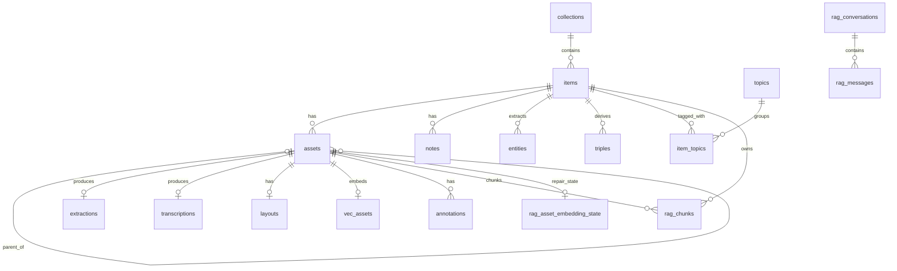

# SQLite de EntropIA Pro/Lite

**English:** [SQLite.en.md](./SQLite.en.md)

Guía operativa del esquema SQLite actual, su creación en runtime y las consultas de diagnóstico. El horizonte migrado es **`0030_items_collection_title_index`**.

## Contrato actual en una mirada

| Capa | Autoridad | Qué crea |
|---|---|---|
| Esquema migrado | `packages/store/src/runner.ts`, migraciones `0001`..`0030` y `schema_full.sql` | Tablas de negocio, `vec_assets`, `rag_chunks`, FTS e índices/triggers de migración |
| Inicio/runtime Rust | `lib.rs`, `nlp/embeddings.rs`, `sync/schema.rs` | `app_settings`, reparaciones compatibles, `rag_asset_embedding_state` y nueve tablas `sync_*` |
| Internas de SQLite/FTS5 | SQLite | `sqlite_sequence` y tablas shadow de `fts_items`/`rag_chunks_fts` |

`packages/store/src/schema.ts` es un modelo ORM parcial. No reemplaza al DDL migrado ni al DDL creado por Rust.

## Ubicaciones Windows

Tauri resuelve `app.path().app_data_dir()` desde el `identifier` efectivo y abre `entropia.sqlite` dentro de ese directorio.

| Variante | Configuración | Ruta |
|---|---|---|
| Pro | `tauri.conf.json`: `com.entropia.pro.desktop` | `%APPDATA%\com.entropia.pro.desktop\entropia.sqlite` |
| Lite | `tauri.lite.conf.json`: `com.entropia.lite` | `%APPDATA%\com.entropia.lite\entropia.sqlite` |
| Desarrollo explícito | `tauri.dev.conf.json`: `com.entropia.pro.desktop.dev` | `%APPDATA%\com.entropia.pro.desktop.dev\entropia.sqlite` |
| Legacy reconocido | constante `com.entropia.app` en `lib.rs` | `%APPDATA%\com.entropia.app\entropia.sqlite` |

El backend no usa la ruta legacy como base activa. Antes de abrir la base actual, migra o combina el directorio legacy, compara la riqueza de ambas bases cuando existen las dos, conserva un backup antes de reemplazar la actual y reescribe rutas legacy de assets. El marcador `.legacy-app-dir-merged` evita repetir el merge completo.

Abrir una variante con `sqlite3`:

```powershell
sqlite3 "$env:APPDATA\com.entropia.pro.desktop\entropia.sqlite"
sqlite3 "$env:APPDATA\com.entropia.lite\entropia.sqlite"
sqlite3 "$env:APPDATA\com.entropia.pro.desktop.dev\entropia.sqlite"
```

## Secuencia de creación

1. Rust resuelve el directorio, migra el directorio legacy y abre conexiones UI/worker con `PRAGMA journal_mode=WAL` y `PRAGMA foreign_keys=ON`.
2. Rust aplica reparaciones idempotentes para bases antiguas y asegura `layouts`, `app_settings`, `vec_assets`, `rag_asset_embedding_state` y el esquema sync cuando sus subsistemas arrancan.
3. El frontend ejecuta `runMigrations()` en orden lexicográfico desde `0001_initial` hasta `0030_items_collection_title_index` y registra cada nombre en `_migrations`.
4. `0020_layouts` se aplica programáticamente para normalizar la tabla legacy y agregar `blocks`; `0025`, `0027` y `0029` usan `BEGIN IMMEDIATE` por contener rebuilds o DDL multi-statement sensible; `0030` es un `CREATE INDEX` simple y no lo necesita.
5. Sync vuelve a ejecutar `ensure_capture` después de las migraciones para crear triggers sobre todas las tablas ya disponibles.

`apps/desktop/src-tauri/tests/fixtures/schema_full.sql` representa el resultado migrado de una instalación nueva. No incluye las tablas exclusivamente runtime (`app_settings`, `rag_asset_embedding_state`, `sync_*`) ni las tablas shadow que SQLite crea al materializar FTS5.

## Clasificación de tablas

### Negocio migrado

`collections`, `items`, `assets`, `notes`, `topics`, `item_topics`, `annotations`, `entities`, `triples`, `extractions`, `transcriptions`, `layouts`, `llm_results`, `rag_conversations`, `rag_messages`.

### Técnicas migradas

`_migrations`, `vec_assets`, `rag_chunks`, `fts_items`, `rag_chunks_fts`.

### Creadas o gestionadas en runtime Rust

`app_settings`, `rag_asset_embedding_state`, `sync_meta`, `sync_oplog`, `sync_row_versions`, `sync_conflicts`, `sync_pending_rows`, `sync_pending_blobs`, `sync_pending_fts`, `sync_topic_aliases`, `sync_blob_index`.

### Internas de SQLite/FTS5

- `sqlite_sequence`, por el `AUTOINCREMENT` de `_migrations`.
- `fts_items_config`, `fts_items_data`, `fts_items_docsize`, `fts_items_idx`.
- `rag_chunks_fts_config`, `rag_chunks_fts_content`, `rag_chunks_fts_data`, `rag_chunks_fts_docsize`, `rag_chunks_fts_idx`.

Las tablas shadow son implementación de FTS5, no entidades de negocio. Una base vieja también puede conservar `vec_items` o `embeddings_fallback`; son leftovers legacy y no pertenecen al contrato runtime actual. La migración histórica `0021_drop_unused_processing_table` elimina `jobs`, pero **`0021` no es el horizonte actual**.

## Árbol de columnas

El árbol usa el orden canónico de una instalación nueva; una tabla `layouts` actualizada desde un formato legacy puede conservar `blocks` al final por efecto de `ALTER TABLE`. `rowid` implícito no se repite salvo donde forma parte del contrato FTS.

```text
entropia.sqlite
├── migrado: negocio
│   ├── collections: id, name, description, created_at, updated_at
│   ├── items: id, title, collection_id, metadata, created_at, updated_at, search_text
│   ├── assets: id, item_id, path, type, size, created_at, sort_index, parent_asset_id, page_number
│   ├── notes: id, item_id, content, created_at, updated_at, asset_id
│   ├── topics: id, name, created_at
│   ├── item_topics: id, item_id, topic_id, created_at
│   ├── annotations: id, asset_id, page, kind, color, x, y, width, height, created_at, updated_at
│   ├── entities: id, item_id, entity_type, value, start_offset, end_offset, confidence, source, model_name, created_at, latitude, longitude, geo_status, asset_id, manual_lat, manual_lon
│   ├── triples: id, item_id, subject, predicate, object, created_at, asset_id
│   ├── extractions: id, asset_id, text_content, method, confidence, created_at
│   ├── transcriptions: id, asset_id, text_content, language, duration_ms, model, segments, confidence, created_at
│   ├── layouts: id, asset_id, regions, blocks, model, image_width, image_height, created_at
│   ├── llm_results: id, target_id, target_type, job_type, result, created_at
│   ├── rag_conversations: id, title, created_at, updated_at
│   └── rag_messages: id, conversation_id, sort_index, role, content, sources, model, created_at
├── migrado: técnico/RAG
│   ├── _migrations: id, name, applied_at
│   ├── vec_assets: asset_id, item_id, embedding, embedding_model, embedding_contract, dimensions
│   ├── rag_chunks: id, asset_id, item_id, source_kind, source_id, chunk_ordinal, text_content, start_char, end_char, source_text_hash, chunking_contract, embedding, embedding_model, embedding_contract, dimensions
│   ├── fts_items: item_id, title, metadata, extracted_text
│   └── rag_chunks_fts: chunk_id, text_content
├── runtime Rust
│   ├── app_settings: key, value
│   ├── rag_asset_embedding_state: asset_id, item_id, rag_incomplete, failure_count, next_retry_at_ms, last_error, updated_at_ms
│   ├── sync_meta: key, value
│   ├── sync_oplog: seq, table_name, row_id, op, changed_at
│   ├── sync_row_versions: table_name, row_id, server_seq
│   ├── sync_conflicts: id, table_name, row_id, reason, loser_payload, winner_summary, created_at, acknowledged
│   ├── sync_pending_rows: table_name, row_id, server_seq, deleted, changed_at, device_id, payload, retry_count, parked_schema_head
│   ├── sync_pending_blobs: asset_id, sha256, rel_path, size, retry_count, last_error, last_attempt_at
│   ├── sync_pending_fts: item_id
│   ├── sync_topic_aliases: remote_id, local_id
│   └── sync_blob_index: asset_id, sha256, size, file_mtime_ms, uploaded
└── shadow FTS5
    ├── fts_items_config: k, v
    ├── fts_items_data: id, block
    ├── fts_items_docsize: id, sz
    ├── fts_items_idx: segid, term, pgno
    ├── rag_chunks_fts_config: k, v
    ├── rag_chunks_fts_content: id, c0, c1
    ├── rag_chunks_fts_data: id, block
    ├── rag_chunks_fts_docsize: id, sz
    └── rag_chunks_fts_idx: segid, term, pgno
```

## Contrato de tipos para clientes

El contrato formal (tipos semánticos por columna, unidades de timestamp, formas de JSON/BLOB) está materializado en el manifest de `entropiaR` (`inst/schemas/manifest.json` del paquete R) y se aplica al materializar con `entropia_collect()`. Esta sección resume lo que un cliente de solo lectura debe aplicar.

### Unidades de timestamp (la trampa más común)

| Unidad | Criterio de magnitud | Columnas |
|---|---|---|
| Epoch **ms** (13 dígitos) | valor ≥ 1e12 | `created_at`/`updated_at` de `collections`, `items`, `assets`, `extractions`, `transcriptions`, `layouts`, `notes`, `annotations`, `llm_results`, `rag_conversations`, `rag_messages`; `sync_conflicts.created_at`; `rag_asset_embedding_state.next_retry_at_ms`/`updated_at_ms` |
| Epoch **segundos** (10 dígitos) | valor < 1e12 | `_migrations.applied_at` |
| **`datetime_auto`** (ms o segundos) | guard `< 1e12 ⟹ segundos` | `entities.created_at`, `triples.created_at` |
| ISO-8601 string | dentro de JSON | `items.metadata.__entropia_file_metadata.importedAt` (`YYYY-MM-DDTHH:MM:SSZ`) |

> `entities.created_at` y `triples.created_at` tienen como DDL default `strftime('%s','now')` (epoch **segundos**), pero la app escribe epoch **ms** en la práctica. Un cliente debe aplicar el guard de magnitud `< 1e12` (la misma regla que usó la migración `0019`), no asumir una sola unidad.

### Columnas JSON dentro de TEXT

| Columna | Shape |
|---|---|
| `items.metadata` | objeto; `__entropia_file_metadata` anidado (`original_name`, `original_path`, `importedAt` ISO-8601) |
| `transcriptions.segments` | array de `{start_ms, end_ms, text}` |
| `layouts.regions` / `layouts.blocks` | arrays de regiones/bloques |
| `rag_messages.sources` | array de citas |
| `llm_results.result` | resultado del job (texto o JSON según `job_type`) |
| `sync_conflicts.loser_payload` / `winner_summary` | payloads del conflicto LWW |

### BLOB de embedding

`vec_assets.embedding` y `rag_chunks.embedding` son vectores `f32` **little-endian** crudos: `dimensions` × 4 bytes (1024 dims = 4096 bytes). No deben seleccionarse por defecto en joins; el acceso es explícito (en `entropiaR`, `with_vector = TRUE`).

### IDs determinísticos (útiles para joins)

| Tabla | Formato |
|---|---|
| `extractions` | `ext-` ∥ `asset_id` |
| `transcriptions` | `trx-` ∥ `asset_id` |
| `layouts` | `lay-` ∥ `asset_id` |
| `llm_results` | `llr-{target_type}-{target_id}-{job_type}` |
| `rag_chunks` | `ragchk-` ∥ sha256 del contenido |

El resto de PK son `TEXT` UUIDv4; la PK de `vec_assets` es `asset_id`.

### Ocultamiento y secretos

- `entities.source = 'manual_deleted'` = soft-delete: la fila persiste pero la app la oculta. Un lector que quiera el conjunto visible debe filtrarla.
- `app_settings` guarda claves de API (`*_api_key`) y no forma parte de ninguna superficie de lectura de `entropiaR`; un cliente no debe exponer sus valores crudos. `sync_meta` sí tiene keys permitidas (ver sección sync).

### Referencias conceptuales sin FK física

`notes/entities/triples.asset_id`, `llm_results.target_id`, `rag_chunks.source_id` (→ `extractions.id`/`transcriptions.id` según `source_kind`) y las referencias sync (`sync_row_versions.row_id`, etc.) no tienen constraint física. `PRAGMA foreign_keys` está activo solo donde hay FK declarada; un cliente debe validar estas referencias por su cuenta.

## PK, FK y constraints

| Tabla | PK | FK físicas y constraints principales |
|---|---|---|
| `_migrations` | `id` AUTOINCREMENT | `name UNIQUE NOT NULL` |
| `collections` | `id` | `name`, `created_at`, `updated_at` NOT NULL |
| `items` | `id` | `collection_id -> collections.id`; `search_text` es GENERATED STORED |
| `assets` | `id` | `item_id -> items.id`; `parent_asset_id -> assets.id ON DELETE CASCADE`; UNIQUE parcial `(parent_asset_id, page_number)` cuando el padre no es NULL |
| `notes` | `id` | `item_id -> items.id`; `asset_id` es referencia conceptual sin FK física |
| `topics` | `id` | `name UNIQUE NOT NULL` |
| `item_topics` | `id` | ambas FK tienen `ON DELETE CASCADE`; UNIQUE `(item_id, topic_id)` |
| `annotations` | `id` | `asset_id -> assets.id ON DELETE CASCADE`; `kind IN ('rectangle','underline','crop','erase','rotation')` |
| `entities` | `id` | `item_id -> items.id ON DELETE CASCADE`; `asset_id` conceptual; `entity_type` tiene CHECK; defaults de offsets/confidence/geo_status |
| `triples` | `id` | `item_id -> items.id ON DELETE CASCADE`; `asset_id` conceptual |
| `extractions` | `id` | `asset_id -> assets.id ON DELETE CASCADE`; UNIQUE `(asset_id)` |
| `transcriptions` | `id` | `asset_id -> assets.id ON DELETE CASCADE`; UNIQUE `(asset_id)` |
| `layouts` | `id` | `asset_id -> assets.id ON DELETE CASCADE`; UNIQUE `(asset_id)`, por lo tanto 0..1 layout por asset; `blocks DEFAULT '[]'` |
| `llm_results` | `id` | `target_id` conceptual; `target_type IN ('asset','item','collection','unknown')` |
| `rag_conversations` | `id` | timestamps y título NOT NULL |
| `rag_messages` | `id` | `conversation_id -> rag_conversations.id ON DELETE CASCADE`; `role IN ('user','assistant')` |
| `vec_assets` | `asset_id` | sin FK física; `item_id`, embedding y contrato NOT NULL |
| `rag_chunks` | `id` | FK a `assets` e `items`, ambas CASCADE; `source_kind IN ('extraction','transcription')`; offsets/dimensiones con CHECK; UNIQUE `(asset_id, source_kind, source_id, chunk_ordinal)` |
| `rag_asset_embedding_state` | `asset_id` | sin FK física; flags/contadores/timestamps con defaults `0` |
| `app_settings`, `sync_meta` | `key` | `value NOT NULL` |
| `sync_oplog` | `seq` AUTOINCREMENT | `op IN ('I','U','D')` |
| `sync_row_versions` | `(table_name, row_id)` | sin FK físicas |
| `sync_pending_rows` | `(table_name, row_id)` | defaults de retry; sin FK físicas |
| `sync_conflicts` | `id` | `acknowledged DEFAULT 0` |
| `sync_pending_blobs` | `asset_id` | `retry_count DEFAULT 0` |
| `sync_pending_fts` | `item_id` | sin FK física |
| `sync_topic_aliases` | `remote_id` | `local_id NOT NULL` |
| `sync_blob_index` | `asset_id` | `uploaded DEFAULT 0` |

`rag_chunks.source_id` apunta lógicamente a `extractions.id` o `transcriptions.id` según `source_kind`, pero no tiene FK física. Lo mismo ocurre con varias referencias auxiliares y sync: su integridad depende del runtime.

## Índices relevantes

### Negocio y procesamiento

- Items/assets: `idx_items_search(search_text)`, `idx_items_collection(collection_id)`, `idx_assets_item(item_id)`, `idx_assets_item_sort(item_id, sort_index)`, `idx_assets_parent_asset_id(parent_asset_id)`, `idx_assets_parent_page(parent_asset_id, page_number)` UNIQUE parcial, `idx_items_collection_title(collection_id, title COLLATE NOCASE, id)`.
- `idx_items_collection_title` cubre de punta a punta la consulta de la grilla de colecciones: el filtro por `collection_id`, el `ORDER BY title COLLATE NOCASE, id` y el cursor keyset construido sobre ese mismo par. Sin las columnas de orden en el índice, SQLite filtra por `idx_items_collection` y después ordena todo el resultado en un b-tree temporal cada vez que se abre una colección.
- Derivados por asset: `idx_extractions_asset_id`, `idx_extractions_asset_id_unique` UNIQUE, `idx_transcriptions_asset_id`, `idx_transcriptions_asset_id_unique` UNIQUE, `idx_layouts_asset_id`, `idx_layouts_asset_id_unique` UNIQUE, `annotations_asset_id_idx`, `annotations_asset_page_idx`.
- Semántica: `idx_notes_item`, `idx_notes_asset_id`, `idx_entities_item_id`, `idx_entities_type`, `idx_entities_geo_status`, `idx_entities_asset_id`, `triples_item_id_idx`, `idx_triples_asset_id`.
- Topics/LLM: `idx_item_topics_item_topic` UNIQUE, `idx_item_topics_topic_id`, `idx_llm_results_target`, `idx_llm_results_target_typed`.

### RAG, estado y sync

- `idx_rag_messages_conversation(conversation_id, sort_index)`.
- `idx_vec_assets_item_id(item_id)`.
- `idx_rag_chunks_asset_id(asset_id)`, `idx_rag_chunks_item_id(item_id)`, `idx_rag_chunks_embedding_contract(embedding_model, embedding_contract, dimensions)`.
- `idx_rag_asset_embedding_state_due(rag_incomplete, next_retry_at_ms)`.
- `idx_sync_oplog_row(table_name, row_id)`.

SQLite también crea índices automáticos para PK/UNIQUE; no se enumeran porque sus nombres `sqlite_autoindex_*` son detalles de implementación.

## Triggers runtime

| Familia | Cantidad | Alcance | Comportamiento |
|---|---:|---|---|
| `collection_activity_*` | 33 | 11 tablas x INSERT/UPDATE/DELETE | Actualiza monotónicamente `collections.updated_at` para `items`, `assets`, `notes`, `extractions`, `layouts`, `transcriptions`, `annotations`, `entities`, `triples`, `vec_assets`, `llm_results` |
| `rag_chunks_fts_*` | 2 | INSERT y DELETE sobre `rag_chunks` | Inserta/elimina el documento correspondiente en `rag_chunks_fts` |
| `trg_sync_*` | 48 | 16 tablas x INSERT/UPDATE/DELETE | Agrega operaciones a `sync_oplog` cuando capture está habilitado y no se está aplicando un pull |

La allowlist sync exacta es: `collections`, `items`, `assets`, `notes`, `annotations`, `extractions`, `transcriptions`, `layouts`, `entities`, `triples`, `topics`, `item_topics`, `llm_results`, `rag_conversations`, `rag_messages`, `vec_assets`.

`rag_chunks` y `rag_asset_embedding_state` **no están en la allowlist sync**: chunks y estado de reparación son derivados/locales. Tampoco se sincronizan tablas FTS ni `sync_*`. Los triggers sync requieren `sync_meta.capture_enabled='1'` y `sync_meta.applying<>'1'`; sin `device_id`, `ensure_capture` vacía `sync_oplog`. La versión actual del template es `triggers_version='2'`.

`rag_chunks_fts` no tiene trigger UPDATE. El runtime reemplaza chunks mediante delete/insert; una actualización SQL manual de `rag_chunks.text_content` dejaría el FTS desfasado y debe evitarse o acompañarse de una reindexación explícita.

## Contratos FTS5

### `fts_items`: contentless y alineado por `rowid`

`fts_items` usa `content=''` y tokenizer `unicode61 remove_diacritics 1`. Sus columnas declaradas no son contenido recuperable: en una tabla contentless pueden leerse como NULL. El contrato es `fts_items.rowid = items.rowid`; toda lectura de identidad/título/metadata debe hacer JOIN con `items` por `rowid`.

```sql
SELECT
  i.id AS item_id,
  i.title,
  bm25(fts_items) AS rank
FROM fts_items
JOIN items i ON i.rowid = fts_items.rowid
WHERE fts_items MATCH 'archivo OR documento'
ORDER BY bm25(fts_items)
LIMIT 20;
```

No uses `SELECT item_id, title FROM fts_items` para recuperar payload ni borres por `item_id`. Los inserts escriben `rowid` explícito; ante drift, el procedimiento seguro es `INSERT INTO fts_items(fts_items) VALUES('delete-all')` seguido de rebuild. `0004` establece el baseline y `0018` corrige bases existentes.

### `rag_chunks_fts`: FTS con contenido a nivel chunk

`rag_chunks_fts` conserva `chunk_id` y `text_content`; se vincula a `rag_chunks.id` y usa el mismo tokenizer.

```sql
SELECT
  rc.id AS chunk_id,
  rc.asset_id,
  rc.item_id,
  rc.source_kind,
  rc.chunk_ordinal,
  snippet(rag_chunks_fts, 1, '[', ']', '...', 20) AS preview
FROM rag_chunks_fts
JOIN rag_chunks rc ON rc.id = rag_chunks_fts.chunk_id
WHERE rag_chunks_fts MATCH 'archivo OR documento'
ORDER BY bm25(rag_chunks_fts)
LIMIT 20;
```

## ERD

```text
collections 1 ── N items 1 ── N assets
                                ├── 0..1 extractions
                                ├── 0..1 transcriptions
                                ├── 0..1 layouts
                                ├── 0..1 vec_assets
                                ├── 0..N annotations
                                ├── 0..N rag_chunks
                                ├── 0..1 rag_asset_embedding_state (conceptual/runtime)
                                └── 0..N child assets (parent_asset_id)

items ──< notes / entities / triples / rag_chunks
items >──< topics via item_topics
rag_conversations 1 ── N rag_messages

fts_items.rowid ── items.rowid
rag_chunks_fts.chunk_id ── rag_chunks.id
```



Las relaciones con `rag_asset_embedding_state`, FTS y varias columnas `asset_id` auxiliares son conceptuales; la tabla de constraints anterior distingue el enforcement físico.

## Inspección estructural

Estas consultas inspeccionan la base que realmente abriste; no presuponen que todas las capas runtime ya se hayan inicializado.

```sql
.tables
.schema

SELECT type, name, tbl_name
FROM sqlite_master
WHERE name NOT LIKE 'sqlite_autoindex_%'
ORDER BY type, name;

SELECT name, applied_at
FROM _migrations
ORDER BY name DESC
LIMIT 10;

SELECT name
FROM _migrations
WHERE name = '0030_items_collection_title_index';

PRAGMA table_xinfo(items);
PRAGMA foreign_key_list(assets);
PRAGMA index_list(rag_chunks);
```

El inventario de esta guía se deriva del fixture migrado y de los DDL runtime autoritativos; no afirma haber consultado una base de usuario concreta. En una base real pueden faltar tablas runtime todavía no inicializadas o aparecer leftovers legacy.

## Queries operativas

### Assets y procesamiento

```sql
SELECT
  a.id,
  a.item_id,
  a.parent_asset_id,
  a.page_number,
  a.path,
  a.type,
  a.sort_index,
  CASE WHEN e.asset_id IS NOT NULL THEN 1 ELSE 0 END AS has_extraction,
  CASE WHEN t.asset_id IS NOT NULL THEN 1 ELSE 0 END AS has_transcription,
  CASE WHEN l.asset_id IS NOT NULL THEN 1 ELSE 0 END AS has_layout
FROM assets a
LEFT JOIN extractions e ON e.asset_id = a.id
LEFT JOIN transcriptions t ON t.asset_id = a.id
LEFT JOIN layouts l ON l.asset_id = a.id
WHERE a.item_id = 'ITEM_ID'
ORDER BY a.sort_index, a.page_number, a.created_at;
```

### Contenido y enriquecimiento semántico

```sql
SELECT id, title, collection_id, metadata, search_text, created_at, updated_at
FROM items
WHERE id = 'ITEM_ID';

SELECT id, asset_id, model, image_width, image_height, regions, blocks, created_at
FROM layouts
WHERE asset_id = 'ASSET_ID';

SELECT
  id,
  item_id,
  asset_id,
  entity_type,
  value,
  confidence,
  latitude,
  longitude,
  manual_lat,
  manual_lon,
  geo_status,
  source,
  model_name
FROM entities
WHERE item_id = 'ITEM_ID'
ORDER BY confidence DESC, value;

SELECT id, asset_id, page, kind, color, x, y, width, height, created_at, updated_at
FROM annotations
WHERE asset_id = 'ASSET_ID'
ORDER BY page, created_at;
```

### Conversaciones y mensajes RAG

```sql
SELECT
  c.id AS conversation_id,
  c.title,
  m.id AS message_id,
  m.sort_index,
  m.role,
  m.model,
  m.created_at,
  m.content,
  m.sources
FROM rag_conversations c
LEFT JOIN rag_messages m ON m.conversation_id = c.id
WHERE c.id = 'CONVERSATION_ID'
ORDER BY m.sort_index;
```

### Chunks y contratos de embedding

```sql
SELECT
  id,
  asset_id,
  item_id,
  source_kind,
  source_id,
  chunk_ordinal,
  start_char,
  end_char,
  length(text_content) AS text_chars,
  length(embedding) AS embedding_bytes,
  embedding_model,
  embedding_contract,
  dimensions,
  chunking_contract
FROM rag_chunks
WHERE asset_id = 'ASSET_ID'
ORDER BY source_kind, source_id, chunk_ordinal;
```

```sql
SELECT
  asset_id,
  item_id,
  length(embedding) AS embedding_bytes,
  embedding_model,
  embedding_contract,
  dimensions
FROM vec_assets
WHERE asset_id = 'ASSET_ID';
```

### Estado de reparación RAG

```sql
SELECT
  asset_id,
  item_id,
  rag_incomplete,
  failure_count,
  next_retry_at_ms,
  datetime(next_retry_at_ms / 1000, 'unixepoch', 'localtime') AS next_retry_local,
  last_error,
  updated_at_ms
FROM rag_asset_embedding_state
WHERE rag_incomplete = 1
ORDER BY next_retry_at_ms, asset_id;
```

Una fila marca persistencia RAG incompleta o un retry pendiente. Al completarse correctamente `vec_assets + rag_chunks`, el runtime elimina la fila de estado; ausencia de fila no significa por sí sola que exista un embedding.

### Diagnóstico sync

```sql
SELECT key, value
FROM sync_meta
ORDER BY key;

SELECT table_name, row_id, MAX(seq) AS latest_seq, COUNT(*) AS operations
FROM sync_oplog
GROUP BY table_name, row_id
ORDER BY latest_seq;

SELECT id, table_name, row_id, reason, created_at, acknowledged
FROM sync_conflicts
WHERE acknowledged = 0
ORDER BY created_at DESC;

SELECT 'pending_rows' AS queue, COUNT(*) AS pending FROM sync_pending_rows
UNION ALL
SELECT 'pending_blobs', COUNT(*) FROM sync_pending_blobs
UNION ALL
SELECT 'pending_fts', COUNT(*) FROM sync_pending_fts;

SELECT table_name, COUNT(*) AS versioned_rows, MAX(server_seq) AS latest_server_seq
FROM sync_row_versions
GROUP BY table_name
ORDER BY table_name;

SELECT uploaded, COUNT(*) AS blobs, SUM(size) AS bytes
FROM sync_blob_index
GROUP BY uploaded
ORDER BY uploaded;

SELECT remote_id, local_id
FROM sync_topic_aliases
ORDER BY remote_id;

SELECT COUNT(*) AS sync_trigger_count
FROM sqlite_master
WHERE type = 'trigger' AND name LIKE 'trg_sync_%';

SELECT name, tbl_name
FROM sqlite_master
WHERE type = 'trigger' AND name LIKE 'trg_sync_%'
ORDER BY tbl_name, name;
```

En un esquema completamente migrado y con capture asegurado, el conteo esperado es 48. Un valor menor puede indicar que faltan tablas/migraciones o que `ensure_capture` todavía no se reejecutó.

## Checklist de diagnóstico

1. Confirmá que abriste la ruta de la variante correcta.
2. Verificá que `_migrations` contenga `0030_items_collection_title_index`, el horizonte actual.
3. Revisá `PRAGMA foreign_keys`, `journal_mode` y la estructura real con `table_xinfo`/`index_list`.
4. Para FTS de ítems, uní `fts_items` con `items` por `rowid`; no leas payload de la tabla contentless.
5. Para RAG, revisá en conjunto `vec_assets`, `rag_chunks`, `rag_chunks_fts` y `rag_asset_embedding_state`.
6. Para sync, revisá sesión/capture en `sync_meta`, oplog, pendientes, conflictos y los 48 triggers.
7. Tratá `schema.ts`, tablas shadow y leftovers legacy según su capa; no los confundas con el esquema físico migrado completo.
