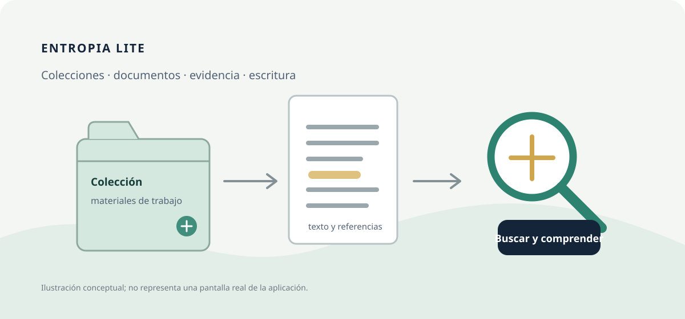
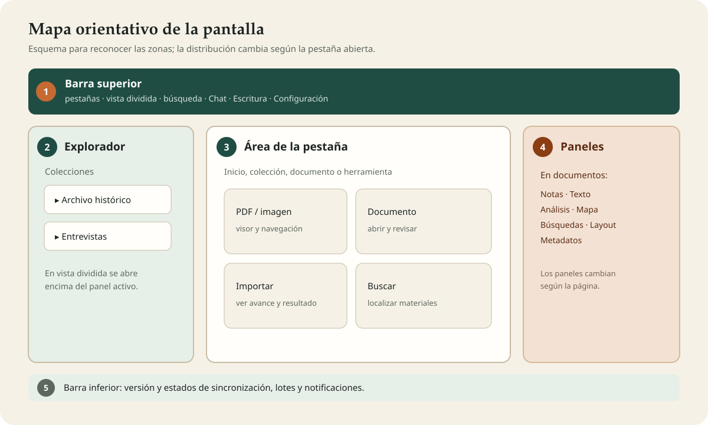
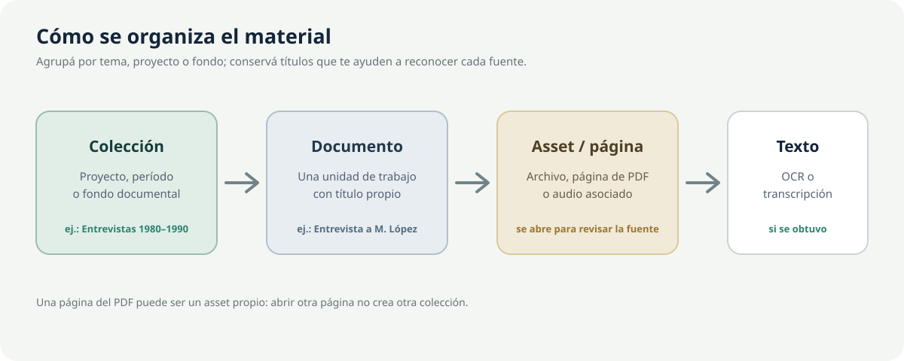
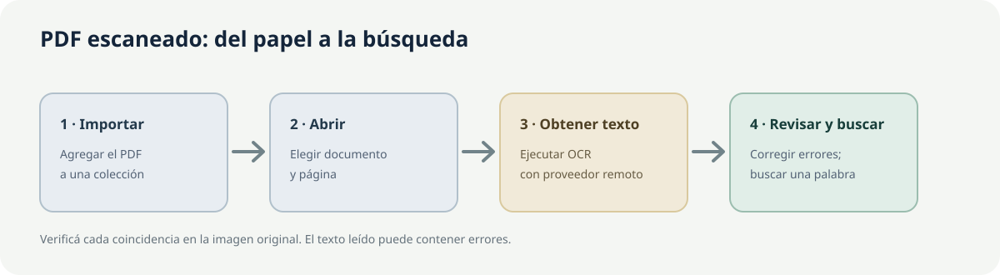
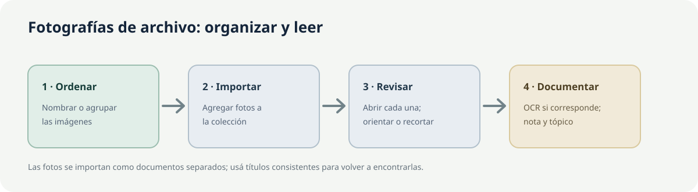
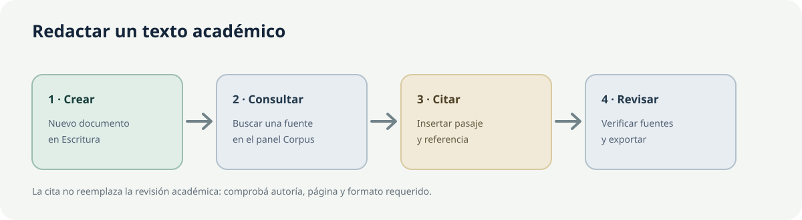
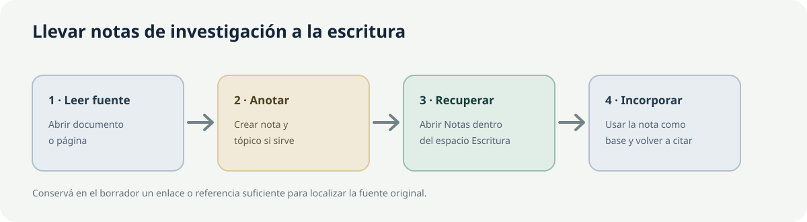

# EntropIA Lite

## Manual de usuario

**Versión de EntropIA:** 1.0.16 · **Actualizado:** 24 de septiembre de 2026

Para comprobar qué versión tenés instalada, mirá la barra inferior.

**Dirigido a:** investigadores, docentes, estudiantes y personas que trabajan con documentos, imágenes, PDF, audio y archivos de investigación.

> **Cómo leer las imágenes.** Las láminas de esta edición son diagramas orientativos, no capturas de pantalla. Los nombres de pantallas y controles corresponden a la interfaz actual de EntropIA Lite; la distribución puede variar según la vista abierta.

## Índice

- [1. Inicio rápido](#capitulo-1-inicio-rapido)
- [2. Introducción a EntropIA Lite](#capitulo-2-introduccion-a-entropia-lite)
- [3. Conceptos básicos](#capitulo-3-conceptos-basicos)
- [4. Crear y organizar una colección de documentos](#capitulo-4-crear-y-organizar-un-corpus)
- [5. Trabajar con documentos, páginas y archivos](#capitulo-5-trabajar-con-documentos-y-assets)
- [6. Obtener texto de documentos](#capitulo-6-obtener-texto-de-documentos)
- [7. Buscar información](#capitulo-7-buscar-informacion)
- [8. Analizar documentos y colecciones](#capitulo-8-analizar-documentos-y-colecciones)
- [9. Notas y tópicos](#capitulo-9-notas-y-topicos)
- [10. Investigación](#capitulo-10-investigacion)
- [11. Escritura](#capitulo-11-escritura)
- [12. Zotero](#capitulo-12-zotero)
- [13. Chat y agentes de EntropIA](#capitulo-13-chat-y-agentes-de-entropia)
- [14. Procesamiento por lotes](#capitulo-14-procesamiento-por-lotes)
- [15. Sincronización y nube](#capitulo-15-sincronizacion-y-nube)
- [16. Configuración y herramientas generales](#capitulo-16-configuracion-y-herramientas-generales)
- [17. Exportar y descargar](#capitulo-17-exportar-y-descargar)
- [18. Ejemplos paso a paso](#capitulo-18-ejemplos-paso-a-paso)
- [19. ¿Qué hago si…?](#capitulo-19-que-hago-si)
- [20. Consejos y buenas prácticas](#capitulo-20-consejos-y-buenas-practicas)
- [21. Glosario](#capitulo-21-glosario)

---

## Capítulo 1. Inicio rápido

Si es la primera vez que utilizás EntropIA Lite, empezá por acá. En este recorrido vas a crear una colección, importar un documento, obtener su texto y encontrar una palabra dentro del material.

### 1.1. Qué vamos a hacer

Elegí un PDF escaneado o una imagen **PNG o JPG** que puedas usar como ejemplo. Si contiene información privada, elegí otro archivo para probar: al pedir el reconocimiento de texto, EntropIA envía la página o imagen al servicio GLM-OCR por Internet.

**Antes de empezar:** para reconocer texto en imágenes o PDF, Lite necesita conexión a Internet y una clave de acceso de GLM-OCR. Si ya está configurada, seguí con el paso 1. Si no, abrí **Configuración → APIs remotas → GLM-OCR**, pegá la clave, pulsá **Probar conexión** y luego **Guardar cambios**. La clave se obtiene en la cuenta del proveedor; EntropIA no crea esa cuenta por vos. Más detalles en [Configuración](#capitulo-16-configuracion-y-herramientas-generales).

### 1.2. Conocer la pantalla principal

1. **Barra superior:** búsqueda general y accesos a **Chat de investigación**, **Agente de investigación**, **Escritura**, **Base de datos** y **Configuración**. Los botones con solo un ícono muestran su nombre al pasar el cursor.
2. **Explorador:** colecciones y, dentro de ellas, documentos y páginas/archivos.
3. **Área de trabajo:** la lista de colecciones, una colección abierta o un documento.
4. **Paneles:** herramientas que cambian según la vista. En un documento aparecen **Notas**, **Texto**, **Análisis**, **Mapa**, **Búsquedas**, **Layout** (estructura de la página) y **Metadatos** (datos descriptivos del archivo).
5. **Barra inferior:** versión y, cuando corresponde, estados de sincronización, lotes y notificaciones.

### 1.3. Crear o seleccionar una colección

Una colección es el espacio donde vas a reunir fuentes de un mismo proyecto, tema o fondo documental.

1. En **Colecciones**, pulsá el botón **Nueva colección**. También podés usar el botón con forma de carpeta y signo más del explorador lateral.
2. Escribí un nombre en **Nombre de la colección**. Por ejemplo: `Prensa local, 1930–1940`.
3. Si querés, agregá una **Descripción (opcional)**. Podés dejarla vacía.
4. Pulsá **Crear colección**.
5. Comprobá que aparece la nueva tarjeta en la pantalla. Pulsá su nombre para abrirla.

Si ya existe una colección adecuada, abrila en lugar de crear otra.

### 1.4. Importar el primer documento

1. Dentro de la colección, pulsá el botón **Importar documento**. También podés arrastrar archivos desde el Explorador de Windows y soltarlos sobre la colección.
2. En el selector de archivos, elegí uno o varios PDF, imágenes o audios admitidos y confirmá.
3. Esperá a que termine la importación. La sección **Resumen de importación** muestra el avance y luego indica cuántos archivos se importaron, omitieron o fallaron.
4. Revisá la lista de documentos; el título inicial se basa en el nombre del archivo.
5. Seleccioná un documento de la lista para abrirlo.

La importación **no** ejecuta OCR ni transcribe audio automáticamente. La lista completa de formatos aparece en [Crear y organizar una colección de documentos](#capitulo-4-crear-y-organizar-un-corpus).

### 1.5. Abrir el documento

1. En la colección, seleccioná la tarjeta del documento.
2. Para recorrer sus páginas o archivos asociados, usá **Página anterior** y **Página siguiente** en el panel del visor o el explorador lateral.
3. En imágenes y PDF, usá los controles de zoom del visor para acercarte o alejarte. Si la letra es pequeña, también podés ampliar toda la interfaz con el control de zoom de la barra superior.
4. En el panel derecho, seleccioná la pestaña **Texto** para trabajar con el texto asociado a la página abierta.

### 1.6. Obtener el texto

Si ya hay texto procesado, elegí **Texto extraído** para verlo. Si todavía no hay texto, el documento no aparece automáticamente por el solo hecho de importarlo.

1. Con un PDF o una imagen **PNG/JPG** abierto, elegí **Texto** en el panel derecho.
2. Pulsá **OCRH** para reconocer las palabras visibles en la página y esperá a que termine.
3. EntropIA envía la página o imagen al servicio GLM-OCR. Necesitás conexión a Internet y una clave de acceso válida.
4. Cuando aparezca el resultado, comparalo con la página original.

> El reconocimiento de texto convierte las palabras visibles en texto digital que EntropIA puede buscar y analizar. La lectura automática puede equivocarse; la página original sigue siendo la referencia.

### 1.7. Revisar el resultado

- Confirmá que el texto corresponde a la página seleccionada.
- Revisá nombres propios, fechas, números y palabras partidas entre líneas.
- Corregí a mano los errores importantes en el área de texto; el cambio se guarda automáticamente.
- Si corregiste el resultado con asistencia de IA y necesitás volver al OCR original, usá **Restaurar OCR original**. Antes de hacerlo, conservá aparte cualquier corrección manual que quieras mantener.

### 1.8. Hacer la primera búsqueda

1. Escribí una palabra que veas en el texto en la búsqueda de la barra superior.
2. Esperá a que aparezcan resultados y elegí el documento correcto. La búsqueda general puede encontrar materiales de distintas colecciones.
3. Para encontrar palabras que ya aparecen en el texto, elegí **Búsquedas → Buscar por texto similar (FTS)**. Esta opción compara palabras; no busca por significado.
4. Si el texto recién reconocido no aparece, abrí **Análisis** en ese documento y pulsá **INDEX** para prepararlo para la búsqueda. Volvé a buscar cuando termine.
5. Abrí el resultado y comprobalo en el texto o en la imagen original.

### 1.9. Primer flujo completado

**Creaste o elegiste una colección → importaste un documento → obtuviste texto → revisaste el resultado → encontraste una palabra.**

Ya conocés el recorrido básico. Para ampliar cada paso, seguí con [organizar tus colecciones](#capitulo-4-crear-y-organizar-un-corpus), [OCR y transcripción](#capitulo-6-obtener-texto-de-documentos) y [búsquedas](#capitulo-7-buscar-informacion).

### 1.10. Inicio rápido visual

**1. Colección → 2. Importar → 3. Abrir → 4. Texto/OCRH → 5. Revisar → 6. Buscar**

Si no hay resultados, comprobá que el texto esté guardado y usá **Análisis → INDEX** para prepararlo. Si OCRH falla, revisá la conexión y la clave en **Configuración → APIs remotas**.

---

## Capítulo 2. Introducción a EntropIA Lite

EntropIA Lite es una aplicación de escritorio para reunir materiales, reconocer texto, buscar información, tomar notas, analizar fuentes y redactar a partir de tus documentos.

Tus notas y archivos se guardan en este equipo. Para reconocer texto, transcribir audio y usar algunas funciones de inteligencia artificial, EntropIA se conecta por Internet a otros servicios. Esas tareas necesitan una clave de acceso válida.

Un flujo habitual es:

**Organizar fuentes → importar → obtener texto si hace falta → revisar → buscar o analizar → registrar notas → redactar → exportar.**

Las respuestas y resúmenes automáticos son ayudas para el trabajo. Comprobá siempre las citas, nombres, fechas y conclusiones en las fuentes originales. EntropIA no reemplaza la lectura crítica ni las reglas de citación de tu institución.

---

## Capítulo 3. Conceptos básicos

| Concepto | Qué significa en la práctica |
|---|---|
| **Colección** | Un espacio para agrupar materiales de un tema, proyecto o fondo. |
| **Documento** o **ítem** | La ficha que aparece en una colección para representar un archivo. En algunos avisos de la interfaz aparece la palabra «ítem». |
| **Asset** | En algunos controles aparece «asset»: se refiere a una página o archivo dentro de un documento. |
| **Corpus** | El conjunto de documentos y colecciones que reunís para trabajar. |
| **Texto extraído** | Texto digital obtenido de una página, una imagen o un audio. No se crea solo al importar. |
| **OCR** | Reconocimiento de las palabras visibles en una imagen o PDF escaneado. En Lite se solicita por Internet. |
| **Transcripción** | Texto generado a partir de las palabras de un audio. En Lite se solicita por Internet. |
| **Metadatos** | Datos que describen un archivo, como su nombre, tipo y otros campos. |
| **Tópico** | Una etiqueta para clasificar un documento, por ejemplo `migración` o `vivienda`. |
| **Nota** | Una observación de investigación asociada a un documento o una página. |
| **Búsqueda de texto (FTS)** | Encuentra las mismas palabras que aparecen en el texto guardado; no busca sinónimos. |
| **Embeddings** | Una forma de representar el texto para que EntropIA compare páginas o archivos que tratan temas parecidos. Se usa con **EMBED** y **Assets similares**. |
| **Recuperación** | Selección de pasajes de tus documentos que el Chat puede usar para preparar una respuesta. |
| **Modelo de IA** | Servicio que usa una instrucción y parte del material para proponer un texto, resumen o análisis. |

---

## Capítulo 4. Crear y organizar una colección de documentos

### 4.1. Crear, buscar y mantener colecciones

En **Colecciones** podés crear un espacio, buscarlo por nombre, editarlo o eliminarlo.
Las tarjetas muestran recuentos resumidos. Al abrir una colección, el panel de estadísticas ayuda a revisar el contenido registrado.

- **Buscar colecciones...** filtra los nombres de las colecciones.
- En una tarjeta, usá el control de edición para cambiar el nombre o la descripción y **Guardar**. **Cancelar** descarta los cambios del formulario.
- El explorador lateral también permite filtrar colecciones, contraer el panel y crear una nueva.
- No hay controles para ordenar manualmente las colecciones.
- Importar otro archivo crea un documento nuevo; no hay una acción para anexarlo a un documento existente.

> **Atención:** eliminar una colección borra sus documentos y datos asociados. Confirmá el nombre y exportá la información que necesites antes de aceptar. No hay una acción de deshacer.

### 4.2. Importar archivos

Dentro de una colección, pulsá **Importar documento** o arrastrá los archivos sobre ella. Se permite seleccionar varios archivos.

| Tipo | Extensiones que se pueden importar |
|---|---|
| PDF | `.pdf` |
| Imágenes | `.png`, `.jpg`, `.jpeg`, `.webp`, `.tiff`, `.tif` |
| Audio | `.wav`, `.mp3`, `.flac`, `.m4a`, `.aac`, `.ogg` |

EntropIA no importa directamente archivos `.txt`, documentos de Office ni el archivo JSON exportado desde una colección. Que un archivo se pueda importar no significa que sirva para reconocer texto: OCRH reconoce imágenes PNG/JPG/JPEG y PDF.

Cada archivo importado se guarda como una copia en este equipo; el original que elegiste no cambia. Un PDF de varias páginas se abre hoja por hoja para elegir cuál consultar. Si importás otra vez el mismo archivo sin cambios, EntropIA puede omitirlo porque ya lo agregaste.

Durante la importación, **Resumen de importación** informa qué archivo se procesa, el avance y cuántos se importaron, omitieron o presentaron un error. Leé los nombres rechazados o el mensaje antes de volver a intentarlo.

### 4.3. Organizar fuentes

Una organización sencilla puede ser:

- **Colección:** `Entrevistas sobre vivienda`.
- **Documento:** una entrevista, una fotografía o un informe.
- **Página o archivo:** el audio, la imagen o una hoja concreta de un PDF.
- **Texto:** texto reconocido en una página o palabras transcritas desde un audio.

Usá nombres de archivo claros antes de importarlos: el título inicial del documento se basa en ese nombre. No hay una opción para mover documentos entre colecciones ni para ordenar sus páginas manualmente.

### 4.4. Buscar dentro de una colección

En la colección, **Buscar documentos...** filtra sus documentos. Para buscar contenido procesado en distintas colecciones, usá la búsqueda superior o **Búsquedas**; se explican en el [capítulo 7](#capitulo-7-buscar-informacion).

### 4.5. Exportar una colección

El botón **Exportar JSON** guarda datos de la colección y sus documentos, textos y análisis, pero no incluye los PDF, imágenes o audios originales. No podés usar ese archivo para reconstruir la colección en EntropIA. Conservá por separado los archivos originales. Ver [Exportar y descargar](#capitulo-17-exportar-y-descargar).

---

## Capítulo 5. Trabajar con documentos, páginas y archivos

### 5.1. Abrir y recorrer un documento

Al abrir una tarjeta, el área principal muestra el visor y el panel de trabajo. Si un documento tiene varias páginas o archivos asociados, seleccioná la página o el archivo que necesitás en el explorador y usá **Página anterior**/**Página siguiente** para moverte.

En la barra superior también aparecen **Documento anterior** y **Documento siguiente** para recorrer documentos de la colección. La ruta de navegación permite volver a **Colecciones** o a la colección actual.

### 5.2. Visor de PDF e imágenes

En la pestaña **Documento**, usá las herramientas disponibles según el tipo de página o archivo:

- **Mover imagen (mano):** desplazar la vista.
- **Acercar** y **Alejar:** cambiar el zoom del visor.
- **Herramienta de anotación rectangular** y **Herramienta de subrayado:** agregar marcas a la página.
- **Color de anotación:** elegir el color de la marca.
- **Recortar a la selección:** recortar la zona seleccionada.
- **Borrar región (relleno blanco):** cubrir con blanco la zona elegida.
- **Rotar 90° a la izquierda/derecha** y **Rotación fina**: orientar la página con el giro deseado.
- **Duplicar asset:** crear una copia de la imagen o del PDF antes de continuar una edición.
- **Deshacer última edición** y **Rehacer última edición:** recorrer cambios recientes del visor.
- **Eliminar anotación seleccionada:** quitar la anotación marcada.

Las anotaciones se guardan con el documento. Para conservar una versión sin cambios, duplicá la página o archivo antes de recortarlo o modificarlo. Estas herramientas no corrigen errores del texto reconocido; revisalo por separado en **Texto**.

### 5.3. Reproductor de audio

Para escuchar un audio, usá **Reproducir/Pausar**, la barra de posición, los saltos disponibles y el control de volumen. Si tu equipo no puede reproducir el formato, EntropIA muestra un error; probá abrir una copia con otro reproductor o convertirla a un formato admitido.

### 5.4. Panel derecho del documento

- **Notas:** tópicos y observaciones ligadas al documento o a la página.
- **Texto:** texto reconocido, transcripción, edición, copia y descarga.
- **Análisis:** preparar texto para búsquedas, reconocer nombres y proponer relaciones.
- **Mapa:** lugares asociados al documento.
- **Búsquedas:** encontrar palabras o explorar materiales parecidos.
- **Layout:** estructura detectada en la página, como títulos, texto, tablas y figuras.
- **Metadatos:** datos descriptivos del archivo y campos que podés completar.

Podés ocultar el panel derecho y volver a mostrarlo con el control lateral.

### 5.5. Layout y metadatos

**Layout** aparece cuando hay secciones de la página detectadas y no se usa para audio. Podés filtrar **Todos**, **Títulos**, **Texto**, **Tablas**, **Figuras** o **Notas**. Seleccioná una sección para ubicarla en la página y ver sus detalles; desde ese panel podés copiar el texto, la ubicación o los datos en formato JSON. El control de superposición muestra u oculta las zonas marcadas en el visor.

En **Metadatos**, consultá los datos del archivo. **Metadatos personalizados** permite agregar un campo, editar su valor o quitarlo. No cambia el archivo original.

### 5.6. Eliminar un documento o una página

La papelera de una tarjeta elimina el documento completo y sus archivos y datos asociados. El control **Eliminar asset activo**, junto a la ruta de navegación, elimina solo la página o archivo seleccionado.

> **Atención:** antes de eliminar, revisá el nombre y la confirmación. Si la página o archivo está citado en Escritura, EntropIA avisa: la cita conserva el pasaje guardado, pero deja de poder abrir la fuente original. La eliminación no reemplaza una copia externa del archivo.

---

## Capítulo 6. Obtener texto de documentos

El texto permite buscar y analizar lo que aparece en una página o se dice en un audio. **La importación no inicia automáticamente esta tarea.** Abrí el documento y elegí **Texto**.

### 6.1. OCR de PDF o imagen

1. Seleccioná un PDF o una imagen compatible.
2. Abrí **Texto** y pulsá **OCRH**.
3. Esperá a que finalice la solicitud.
4. Leé el resultado y contrastalo con la página original.
5. Corregí manualmente los errores relevantes si hace falta.

En Lite, OCRH envía la página o imagen por Internet al servicio de reconocimiento GLM-OCR y necesita una clave configurada en **Configuración → APIs remotas**. Esta variante no reconoce texto sin conexión (**OCRL**). Aunque se pueden importar archivos WebP/TIFF/TIF, OCRH no siempre los acepta; si necesitás reconocer una imagen, probá con una copia PNG/JPG.

### 6.2. Corregir o resumir el texto

| Acción visible | Para qué sirve | Requisito |
|---|---|---|
| **OCRC** | Proponer una corrección del texto reconocido. Revisá la propuesta antes de usarla. | Texto disponible y OpenRouter configurado. |
| **OCRR** o **Resumen** | Generar una síntesis del texto disponible. | OpenRouter configurado. |
| **Restaurar OCR original** | Volver al texto OCR original disponible después de una corrección. | Que exista un original recuperable. |

La corrección y el resumen son propuestas del modelo: pueden omitir datos o cambiar el sentido. Compará nombres, cifras y citas con el documento. Si editaste el texto a mano después de corregirlo, preservá primero lo que quieras conservar antes de restaurar.

### 6.3. Transcribir audio

1. Abrí el audio y comprobá que se pueda reproducir.
2. En el panel **Texto**, elegí **STT** para convertir la voz en texto.
3. Esperá la transcripción y revisá el texto junto al audio.
4. Corregí errores de nombres, turnos de habla o palabras dudosas.
5. Si está disponible, pedí un **Resumen** del texto transcripto.

En Lite, la transcripción usa AssemblyAI y requiere Internet y una clave de acceso. El audio necesario para la tarea se envía a ese servicio. El dictado por micrófono en los editores también necesita este servicio.

### 6.4. Comprobar, copiar y descargar

La pestaña muestra el texto de la página o archivo abierto. Comprobá que corresponda a ese material. Podés editarlo; los cambios se guardan automáticamente. **Copiar** lleva el texto al portapapeles. **Descargar** permite obtenerlo como Markdown, PDF o Word (`.docx`).

Si hay bloques de layout disponibles, consultalos en **Layout**. No es una verificación de exactitud: revisá la imagen original.

### 6.5. Si el texto no aparece

- Comprobá que abriste la página o el audio correctos y que la tarea terminó.
- Revisá el mensaje del servicio en **Texto**.
- Para buscar contenido, comprobá si hace falta **Análisis → INDEX**.
- Si el servicio no responde, revisá su clave y conexión en **Configuración → APIs remotas**.
- Si una foto está oscura, inclinada o borrosa, conservá el original y probá con una copia más clara y derecha.

---

## Capítulo 7. Buscar información

EntropIA tiene varias búsquedas. Elegí la que corresponda; no todas buscan lo mismo.

| Dónde | Qué busca | Cuándo usarla |
|---|---|---|
| **Buscar colecciones...** | Nombres de colecciones. | Encontrar un espacio de trabajo. |
| **Buscar documentos...** | Documentos de la colección abierta. | Filtrar una colección por una palabra. |
| **Búsqueda superior** | Documentos y texto disponible del conjunto de colecciones. | Encontrar una palabra/frase y abrir un documento. |
| **Búsquedas → Buscar por texto similar (FTS)** | Encuentra palabras que aparecen en los documentos. Puede mostrar hasta 10 resultados de distintas colecciones. | Buscar una palabra o frase concreta. |
| **Assets similares** | Sugiere páginas o archivos que tratan temas parecidos a un material seleccionado. | Explorar fuentes relacionadas aunque no uses las mismas palabras. |
| **Chat de investigación** | Responde preguntas sobre texto reconocido en tus documentos y puede mostrar las fuentes. | Pedir una explicación que puedas comprobar en las fuentes. |
| **Investigar** | Desarrolla una pregunta de investigación a partir de colecciones seleccionadas y prepara un informe con fuentes. | Explorar una pregunta amplia paso a paso. |

### 7.1. Buscar una palabra o frase

1. Escribí un término en la búsqueda superior o en **Búsquedas**.
2. Revisá los resultados y la colección a la que pertenece cada uno.
3. Abrí el resultado y comprobá el fragmento en el documento original.
4. Si un OCR produjo una variante, probá también otras grafías o una parte distintiva de la frase.

La búsqueda de texto compara palabras que aparecen en el título, los datos o el texto reconocido del documento. No encuentra automáticamente sinónimos ni interpreta la intención de una pregunta. Para buscar dentro del contenido, primero reconocé el texto y, si aún no aparecen resultados, pulsá **Análisis → INDEX** para prepararlo.

En **Búsquedas → Buscar por texto similar (FTS)** pueden aparecer hasta 10 documentos; esta lista es distinta de los resultados de la búsqueda superior.

### 7.2. Buscar materiales parecidos

Para encontrar páginas o archivos parecidos con **Assets similares**, seleccioná uno que ya tenga texto, pulsá **EMBED** en **Análisis** y luego abrí **Assets similares** en **Búsquedas**. La herramienta compara su contenido con el de otros materiales preparados. En Lite necesita conexión a Internet y OpenRouter.

La vista previa permite leer el fragmento y, cuando está disponible, volver al documento de origen. La semejanza sirve como pista para revisar; no demuestra que dos fuentes digan lo mismo.

### 7.3. Llegar desde el resultado a la fuente

Al abrir un resultado, comprobá el título, la colección y la página o archivo. Usá la ruta de navegación para volver. Si necesitás una lista de citas y fuentes, consultá [Chat de investigación](#capitulo-13-chat-y-agentes-de-entropia) o [Investigar](#capitulo-10-investigacion).

> **Importante:** la búsqueda FTS encuentra palabras que aparecen en el texto; **Assets similares** sugiere materiales con contenido parecido. En ambos casos, comprobá la fuente original.

---

## Capítulo 8. Analizar documentos y colecciones

### 8.1. Acciones de análisis por documento

Abrí **Análisis** en el panel del documento. Los indicadores muestran si una acción está pendiente, en curso, completa o con error.

| Acción | Qué hace | Cuándo usarla y resultado |
|---|---|---|
| **INDEX** | Prepara el texto reconocido para que puedas encontrar sus palabras. | Usalo si no encontrás palabras que aparecen en el texto. Compara palabras, no busca sinónimos. |
| **EMBED** | Prepara una página o archivo con texto para compararlo con materiales parecidos. | Usalo antes de **Assets similares**. En Lite requiere OpenRouter y conexión a Internet. |
| **NER** | Propone nombres de personas, lugares, instituciones y fechas. | Revisá los resultados en **Entidades**; en Lite usa un servicio por Internet. |
| **TRIPLET** | Propone relaciones entre elementos; por ejemplo, quién hizo qué. | Revisá cada relación y corregí sus partes si es necesario. En Lite requiere OpenRouter. |

Cada acción se realiza sobre la página o el documento abierto, según corresponda. Primero obtené y revisá el texto. No hace falta repetir una tarea completada, salvo que hayas cambiado el material.

### 8.2. Entidades, relaciones y mapa

En **Entidades** podés crear, editar o eliminar nombres de personas, lugares, instituciones o fechas. En **Tripletas semánticas** podés agregar o corregir quién hizo qué o qué relación aparece entre dos elementos. Revisá cada propuesta en la fuente.

La pestaña **Mapa** muestra lugares asociados al documento. Podés seleccionar un marcador, ajustar la ubicación y guardarla, o restablecerla cuando esté disponible. Ver el mapa y buscar lugares requiere Internet. Comprobá que cada lugar corresponda a la fuente.

### 8.3. Análisis textual de una colección

Dentro de una colección, abrí el panel lateral con **Mostrar análisis textual**. Este panel cuenta palabras de textos reconocidos y transcripciones guardadas; no genera resúmenes ni interpreta los documentos.

- **Visualización:** nube **Top N palabras** y gráfico **Top 20 palabras**. Cada gráfico puede descargarse como PNG.
- **Parámetros:** cambiar la cantidad de términos de la nube y agregar en **Stopwords personalizadas** las palabras que no querés incluir en el recuento.
- **Ocultar análisis textual:** cerrar el panel.

Si todavía no hay texto reconocido o transcripciones, la colección no tiene palabras para contar. Primero revisá el texto de sus documentos. El recuento usa los textos guardados en este equipo y no necesita una clave de IA.

---

## Capítulo 9. Notas y tópicos

### 9.1. Clasificar con tópicos

En **Notas**, usá **Tópicos** para asignar palabras clave al documento, como `censo`, `trabajo` o `vida cotidiana`. Escribí un tópico y confirmalo con Enter o coma. Podés elegir sugerencias existentes y quitar un tópico con su control correspondiente.

### 9.2. Crear y editar notas

1. Abrí la página o el archivo al que se refiere tu observación.
2. En **Notas**, pulsá **Agregar nota**.
3. Escribí en **Escribí una nota...** y usá el editor para aplicar negrita, cursiva, títulos, listas, citas o enlaces.
4. Pulsá **Guardar nota**.
5. Para leer una nota anterior, abrila en la lista. **Editar nota** permite cambiarla; **Eliminar nota** pide confirmación.

La nota puede quedar asociada al documento o a la página abierta. Al cambiar de página, revisá sus notas. Para dictar una nota, pulsá **Iniciar dictado**; necesitás permitir el uso del micrófono y tener AssemblyAI configurado en Lite.

### 9.3. Reutilizar notas al escribir

En **Escritura → Notas**, buscá una nota, abrila y revisá su origen. **Insertar como texto** copia el contenido como texto independiente. **Insertar como vínculo** agrega un enlace para volver a consultarla. El panel busca notas de todos tus documentos; no permite limitar la búsqueda a las colecciones de un manuscrito.

Si la nota vinculada cambia o desaparece, Escritura muestra su estado y conserva el texto del manuscrito. Si la nota ya no existe, el vínculo no puede abrirla.

También podés seleccionar una frase del manuscrito y usar **Guardar la selección como nota**; luego elegís el documento al que corresponde. Esta acción crea una nota, no una cita bibliográfica.

---

## Capítulo 10. Investigación

**Investigar** permite plantear una pregunta, elegir colecciones y obtener un informe acompañado de fuentes. Es diferente de una búsqueda por palabra y del chat breve del capítulo 13.

### 10.1. Crear una investigación

1. En la barra superior, abrí **Agente de investigación**; la página se titula **Investigar**.
2. En **Nueva investigación**, escribí una pregunta concreta y, si querés, un título.
3. Abrí **Alcance de colecciones**. EntropIA puede proponer las colecciones que ya tienen fragmentos; revisá la selección, agregá o quitá colecciones y usá **Seleccionar todas** si corresponde.
4. Seleccioná al menos una colección y pulsá **Investigar**.
5. La tarjeta del trabajo aparece en la lista de investigaciones anteriores. Abrila para seguir el proceso y consultar el resultado.

La pregunta y el alcance determinan el material que el agente puede consultar. Prepará antes los documentos y el texto; sin fuentes procesadas, la evidencia será limitada.

### 10.2. Acompañar el proceso

Durante el trabajo, la vista puede pedir intervención:

- **Preguntas antes de armar el informe:** contestá lo que puedas. Si hace falta, usá **Editar diseño** para ajustar las ideas iniciales, el alcance y las condiciones para cerrar la investigación. Después, pulsá **Responder y seguir**.
- **Búsquedas antes de consultar tus documentos:** revisá las búsquedas propuestas. Podés aceptarlas con **Aprobar y buscar** o modificarlas en **Editar búsquedas**; después, pulsá **Guardar y buscar**.
- Si querés ajustar los límites de llamadas o costo, pausá el trabajo. Después podés continuarlo o cancelarlo. Revisá los límites antes de reanudar.

En Lite, **Investigar** necesita conexión a Internet y una clave de OpenRouter. Revisá qué contenido se enviará al servicio antes de trabajar con material sensible.

### 10.3. Leer y comprobar el informe

El informe puede incluir el planteo, cobertura por colección, hallazgos, limitaciones y **Fuentes citadas**. Revisá los avisos de fuentes sin texto o cobertura insuficiente.

1. Seleccioná una cita `[n]` para leer el pasaje y los datos de la fuente.
2. Usá **Abrir el documento** para regresar al material local cuando esté disponible.
3. Contrastá la afirmación con la página, el audio o el texto original. Una cita no garantiza que el informe haya interpretado bien la fuente.
4. Si necesitás ajustar una sección, usá **Editar** y guardá tu versión. La vista indica que modificaste el texto.
5. **Reescribir** acepta una instrucción y genera otra propuesta sobre la evidencia del informe. Revisá la salida antes de incorporarla.

La investigación consulta solo las colecciones que seleccionaste. No busca en Internet ni en bibliografía pública. Al crearla no podés elegir un proyecto, un límite de costo o una forma de búsqueda.

### 10.4. Guardar o eliminar una investigación

El informe se puede descargar como Markdown, HTML o Word (`.docx`). La vista actual no ofrece PDF para este informe. Las investigaciones anteriores muestran estados y se pueden volver a abrir. **Borrar la investigación** requiere confirmación y elimina el informe y su información asociada; verificá antes que no necesites conservarlo.

---

## Capítulo 11. Escritura

**Escritura** sirve para redactar un manuscrito y consultar tus documentos, las notas, Zotero y la ayuda contextual desde un mismo espacio.

### 11.1. Crear y abrir un manuscrito

1. Abrí **Escritura** desde la barra superior.
2. Pulsá **Documento nuevo** para crear un manuscrito vacío.
3. Seleccioná un documento de la lista para abrirlo.
4. Editá el título en la parte superior y confirmalo al salir del campo.

La vista actual no importa un DOCX o un Markdown como manuscrito. Si ya tenés texto en otro archivo, podés copiarlo y pegarlo en un documento nuevo.

### 11.2. Escribir y navegar

El espacio reúne **Esquema**, el manuscrito y el panel de investigación. Podés cambiar el ancho de los paneles o esconder los que no necesites.

- El editor permite aplicar formato, títulos, listas, citas en bloque, notas al pie, enlaces, tablas, imágenes y alineación.
- **Buscar** localiza texto dentro del manuscrito; **Reemplazar** y **Reemplazar todo** permiten cambiar coincidencias.
- Para insertar una imagen, usá **Insertar imagen**, pegala o arrastrala dentro del manuscrito. Se admiten PNG, JPG/JPEG y GIF.
- **Esquema** muestra títulos de nivel 1 a 3. Seleccioná uno para saltar a esa sección; podés cambiar su título, moverla, agregar otra debajo o eliminarla con su contenido.
- El botón de dictado usa micrófono y transcripción remota; en Lite requiere AssemblyAI y conexión.

### 11.3. Guardado automático y revisiones

El manuscrito se guarda automáticamente; no hay un botón para guardarlo manualmente. La barra muestra **Guardado**, **Guardando**, **Cambios pendientes** o **Error de guardado**. Esperá a ver **Guardado** antes de cerrar o cambiar de documento. El número junto a **Revisión** solo cuenta cambios; no permite abrir versiones anteriores.

La interfaz actual no ofrece una lista de versiones anteriores ni una acción para restaurarlas. Si el guardado falla, usá **Reintentar** cuando aparezca y conservá una copia del texto importante antes de cerrar.

### 11.4. Consultar tus documentos y citar una fuente

En el panel de investigación, abrí **Corpus** y escribí en **Buscar en el corpus**. Esta búsqueda solo encuentra texto que ya se reconoció; no lee la página mientras escribís. Si activás **Incluir coincidencias aproximadas**, también puede encontrar palabras escritas de forma parecida.

Abrí un resultado, elegí la página y marcá el pasaje que querés citar. Después, pulsá **Insertar como cita**.

La cita mantiene el vínculo con el documento y el pasaje. Si la fuente cambia, EntropIA avisa y no resalta un texto distinto como si fuera el fragmento original. Para agregar una referencia bibliográfica de Zotero, seguí el [capítulo 12](#capitulo-12-zotero).

### 11.5. Usar notas, agente y exportación

Las cinco pestañas del panel son **Corpus**, **Zotero**, **Notas**, **Agente** y **Exportar**. **Notas** permite localizar notas asociadas a tus documentos e insertarlas como texto o vínculo. **Agente** trabaja sobre una selección y se explica en el [capítulo 13](#capitulo-13-chat-y-agentes-de-entropia). **Exportar** configura el formato de las citas y la bibliografía; el botón **Descargar** está en la barra del manuscrito.

### 11.6. Eliminar un manuscrito

Para eliminar un manuscrito, volvé a la lista de Escritura, usá su acción **Eliminar** y confirmá. El documento sale de la lista; no hay una vista de papelera ni un control para restaurarlo. Descargá una copia antes de eliminarlo.

### 11.7. Sincronización del manuscrito

Los manuscritos de Escritura se guardan en este equipo y no forman parte de la sincronización general entre dispositivos. Exportá una copia si necesitás moverlos o conservarlos fuera de la aplicación.

---

## Capítulo 12. Zotero

Zotero aporta referencias bibliográficas al manuscrito. EntropIA consulta la biblioteca local de Zotero; no es un acceso a una cuenta web.

### 12.1. Conectar Zotero

1. Abrí Zotero en el equipo.
2. En Zotero, entrá en **Editar → Configuración → Avanzado**.
3. Activá **Permitir que otras aplicaciones se comuniquen con Zotero**.
4. Volvé a EntropIA, abrí **Escritura → Zotero** y esperá el estado de conexión.
5. Cuando Zotero responda, la pestaña muestra referencias de la biblioteca y habilita **Actualizar**.

Si la conexión no funciona, EntropIA indica si Zotero no permitió la conexión, no respondió a tiempo o envió una respuesta que no pudo leer. La falta de respuesta no demuestra que Zotero esté cerrado o desinstalado. Es posible que sigan apareciendo referencias consultadas antes.

### 12.2. Buscar y citar

1. En **Buscar en tu biblioteca de Zotero**, escribí autor, título o año.
2. Al pulsar Enter, EntropIA también consulta Zotero. Revisá título, autoría y año de cada resultado.
3. Pulsá **Citar** junto a la obra que querés incluir. Necesitás tener un manuscrito abierto.
4. En **Ajustar la cita**, elegí el dato que ubica el pasaje, como una página o un capítulo. Marcá **Ya nombré al autor en mi frase** si corresponde. Si hace falta, completá **Antes de la cita** o **Después de la cita**.
5. Revisá **Así queda** y pulsá **Listo**. **Cancelar** deja el manuscrito sin el ajuste.

El formato de cita inicial es APA; no podés elegir otro estilo desde EntropIA ni administrar bibliotecas o grupos de Zotero. La referencia guarda una copia de sus datos para que siga en el manuscrito aunque Zotero no responda más adelante.

### 12.3. Incluir bibliografía

En **Escritura → Exportar**, dejá activada **Incluir bibliografía** si querés que el archivo incluya la lista de obras de Zotero citadas. La bibliografía se construye con las referencias Zotero; no convierte las citas insertadas desde tus documentos en referencias de Zotero.

---

## Capítulo 13. Chat y agentes de EntropIA

La interfaz tiene tres ayudas relacionadas, pero distintas:

- **Chat de investigación:** responde preguntas sobre tus documentos y muestra las fuentes asociadas a cada respuesta.
- **Investigar:** desarrolla una investigación con alcance por colecciones y produce un informe; ver [capítulo 10](#capitulo-10-investigacion).
- **Escritura → Agente:** propone cambios sobre un fragmento seleccionado del manuscrito.

Ninguna de estas herramientas sustituye la comprobación de la fuente.

### 13.1. Preguntar sobre tus documentos en el Chat

1. Abrí **Chat de investigación** desde la barra superior.
2. Escribí una pregunta de hasta 4000 caracteres sobre documentos cuyo texto ya se reconoció y preparó para la búsqueda.
3. Pulsá **Enviar**. Enter envía; Shift+Enter agrega una línea.
4. Revisá la respuesta y abrí **Fuentes** para comprobar los documentos y fragmentos citados.
5. Pulsá una fuente para volver al documento de origen.

El Chat consulta los documentos disponibles; no permite elegir una colección ni busca en Internet. En Lite, las respuestas usan OpenRouter y requieren una clave de acceso y conexión. Si no encuentra pasajes relacionados con tu pregunta, puede indicarlo o responder sin fuentes útiles.

### 13.2. Conversaciones e historial

- **Nueva conversación** inicia otro hilo al enviar la primera pregunta.
- **Conversaciones** permite volver a un hilo, buscar en sus títulos/contenidos, renombrarlo o eliminarlo.
- **Copiar respuesta** incluye la lista de fuentes cuando está disponible.
- La conversación se puede descargar como PDF.
- **Profundizar con el Agente** transfiere la última pregunta y parte de la conversación a **Investigar**. Ese contexto no confirma por sí solo que una afirmación sea cierta; comprobá las fuentes del informe.

### 13.3. Agente de Escritura

En **Escritura → Agente**, seleccioná un pasaje del manuscrito y elegí una acción. Las opciones visibles son:

- **Ortografía**, **Redacción**, **Claridad**, **Argumentación**.
- **Acortar**, **Desarrollar**, **Resumir**, **Reformular**.
- **Reiteraciones**, **Contradicciones**.
- **Evidencia**, **Contraevidencia**, **Contraejemplos**, **Notas**.

Las primeras acciones trabajan sobre el pasaje seleccionado. **Evidencia**, **Contraevidencia**, **Contraejemplos** y **Notas** también consultan pasajes o notas relacionados. En Lite, estas acciones usan OpenRouter y envían al servicio el texto seleccionado y, cuando corresponde, pasajes de tus documentos.

EntropIA muestra el texto original, la propuesta, su explicación y la evidencia que logró recuperar. Vos decidís qué hacer:

- **Reemplazar** el pasaje original.
- **Insertar debajo** de la selección.
- **Descartar** la propuesta.

El agente no cambia el manuscrito automáticamente. Si el pasaje cambió desde que se creó la propuesta, revisalo antes de aplicarla. Sin una clave de acceso de OpenRouter, podés seguir escribiendo a mano aunque no tengas disponible el agente.

---

## Capítulo 14. Procesamiento por lotes

Los lotes permiten procesar varias colecciones a la vez: reconocer texto y preparar materiales para compararlos por semejanza. No generan un resumen conjunto de todos los documentos.

1. Abrí **Configuración → Lotes** y seleccioná una o varias colecciones. **Seleccionar todas** marca todas las disponibles.
2. Elegí **OCR** para reconocer palabras en imágenes o PDF, **Embeddings** para preparar una comparación por semejanza, o ambas tareas. Después, pulsá **Analizar selección**.
3. Revisá qué documentos y tareas incluye la propuesta. Si el alcance no es correcto, descartala.
4. Cuando termine el análisis, pulsá **Iniciar lote**.
5. Seguí el estado en la pestaña o desde el indicador de lotes de la barra inferior.

No hace falta repetir las tareas ya completas. La comparación por semejanza solo se prepara cuando hay texto. El lote avanza mientras EntropIA está abierta; si cerrás la aplicación, se detiene. Si volvés y quedan tareas pendientes, revisá cuáles faltan y leé sus mensajes antes de continuar.

Cuando la interfaz lo permite, podés **Pausar**, **Reanudar** o **Cancelar**. Abrí una tarea fallida para leer el mensaje y volvé a intentarla. La pestaña separa los lotes en curso de los anteriores; **Cargar más** muestra los registros previos.

En Lite, reconocer texto y comparar materiales depende de servicios por Internet y claves configuradas. Que el lote muestre avance no garantiza que el servicio esté disponible ni que cada tarea termine correctamente.

---

## Capítulo 15. Sincronización y nube

La sincronización es opcional. Si trabajás en un solo equipo, podés dejarla desactivada. Al activarla, EntropIA envía los datos incluidos en la sincronización a su servicio en la nube. Revisá qué información se sincroniza y las condiciones del servicio antes de iniciar sesión.

### 15.1. Iniciar sesión y sincronizar

1. Abrí **Configuración → Sincronización**.
2. Iniciá sesión con tu cuenta o registrate si la opción está disponible. La contraseña nueva debe tener al menos 10 caracteres.
3. Una vez dentro, usá **Sincronizar ahora** o activá **Sincronización automática** y elegí su intervalo.
4. Revisá los equipos conectados, el espacio disponible y tu plan. Desconectá los equipos que ya no uses.
5. Para dejar de usar la cuenta en este equipo, usá **Cerrar sesión**.

EntropIA Lite usa el servicio incluido; no podés cambiar su dirección ni elegir colecciones individuales para sincronizar. Si la primera sincronización incluye más de 500 MiB (unos 525 MB), EntropIA te pide confirmación antes de continuar.

### 15.2. Estados, errores y datos

El indicador inferior puede mostrar que la sincronización está al día, que hay actividad, falta de conexión, un error, diferencias entre equipos o un aviso relacionado con la hora del dispositivo. Pulsalo para abrir la configuración y leer más detalles. Si hay diferencias, revisalas antes de asumir que ambos equipos tienen el mismo contenido.

**Re-verificar archivos** vuelve a enviar los archivos al servicio para comprobarlos; no sirve como copia de respaldo. **Borrar mis datos del servidor** elimina los datos remotos con confirmación, pero conserva los de este equipo.

> **Importante:** los manuscritos de **Escritura** permanecen en el equipo donde se crearon y no forman parte de la sincronización general. Exportalos aparte si necesitás pasarlos a otro dispositivo. Las notas asociadas a documentos pueden sincronizarse cuando configurás la cuenta.

---

## Capítulo 16. Configuración y herramientas generales

Abrí **Configuración** con el botón de engranaje de la barra superior. En Lite aparecen estas pestañas:

| Pestaña | Para qué sirve | Recomendación inicial |
|---|---|---|
| **APIs remotas** | Conectar los servicios que reconocen texto, transcriben audio y ayudan con tareas de IA. | Configurá solo los que vayas a usar; probá la conexión y guardá. |
| **Prompts** | Revisar las instrucciones que EntropIA sigue al corregir texto, resumir o proponer nombres y relaciones. | Conservá los valores iniciales si no necesitás cambiarlos. |
| **Model Params** | Ajustar el modelo y la forma en que prepara cada respuesta. | Dejá los valores predeterminados. |
| **RAG Params** | Elegir qué pasajes de tus documentos consulta el Chat, cuántos usa y cuánto de la conversación previa considera. | Dejá los valores predeterminados hasta tener una necesidad concreta. |
| **Sincronización** | Conectar la cuenta y compartir datos entre equipos. | No la actives si no necesitás usar más de un equipo. |
| **Lotes** | Reconocer texto y preparar varios documentos para compararlos. | Ejecutá primero una prueba con una colección pequeña. |
| **Logs** | Leer mensajes de actividad y error. | Anotá el mensaje visible antes de compartirlo con soporte. |

La pestaña **Dependencias de IA** no aparece en Lite. Esta variante no permite elegir los motores locales incluidos en Pro.

### 16.1. Configurar proveedores

En **APIs remotas**:

1. Buscá el proveedor de la tarea que necesitás.
2. Pegá la clave de acceso en **API Key**. Usá el control para mostrarla u ocultarla al revisarla.
3. Pulsá **Probar conexión**.
4. Cuando la prueba sea correcta, pulsá **Guardar cambios**.

| Proveedor | Funciones de Lite que lo utilizan |
|---|---|
| **GLM-OCR / z.ai** | OCRH de imágenes y PDF compatibles. |
| **AssemblyAI** | Transcribe audio y permite dictar con el micrófono. Si está disponible, también identifica quién habla en audios de tus colecciones. |
| **OpenRouter** | Ayuda a corregir textos, resumir, conversar con tus documentos y proponer nombres o relaciones. También permite elegir los modelos utilizados. |

Una clave válida no garantiza que el servicio esté funcionando ni que tu cuenta permita más usos en ese momento. Antes de enviar material sensible, revisá cómo trata los datos el servicio. EntropIA envía el contenido necesario para reconocer, transcribir o generar una respuesta.

### 16.2. Prompts, Model Params y RAG Params

**Prompts** permite revisar o cambiar las instrucciones. **Validar cambios** señala si falta algún requisito; **Restaurar default** recupera el texto inicial. Si los resultados empeoran después de un cambio, restaurá el valor predeterminado y guardá.

**Model Params** organiza ajustes para tareas como corregir texto, resumir o proponer nombres y relaciones. **RAG Params** permite elegir qué pasajes de tus documentos consulta el Chat, cuántos usa y cuánto de la conversación previa conserva. Para el uso habitual, dejá estos controles como están. Si los cambiás, anotá los valores anteriores.

### 16.3. Apariencia, idioma y accesibilidad visual

Los siguientes controles están en la barra superior y no en las pestañas de configuración:

- **Tema:** **Oscuro**, **Cálido**, **Claro** o **Lite**. «Lite» es el nombre de un tema visual; no es un cambio de producto a Pro.
- **Contraste:** **Contraste suave**, **Contraste normal** o **Contraste alto**.
- **Zoom:** pulsá **+** o **−**, o **Restablecer zoom**. El intervalo es 75 %–125 % en pasos de 5 %. En Windows podés usar **Ctrl +**, **Ctrl −** y **Ctrl 0**.
- **Tipografía:** opciones **Académica**, **Moderna**, **Editorial** y **Archivo**.
- **Idioma:** **ES** o **EN**. Cambia los textos de la interfaz, no el idioma de tus documentos.
- **Panel lateral:** en la zona de colecciones, **Ctrl+B** lo contrae o lo vuelve a mostrar.

### 16.4. Base de datos, estado y avisos

El botón **Base de datos** abre **Consulta DB**, una página de solo lectura para consultar listas de datos, buscar y ordenar sus elementos y descargar una tabla como JSON o CSV. No permite recuperar documentos ni guardar una copia de seguridad completa.

La barra inferior también muestra los lotes, la sincronización y, cuando corresponde, la campana de notificaciones. Un aviso de actualización puede ofrecer **Ver actualización**, que abre la ficha de Microsoft Store; no instala la actualización.
El pie también incluye enlaces a GitHub y HLab.

---

## Capítulo 17. Exportar y descargar

Elegí el formato según lo que quieras conservar. Los botones de exportación no son equivalentes y no todos incluyen archivos originales.

| Desde | Acción/formato | Qué guardar o tener en cuenta |
|---|---|---|
| Colección | **Exportar JSON** | Guarda datos de la colección, pero no incluye los PDF, imágenes ni audios originales. No podés usarlo para reconstruir la colección. |
| Documento → Texto | **Descargar** como Markdown, PDF o Word (`.docx`). | Texto reconocido en la página o archivo seleccionado. |
| Chat de investigación | Descargar conversación como PDF. | Guarda la conversación, no un informe completo de investigación. |
| Investigación | Descargar como Markdown, HTML o Word (`.docx`). | Guarda el informe y las fuentes disponibles; no hay opción PDF en esa pantalla. |
| Escritura | **Descargar** como Markdown, HTML o Word (`.docx`). | Guarda el manuscrito actual; Escritura no ofrece descarga PDF. |
| Escritura → Exportar | Elegir cómo aparecen las citas y activar **Incluir bibliografía**. | Son preferencias de descarga, no un botón para descargar. La bibliografía incluye las obras de Zotero citadas. |
| Análisis textual de colección | Descargar gráfico como PNG. | Guarda el gráfico de frecuencias, no los documentos originales. |
| Consulta DB | Descargar una tabla como JSON o CSV. | Guarda los datos de la tabla seleccionada, no una copia de seguridad completa. |

### 17.1. Preferencias de citas en Escritura

En **Escritura → Exportar**, elegí cómo aparecen las citas de los pasajes que insertaste desde tus documentos:

- **Nota al pie**.
- **Referencia breve**.
- **Comentario**.
- **Texto citado y nota**.

También podés activar **Incluir bibliografía** para las obras de Zotero citadas. Markdown no admite comentarios; EntropIA los convierte en notas al pie y te avisa. Si Word no puede conservar un elemento del formato elegido, la descarga se detiene y explica qué se perdería.

### 17.2. Diferencia entre exportar y respaldar

El archivo JSON de la colección, el CSV de una tabla y los documentos descargados no guardan todos los archivos y datos necesarios para recuperar EntropIA. Conservá los originales y los manuscritos exportados en una copia de seguridad de tu organización. La sincronización en la nube tampoco reemplaza esa copia.

---

## Capítulo 18. Ejemplos paso a paso

### 18.1. Tengo un PDF escaneado y quiero buscar su contenido

1. Creá o elegí una colección y pulsá **Importar documento**.
2. Abrí el PDF y elegí su primera página.
3. En **Texto**, ejecutá **OCRH**. Necesitás GLM-OCR configurado y conexión.
4. Compará el texto con la imagen; corregí nombres o cifras mal leídos.
5. Buscá una palabra en **Búsquedas** o en la barra superior. Si no aparece, usá **Análisis → INDEX** y repetí la búsqueda.

### 18.2. Tengo fotografías de documentos de archivo

1. Conservá originales y usá nombres que indiquen fondo, fecha o número de pieza.
2. Importá las imágenes a la colección. Cada foto será un documento separado.
3. Abrí cada foto; si hace falta, orientá o recortá una copia para facilitar la lectura.
4. En **Texto**, ejecutá OCRH sobre PNG/JPG, revisá el resultado y agregá un tópico o nota de procedencia.
5. Usá la búsqueda para localizar palabras y abrí cada coincidencia en su imagen original.

### 18.3. Quiero encontrar un tema en muchos documentos

1. Reuní las fuentes de trabajo en una o más colecciones.
2. Obtené el texto que falte y corregí errores que afecten la búsqueda.
3. Buscá términos concretos desde la barra superior o **Búsquedas**; verificá cada resultado y su colección.
4. Para una pregunta amplia sobre varias fuentes, usá **Chat de investigación**; para un informe con alcance por colecciones, usá **Investigar**.
5. Guardá pasajes relevantes como notas con referencia a la fuente.

### 18.4. Quiero resumir y analizar varios documentos

1. Importá las fuentes y obtené el texto de cada documento que lo necesite.
2. Abrí cada documento y usá **OCRR/Resumen** para resumirlo, **NER** para proponer nombres de personas o lugares, o **TRIPLET** para sugerir relaciones, como quién hizo qué. Son acciones por documento; los lotes no crean un resumen general.
3. Contrastá cada salida con su texto original; usá **Análisis textual** en la colección para observar frecuencias de palabras.
4. Registrá coincidencias y diferencias en notas, citando qué documento las respalda.

### 18.5. Quiero redactar un texto académico a partir de mis documentos

1. En **Escritura**, creá un **Documento nuevo** y escribí el título.
2. En la pestaña **Corpus**, buscá un pasaje y usá **Insertar como cita**.
3. Si usás bibliografía Zotero, conectá Zotero, encontrá la obra y pulsá **Citar**; después revisá **Ajustar la cita**.
4. Redactá el argumento y verificá citas, páginas y bibliografía contra las fuentes.
5. En **Exportar**, elegí la representación de citas y descargá el manuscrito como Markdown, HTML o Word.

### 18.6. Quiero tomar notas y usarlas más tarde al escribir

1. Abrí el documento o página y creá una nota en **Notas**; agregá un tópico si ayuda a clasificarla.
2. Abrí **Escritura → Notas**, buscá el documento de origen y revisá la nota.
3. Elegí **Insertar como texto** para copiar su contenido o **Insertar como vínculo** para conservar un enlace.
4. Incorporá la nota al borrador y volvé a la fuente antes de convertirla en una cita o afirmación.

---

## Capítulo 19. ¿Qué hago si…?

| Problema | Qué revisar |
|---|---|
| No aparece texto después de importar | La importación no reconoce texto automáticamente. Abrí **Texto** y usá **OCRH** para una imagen o PDF compatible, o **STT** para pasar el audio a texto. |
| El reconocimiento de texto produjo errores | Compará el resultado con la imagen y corregí lo necesario. Para fotos, usá PNG/JPG y revisá que la imagen no esté borrosa, inclinada u oscura. |
| OCRH no está disponible o da error | En Lite, el reconocimiento de texto necesita Internet. Revisá GLM-OCR en **Configuración → APIs remotas**, probá la conexión y guardá los cambios. |
| No encuentro un documento | Abrí la colección correcta, limpiá los filtros y buscá por nombre en **Buscar documentos...** o usá la búsqueda superior. |
| Una búsqueda no devuelve resultados | Comprobá que se haya reconocido el texto de la página correcta. En **Análisis**, pulsá **INDEX** para prepararlo y probá una palabra más breve o escrita de otra manera. |
| **Assets similares** no muestra resultados | Comprobá que la página o archivo tenga texto y que **EMBED** haya terminado. En Lite, revisá la conexión con OpenRouter. |
| Falla una operación de IA | Revisá la conexión y la clave de acceso del servicio correspondiente. Leé el mensaje antes de repetir la operación. |
| No hay un modelo disponible | Lite usa servicios de IA por Internet. Revisá qué modelo está seleccionado en OpenRouter y si está disponible para tu cuenta. |
| No puedo procesar un archivo | Confirmá que el archivo se pueda abrir y esté en un formato admitido. Para reconocer texto, probá con una copia PNG/JPG o PDF compatible. |
| Un lote muestra un error | Abrí **Configuración → Lotes**, expandí la tarea y leé el mensaje. Corregí primero el problema y después volvé a intentarla. |
| No puedo sincronizar | Revisá el estado inferior, la conexión y la sesión. En **Configuración → Sincronización** y **Logs** podés leer más detalles; no borres datos como prueba. |
| Zotero no aparece en Escritura | Abrí Zotero y habilitá **Permitir que otras aplicaciones se comuniquen con Zotero** en **Editar → Configuración → Avanzado**. Después, volvé a **Escritura → Zotero** y usá **Actualizar** si está disponible. |
| Escritura no guardó un cambio | Esperá el estado **Guardado**. Si aparece **Error de guardado**, pulsá **Reintentar** si está disponible y copiá el texto importante antes de cerrar. |
| No puedo restaurar una versión de Escritura | EntropIA muestra un número de revisión, pero no permite abrir versiones anteriores ni restaurarlas. Exportá el texto mientras esté abierto. |

Antes de recurrir a ayuda, anotá el nombre de la pantalla, el paso, el mensaje exacto, el formato del archivo y la versión que aparece en la barra inferior. No compartas claves de proveedor ni documentos sensibles en capturas.

---

## Capítulo 20. Consejos y buenas prácticas

> **Consejo**
>
> Nombrá colecciones y archivos con palabras que usarías para volver a encontrarlos. Guardá título, fecha y procedencia también en una nota cuando sean relevantes.

> **Consejo**
>
> Probá OCR en una página antes de procesar un lote grande. Corregí errores claros y conservá la imagen o PDF para revisar el resultado.

> **Importante**
>
> En Lite, OCR, transcripción, Chat y muchas acciones de IA envían contenido al proveedor externo que realiza la tarea. La sincronización envía datos al servicio de nube solo cuando configurás una cuenta y la activás. Revisá las condiciones del proveedor antes de usar material confidencial.

> **Importante**
>
> Una coincidencia de búsqueda, una comparación automática o una respuesta de la aplicación son pistas. Contrastá siempre el pasaje, la página y la referencia con el material original.

> **Atención**
>
> Eliminar una colección o un documento puede borrar sus datos y archivos asociados. Si eliminás una página o archivo citado, el pasaje guardado puede dejar de abrir la fuente. El archivo JSON de la colección no incluye los documentos originales ni permite reconstruirla. Conservá esos originales y exportá los manuscritos que necesites.

> **Atención**
>
> Los documentos creados en **Escritura** no se sincronizan entre dispositivos. Guardá una copia en una carpeta segura o en otro dispositivo antes de cambiar de equipo.

---

## Capítulo 21. Glosario

- **Asset:** palabra que aparece en algunos controles para referirse a una página o archivo dentro de un documento.
- **Búsqueda FTS:** encuentra las mismas palabras que aparecen en el texto; no busca sinónimos.
- **Colección:** grupo de documentos reunidos para un tema o proyecto.
- **Corpus:** conjunto de documentos y colecciones que reunís para trabajar.
- **Embedding:** forma de representar el texto para sugerir páginas o documentos que tratan temas parecidos.
- **Entidad:** nombre o dato identificado en un texto, como una persona, un lugar o una fecha.
- **Ítem:** palabra que algunos mensajes de EntropIA usan para referirse a un documento.
- **Layout:** herramienta que marca zonas de una página, como títulos, párrafos, tablas o figuras.
- **Metadatos:** datos que describen un archivo o documento.
- **Modelo de IA:** servicio que propone texto, resúmenes o análisis a partir de una instrucción y material relacionado.
- **OCR:** reconocimiento de palabras visibles en imágenes o PDF escaneados.
- **OpenRouter:** servicio por Internet que Lite usa para algunas tareas de texto y análisis.
- **RAG / recuperación:** opción para que el Chat consulte pasajes de tus documentos antes de responder.
- **STT:** conversión de voz o audio a texto.
- **Tópico:** etiqueta que ayuda a clasificar documentos.
- **Tripleta:** forma de registrar una relación; por ejemplo, quién realizó una acción.
- **Zotero:** gestor bibliográfico que EntropIA consulta en el mismo equipo para buscar e insertar referencias.

---

## Índice y navegación

Podés leer el manual en orden o abrir el capítulo que explica cada tarea. Las referencias te llevan a explicaciones relacionadas; volvé a este índice cuando quieras elegir otra herramienta.

**Documento complementario:** [Inventario de funciones de EntropIA Lite](inventario-funciones-manual.md).
