# EntropIA Lite

## Manual de usuario

**Versión de EntropIA:** 1.0.16 · **Actualizado:** 25 de septiembre de 2026

Para comprobar qué versión tenés instalada, mirá la barra inferior.

**Dirigido a:** investigadores, docentes, estudiantes y personas que trabajan con documentos, imágenes, PDF, audio y archivos de investigación.

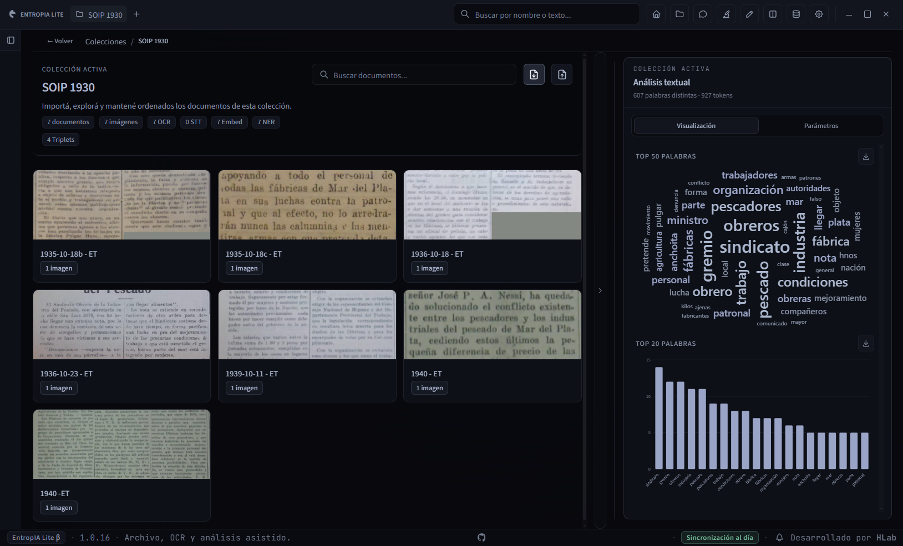

Este manual acompaña el recorrido completo: **preparar el espacio de trabajo → reunir fuentes → obtener y revisar texto → buscar y analizar → investigar → escribir con citas → exportar**. No necesitás configurar todas las funciones para empezar.

> **Cómo leer las imágenes.** Las capturas muestran EntropIA Lite con un corpus de ejemplo; tus títulos, recuentos y resultados serán diferentes. Los recortes están identificados como «Detalle» y conservan la interfaz original. Los diagramas explican procesos, no representan pantallas. En la edición web, pulsá cualquier imagen para abrirla a tamaño completo en otra pestaña.

### Elegí tu recorrido

| Quiero… | Empezar por… |
|---|---|
| Usar EntropIA por primera vez | [Inicio rápido](#capitulo-1-inicio-rapido). |
| Configurar OCR, audio o asistencia de IA | [Proveedores y configuración](#capitulo-16-configuracion-y-herramientas-generales). |
| Ordenar un archivo y extraer texto | [Colecciones](#capitulo-4-crear-y-organizar-un-corpus) y [OCR / transcripción](#capitulo-6-obtener-texto-de-documentos). |
| Encontrar evidencia y comparar fuentes | [Búsquedas](#capitulo-7-buscar-informacion), [análisis](#capitulo-8-analizar-documentos-y-colecciones) e [Investigación](#capitulo-10-investigacion). |
| Redactar con notas y bibliografía | [Escritura](#capitulo-11-escritura) y [Zotero](#capitulo-12-zotero). |
| Conservar o compartir resultados | [Exportar y descargar](#capitulo-17-exportar-y-descargar). |
| Resolver un problema | [¿Qué hago si…?](#capitulo-19-que-hago-si). |

## Índice

- [1. Inicio rápido](#capitulo-1-inicio-rapido)
- [2. Introducción a EntropIA Lite](#capitulo-2-introduccion-a-entropia-lite)
- [3. Conceptos básicos](#capitulo-3-conceptos-basicos)
- [4. Crear y organizar una colección de documentos](#capitulo-4-crear-y-organizar-un-corpus)
- [5. Trabajar con documentos, páginas y archivos](#capitulo-5-trabajar-con-documentos-y-assets)
- [6. Obtener texto de documentos](#capitulo-6-obtener-texto-de-documentos)
- [7. Buscar información](#capitulo-7-buscar-informacion)
- [8. Analizar documentos y colecciones](#capitulo-8-analizar-documentos-y-colecciones)
- [9. Notas y tópicos](#capitulo-9-notas-y-topicos)
- [10. Investigación](#capitulo-10-investigacion)
- [11. Escritura](#capitulo-11-escritura)
- [12. Zotero](#capitulo-12-zotero)
- [13. Chat y agentes de EntropIA](#capitulo-13-chat-y-agentes-de-entropia)
- [14. Procesamiento por lotes](#capitulo-14-procesamiento-por-lotes)
- [15. Sincronización y nube](#capitulo-15-sincronizacion-y-nube)
- [16. Configuración y herramientas generales](#capitulo-16-configuracion-y-herramientas-generales)
- [17. Exportar y descargar](#capitulo-17-exportar-y-descargar)
- [18. Ejemplos paso a paso](#capitulo-18-ejemplos-paso-a-paso)
- [19. ¿Qué hago si…?](#capitulo-19-que-hago-si)
- [20. Consejos y buenas prácticas](#capitulo-20-consejos-y-buenas-practicas)
- [21. Glosario](#capitulo-21-glosario)

---

## Capítulo 1. Inicio rápido

Si es la primera vez que utilizás EntropIA Lite, empezá por acá. En este recorrido vas a crear una colección, importar un documento, obtener su texto y encontrar una palabra dentro del material.

### 1.1. Qué vamos a hacer

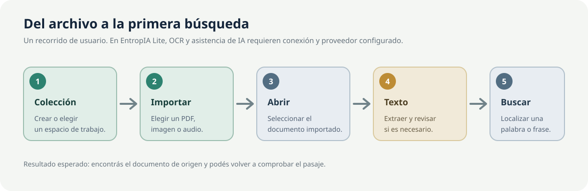

Elegí un PDF escaneado o una imagen **PNG o JPG** que puedas usar como ejemplo. Si contiene información privada, elegí otro archivo para probar: al pedir el reconocimiento de texto, EntropIA envía la página o imagen al servicio GLM-OCR por Internet.

**Antes de empezar:** para reconocer texto en imágenes o PDF, Lite necesita conexión a Internet y una clave de acceso de GLM-OCR. Si ya está configurada, seguí con el paso 1. Si no, abrí **Configuración → APIs remotas → GLM-OCR**, pegá la clave, pulsá **Probar conexión** y luego **Guardar cambios**. La clave se obtiene en la cuenta del proveedor; EntropIA no crea esa cuenta por vos. Más detalles en [Configuración](#capitulo-16-configuracion-y-herramientas-generales).

### 1.2. Conocer la pantalla principal

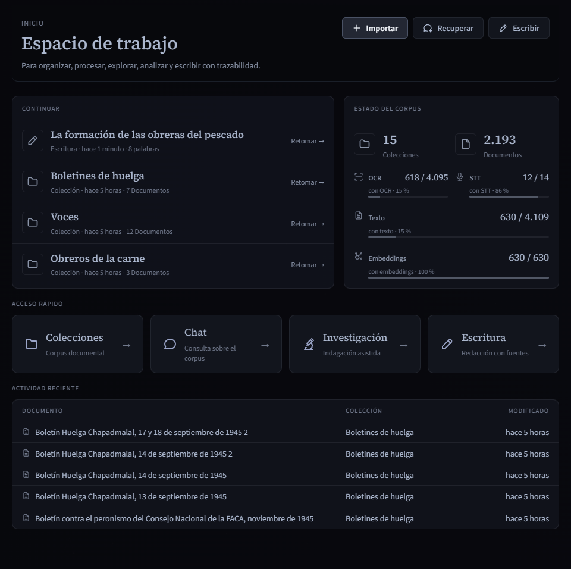

Al abrir EntropIA llegás a **Inicio → Espacio de trabajo**, no directamente a la lista de colecciones. Desde ahí podés:

- **Importar:** abrir **Importar fuentes**, elegir una colección de destino o crear una y seleccionar archivos.
- **Recuperar:** comenzar una conversación nueva en el Chat para consultar el corpus. No restaura archivos ni copias de seguridad.
- **Escribir:** crear un manuscrito o retomar el que sigue vacío y sin título.
- **Continuar → Retomar:** volver a trabajos recientes.
- **Estado del corpus:** consultar cuántas colecciones y documentos tenés y el avance de OCR, STT, texto y embeddings. Los porcentajes indican procesamiento, no exactitud ni cobertura completa de un tema.
- **Acceso rápido:** entrar en **Colecciones**, **Chat**, **Investigación** o **Escritura**.
- **Actividad reciente:** abrir documentos modificados recientemente. Si hay un lote activo, su indicador permite ir a **Ver lote**.

En un espacio vacío, **Empezá con EntropIA** ofrece importar fuentes o crear una colección. Para orientarte en las demás pantallas, reconocé estas zonas:

1. **Barra superior:** pestañas de trabajo, **Abrir nueva pestaña**, **Vista dividida**, búsqueda general y accesos a **Inicio**, **Colecciones**, **Chat de investigación**, **Agente de investigación**, **Escritura**, **Base de datos** y **Configuración**. Los botones con solo un ícono muestran su nombre al pasar el cursor. El tema, el idioma y el zoom de interfaz se ajustan en **Configuración → Apariencia**.
2. **Explorador:** colecciones y, dentro de ellas, documentos y páginas o archivos. En una sola pantalla queda a la izquierda. En vista dividida se abre encima del panel activo.
3. **Área de trabajo:** lo que muestra la pestaña activa. Puede ser Inicio, una colección, un documento u otra herramienta.
4. **Paneles:** herramientas que cambian según la vista. En un documento aparecen **Notas**, **Texto**, **Análisis**, **Mapa**, **Búsquedas**, **Layout** (estructura de la página) y **Metadatos** (datos descriptivos del archivo).
5. **Barra inferior:** versión y, cuando corresponde, estados de sincronización, lotes y notificaciones.

### 1.3. Crear o seleccionar una colección

Una colección es el espacio donde vas a reunir fuentes de un mismo proyecto, tema o fondo documental.

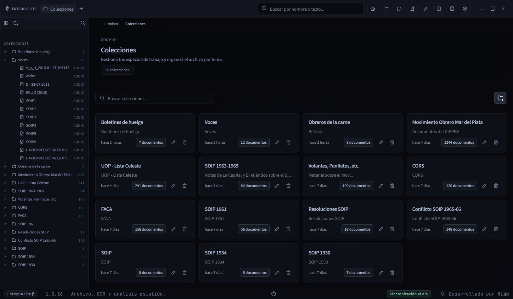

1. En **Colecciones**, pulsá el botón **Nueva colección**. También podés usar el botón con forma de carpeta y signo más del explorador lateral.
2. Escribí un nombre en **Nombre de la colección**. Por ejemplo: `Prensa local, 1930–1940`.
3. Si querés, agregá una **Descripción (opcional)**. Podés dejarla vacía.
4. Pulsá **Crear colección**.
5. Comprobá que aparece la nueva tarjeta en la pantalla. Pulsá su nombre para abrirla.

Si ya existe una colección adecuada, abrila en lugar de crear otra.

### 1.4. Importar el primer documento

1. Dentro de la colección, pulsá el botón **Importar documento**. También podés arrastrar archivos desde el Explorador de Windows y soltarlos sobre la colección.
2. En el selector de archivos, elegí uno o varios PDF, imágenes o audios admitidos y confirmá.
3. Esperá a que termine la importación. La sección **Resumen de importación** muestra el avance y luego indica cuántos archivos se importaron, omitieron o fallaron.
4. Revisá la lista de documentos; el título inicial se basa en el nombre del archivo.
5. Seleccioná un documento de la lista para abrirlo.

Si importás un único archivo correctamente desde una colección, puede abrirse directamente. Con varios archivos o incidencias, revisá la colección y el resumen. No hace falta volver a importarlo para abrirlo.

La importación **no** ejecuta OCR ni transcribe audio automáticamente. La lista completa de formatos aparece en [Crear y organizar una colección de documentos](#capitulo-4-crear-y-organizar-un-corpus).

**Alternativa desde Inicio:** pulsá **Importar**, elegí **Destino** o **+ Nueva colección**, completá el nombre si corresponde y pulsá **Elegir archivos**. Si cancelás el selector de archivos, no se crea la colección nueva. Al finalizar sin incidencias, se abre la colección; si hubo duplicados, archivos omitidos o errores, revisá el resumen y pulsá **Ir a la colección**. Durante la importación, esperá a que termine antes de cerrar.

### 1.5. Abrir el documento

1. En la colección, seleccioná la tarjeta del documento.
2. Para recorrer sus páginas o archivos asociados, usá **Página anterior** y **Página siguiente** en el panel del visor o el explorador lateral.
3. En imágenes y PDF, usá los controles de zoom del visor para acercarte o alejarte. Si toda la interfaz se ve pequeña, ajustá **Configuración → Apariencia → Zoom**; es un ajuste diferente del zoom de la página.
4. En el panel derecho, seleccioná la pestaña **Texto** para trabajar con el texto asociado a la página abierta.

### 1.6. Obtener el texto

Si ya hay texto procesado, elegí **Texto extraído** para verlo. Si todavía no hay texto, el documento no aparece automáticamente por el solo hecho de importarlo.

1. Con un PDF o una imagen **PNG/JPG** abierto, elegí **Texto** en el panel derecho.
2. Pulsá **OCRH** para reconocer las palabras visibles en la página y esperá a que termine.
3. El reconocimiento remoto usa GLM-OCR y necesita conexión y una clave válida. En PDF, EntropIA intenta aprovechar primero el texto digital de la página cuando tiene calidad suficiente; no implica que Lite incluya OCR local.
4. Cuando aparezca el resultado, comparalo con la página original.

> El reconocimiento de texto convierte las palabras visibles en texto digital que EntropIA puede buscar y analizar. La lectura automática puede equivocarse; la página original sigue siendo la referencia.

### 1.7. Revisar el resultado

- Confirmá que el texto corresponde a la página seleccionada.
- Revisá nombres propios, fechas, números y palabras partidas entre líneas.
- Para corregir a mano, abrí **Texto** a la derecha y desplegá **Texto extraído**. El cambio se guarda automáticamente.
- Si usaste **OCRC**, la corrección ya reemplazó el texto. Para volver al original, abrí **Texto extraído** sobre el visor y usá **Restaurar OCR original**. Antes de hacerlo, conservá aparte cualquier corrección manual que quieras mantener.

### 1.8. Hacer la primera búsqueda

1. Escribí una palabra que veas en el texto en la búsqueda de la barra superior.
2. Esperá a que aparezcan resultados y elegí el documento correcto. La búsqueda general puede encontrar materiales de distintas colecciones.
3. Para encontrar palabras que ya aparecen en el texto, elegí **Búsquedas → Buscar por texto similar (FTS)**. Esta opción compara palabras; no busca por significado.
4. Si el texto recién reconocido no aparece, abrí **Análisis** en ese documento y pulsá **INDEX** para prepararlo para la búsqueda. Volvé a buscar cuando termine.
5. Abrí el resultado y comprobalo en el texto o en la imagen original.

### 1.9. Primer flujo completado

**Creaste o elegiste una colección → importaste un documento → obtuviste texto → revisaste el resultado → encontraste una palabra.**

Ya conocés el recorrido básico. Para ampliar cada paso, seguí con [organizar tus colecciones](#capitulo-4-crear-y-organizar-un-corpus), [OCR y transcripción](#capitulo-6-obtener-texto-de-documentos) y [búsquedas](#capitulo-7-buscar-informacion).

### 1.10. Inicio rápido visual

**1. Colección → 2. Importar → 3. Abrir → 4. Texto/OCRH → 5. Revisar → 6. Buscar**

Si no hay resultados, comprobá que el texto esté guardado y usá **Análisis → INDEX** para prepararlo. Si OCRH falla, revisá la conexión y la clave en **Configuración → APIs remotas**.

### 1.11. Trabajar con varias pantallas

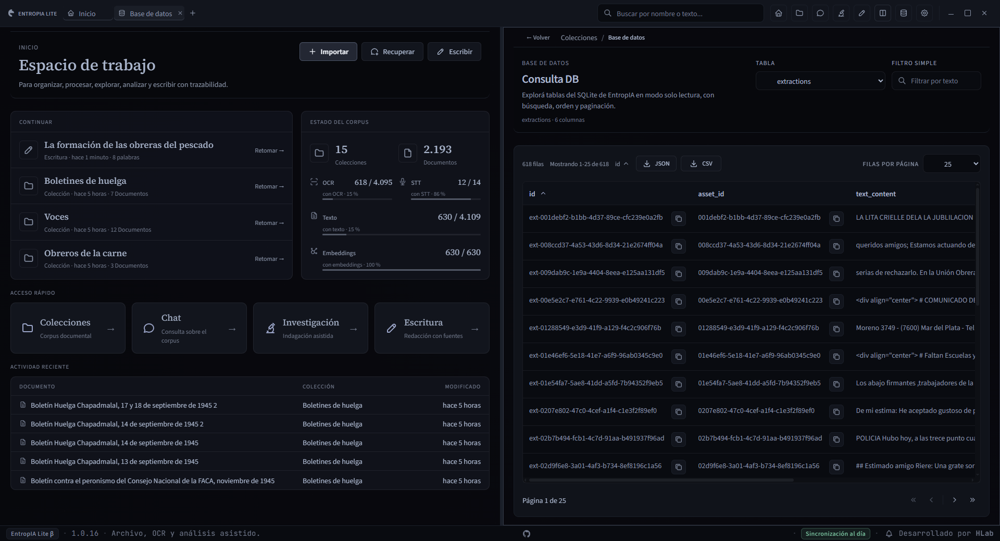

Podés tener hasta **4 pestañas**. Cada una recuerda su propio recorrido: **← Volver** en una no cambia las demás.

1. Pulsá **Abrir nueva pestaña**, el signo más junto a las pestañas. La nueva se abre en **Inicio**.
2. Elegí una pestaña por su nombre para volver a esa pantalla. El nombre sigue lo que esté abierto: una colección, un documento o una herramienta.
3. Si hay más de una, pasá el cursor sobre la pestaña y pulsá **Cerrar pestaña**. La última no se puede cerrar.
4. Al llegar a 4, el signo más se desactiva y muestra **Límite de 4 pestañas alcanzado**.

**Vista dividida** muestra dos pestañas al mismo tiempo:

1. Pulsá **Vista dividida** en la barra superior.
2. Si todavía no hay 4 pestañas, EntropIA abre una de Inicio al lado de la actual. Si ya hay 4, empareja la activa con la vecina.
3. Arrastrá la división para cambiar el tamaño. Cada lado conserva al menos el 40 % del espacio y un ancho mínimo de 480 píxeles. Un doble clic la devuelve al medio. Con el teclado, usá las flechas.
4. Si la ventana queda demasiado angosta, se muestra solo la pestaña activa; los paneles no se apilan. Ampliá la ventana para ver ambos otra vez. Si todavía no activaste la división, el botón puede estar deshabilitado hasta que haya ancho suficiente.
5. Pulsá otra vez **Vista dividida** para volver a una sola pantalla. Las dos pestañas siguen abiertas.

En vista dividida, el explorador no ocupa una columna fija. Abrilo con **Abrir explorador de documentos**: aparece sobre el panel activo y no achica el otro. **Cerrar explorador (Esc)** o la tecla Esc lo oculta. Al cambiar de pestaña o salir de Colecciones, también se cierra.

Si la ventana se estrecha y solo queda visible la pestaña activa, el explorador recupera su comportamiento lateral de una sola pantalla.

**Escritura** puede estar abierta en una sola pestaña. Si la pedís desde otra, EntropIA te lleva a la que ya la tiene. Si una pestaña llega a Escritura mientras otra la está usando, verás **Escritura está abierta en otra pestaña** y el botón **Ir a esa pestaña**.

Si eliminás una colección, un documento o una página, desaparece de todas las pestañas que lo tenían abierto.

---

## Capítulo 2. Introducción a EntropIA Lite

EntropIA Lite es una aplicación de escritorio para reunir materiales, reconocer texto, buscar información, tomar notas, analizar fuentes y redactar a partir de tus documentos.

Tus notas y archivos se guardan en este equipo. Para reconocer texto, transcribir audio y usar algunas funciones de inteligencia artificial, EntropIA se conecta por Internet a otros servicios. Esas tareas necesitan una clave de acceso válida.

Un flujo habitual es:

**Organizar fuentes → importar → obtener texto si hace falta → revisar → buscar o analizar → registrar notas → redactar → exportar.**

Las respuestas y resúmenes automáticos son ayudas para el trabajo. Comprobá siempre las citas, nombres, fechas y conclusiones en las fuentes originales. EntropIA no reemplaza la lectura crítica ni las reglas de citación de tu institución.

### 2.1. Qué necesitás para cada tarea

| Tarea | Sin servicios de IA | Servicio adicional |
|---|---|---|
| Crear colecciones, importar, consultar archivos locales, tomar notas y escribir | Sí. | Ninguno para estas tareas. |
| Buscar palabras y contar frecuencias sobre texto ya guardado | Sí. | Primero necesitás disponer del texto. |
| Reconocer texto de imágenes o PDF con OCRH | No. | Internet y una clave de GLM-OCR / z.ai. |
| Transcribir audios o dictar | No. | Internet y AssemblyAI; permiso de micrófono para dictado. |
| Corregir, resumir, generar embeddings y usar Chat o agentes | No. | Internet y OpenRouter con modelos disponibles para tu cuenta. |
| Consultar Zotero | No necesita IA. | Zotero abierto en este equipo y comunicación local habilitada. |
| Sincronizar entre equipos | No necesita IA. | Internet y una cuenta de sincronización. Es opcional. |

Las cuentas de proveedores y la cuenta de sincronización son independientes. El uso de servicios remotos puede tener costos o límites del proveedor; una clave no equivale a uso ilimitado. **Lite no instala los motores locales de IA de Pro**.

### 2.2. Preparar una sesión de trabajo segura

1. Conservá una copia externa de las fuentes originales.
2. Configurá solo el proveedor que necesitás y probá con un archivo no sensible.
3. Importá una muestra pequeña y comprobá su texto antes de procesar muchas páginas.
4. Antes de cerrar, esperá que terminen las tareas importantes y que Escritura indique **Guardado**.
5. Exportá los resultados que necesites conservar fuera de EntropIA. La exportación y la sincronización tienen alcances distintos; ver [capítulo 17](#capitulo-17-exportar-y-descargar).

---

## Capítulo 3. Conceptos básicos

| Concepto | Qué significa en la práctica |
|---|---|
| **Colección** | Un espacio para agrupar materiales de un tema, proyecto o fondo. |
| **Documento** o **ítem** | La ficha que aparece en una colección para representar un archivo. En algunos avisos de la interfaz aparece la palabra «ítem». |
| **Asset** | En algunos controles aparece «asset»: se refiere a una página o archivo dentro de un documento. |
| **Corpus** | El conjunto de documentos y colecciones que reunís para trabajar. |
| **Texto extraído** | Texto digital obtenido de una página, una imagen o un audio. No se crea solo al importar. |
| **OCR** | Reconocimiento de las palabras visibles en una imagen o PDF escaneado. En Lite se solicita por Internet. |
| **Transcripción** | Texto generado a partir de las palabras de un audio. En Lite se solicita por Internet. |
| **Metadatos** | Datos que describen un archivo, como su nombre, tipo y otros campos. |
| **Tópico** | Una etiqueta para clasificar un documento, por ejemplo `migración` o `vivienda`. |
| **Nota** | Una observación de investigación asociada a un documento o una página. |
| **Búsqueda de texto (FTS)** | Encuentra términos y puede incluir variantes de escritura próximas; no interpreta el significado ni busca sinónimos. |
| **Embeddings** | Una forma de representar el texto para que EntropIA compare páginas o archivos que tratan temas parecidos. Se usa con **EMBED** y **Assets similares**. |
| **Recuperación** | Selección de pasajes de tus documentos que el Chat puede usar para preparar una respuesta. |
| **Pestaña** | Una pantalla de trabajo independiente. Podés tener hasta cuatro, y cada una conserva su recorrido. |
| **Vista dividida** | Dos pestañas visibles al mismo tiempo, separadas por una división que podés mover. |

---

## Capítulo 4. Crear y organizar una colección de documentos

### 4.1. Crear, buscar y mantener colecciones

En **Colecciones** podés crear un espacio, buscarlo por nombre, editarlo o eliminarlo.
Las tarjetas muestran recuentos resumidos. Al abrir una colección, el panel de estadísticas ayuda a revisar el contenido registrado.

- **Buscar colecciones...** filtra los nombres de las colecciones.
- En una tarjeta, usá el control de edición para cambiar el nombre o la descripción y **Guardar**. **Cancelar** descarta los cambios del formulario.
- El explorador también permite filtrar colecciones, contraer el panel y crear una nueva. En una sola pantalla, **Ctrl+B** lo oculta o lo muestra. En vista dividida se abre encima del panel activo; el uso completo está en [pestañas y vista dividida](#pestanas-y-vista-dividida).
- No hay controles para ordenar manualmente las colecciones.
- Importar otro archivo crea un documento nuevo; no hay una acción para anexarlo a un documento existente.

> **Atención:** eliminar una colección borra sus documentos y datos asociados. Confirmá el nombre y exportá la información que necesites antes de aceptar. No hay una acción de deshacer.

### 4.2. Importar archivos

Dentro de una colección, pulsá **Importar documento** o arrastrá los archivos sobre ella. Se permite seleccionar varios archivos.

| Tipo | Extensiones que se pueden importar |
|---|---|
| PDF | `.pdf` |
| Imágenes | `.png`, `.jpg`, `.jpeg`, `.webp`, `.tiff`, `.tif` |
| Audio | `.wav`, `.mp3`, `.flac`, `.m4a`, `.aac`, `.ogg` |

EntropIA no importa directamente archivos `.txt`, documentos de Office ni el archivo JSON exportado desde una colección. Que un archivo se pueda importar no significa que sirva para reconocer texto: OCRH reconoce imágenes PNG/JPG/JPEG y PDF.

Cada archivo importado se guarda como una copia en este equipo; el original que elegiste no cambia. Un PDF de varias páginas se abre hoja por hoja para elegir cuál consultar. Si importás otra vez el mismo archivo sin cambios, EntropIA puede omitirlo porque ya lo agregaste. Si ese archivo ya se está importando en la misma colección, espera a la primera operación: si queda guardado, la segunda no crea otro documento.

Durante la importación, **Resumen de importación** informa qué archivo se procesa, el avance y cuántos se importaron, omitieron o presentaron un error. Leé los nombres rechazados o el mensaje antes de volver a intentarlo.

**Comprobación:** el documento tiene que aparecer en la colección y abrirse en el visor. Un archivo omitido por duplicado no es un OCR fallido: son etapas diferentes. Si parte de la importación falla, revisá el resumen antes de repetir la selección completa.

### 4.3. Organizar fuentes

Una organización sencilla puede ser:

- **Colección:** `Entrevistas sobre vivienda`.
- **Documento:** una entrevista, una fotografía o un informe.
- **Página o archivo:** el audio, la imagen o una hoja concreta de un PDF.
- **Texto:** texto reconocido en una página o palabras transcritas desde un audio.

Usá nombres de archivo claros antes de importarlos: el título inicial del documento se basa en ese nombre. No hay una opción para mover documentos entre colecciones ni para ordenar sus páginas manualmente.

### 4.4. Buscar dentro de una colección

En la colección, **Buscar documentos...** consulta nombres, datos y contenido indexado, no solo las tarjetas visibles. Puede mostrar coincidencias de escritura próximas identificadas como **Aproximado**. La lista carga más documentos al desplazarte. Para buscar en distintas colecciones, usá la barra superior o **Búsquedas**; ver [capítulo 7](#capitulo-7-buscar-informacion).

### 4.5. Exportar una colección

El botón **Exportar JSON** guarda datos de la colección y sus documentos, textos y análisis, pero no incluye los PDF, imágenes o audios originales. No podés usar ese archivo para reconstruir la colección en EntropIA. Conservá por separado los archivos originales. Ver [Exportar y descargar](#capitulo-17-exportar-y-descargar).

### 4.6. Leer los indicadores de una colección

La cabecera resume documentos, tipos de archivo y resultados como **OCR**, **STT**, **Embed**, **NER** y **Triplets**. Usalos para orientarte antes de procesar; no sustituyen la revisión de cada página. La nube y el gráfico de palabras pertenecen a **Análisis textual**, explicado en el [capítulo 8](#capitulo-8-analizar-documentos-y-colecciones).

---

## Capítulo 5. Trabajar con documentos, páginas y archivos

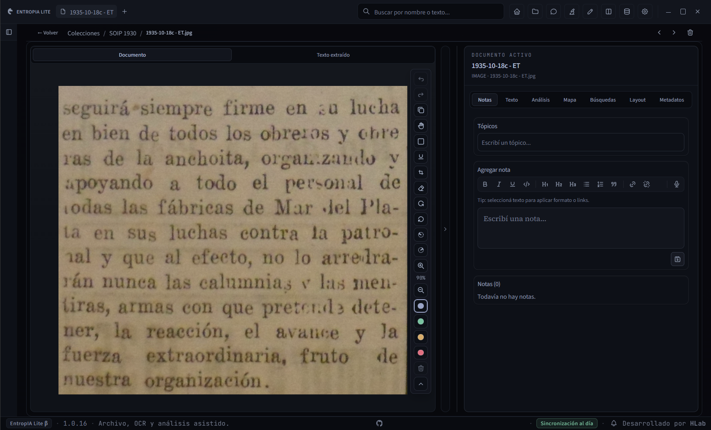

### 5.1. Abrir y recorrer un documento

Al abrir una tarjeta, el área principal muestra el visor y el panel de trabajo. Si un documento tiene varias páginas o archivos asociados, seleccioná la página o el archivo que necesitás en el explorador y usá **Página anterior**/**Página siguiente** para moverte.

Cada pestaña tiene su propia ruta, encima del contenido. Desde ahí podés usar **← Volver**, volver a **Colecciones** o a la colección actual y, con un documento abierto, **Documento anterior** y **Documento siguiente**. Esos controles pertenecen a esa pestaña.

### 5.2. Visor de PDF e imágenes

En la pestaña **Documento**, usá las herramientas disponibles según el tipo de página o archivo:

- **Mover imagen (mano):** desplazar la vista.
- **Acercar** y **Alejar:** cambiar el zoom del visor.
- **Herramienta de anotación rectangular** y **Herramienta de subrayado:** agregar marcas a la página.
- **Color de anotación:** elegir el color de la marca.
- **Recortar a la selección:** recortar la zona seleccionada.
- **Borrar región (relleno blanco):** cubrir con blanco la zona elegida.
- **Rotar 90° a la izquierda/derecha** y **Rotación fina**: orientar la página con el giro deseado.
- **Duplicar asset:** crear una copia de la imagen o del PDF antes de continuar una edición.
- **Deshacer última edición** y **Rehacer última edición:** recorrer cambios recientes del visor.
- **Eliminar anotación seleccionada:** quitar la anotación marcada.

Las anotaciones se guardan con el documento. Para conservar una versión sin cambios, duplicá la página o archivo antes de recortarlo o modificarlo. Estas herramientas no corrigen errores del texto reconocido; revisalo por separado en **Texto**.

### 5.3. Reproductor de audio

Para escuchar un audio, usá **Reproducir/Pausar**, la barra de posición, los saltos de **5 segundos** y el control de volumen. En la barra de posición, las flechas retroceden o avanzan 5 segundos; Inicio y Fin van a los extremos. Si falla la reproducción, distinguí un formato no compatible de un archivo movido o eliminado fuera de EntropIA. Conservá el original antes de probar una conversión.

### 5.4. Panel derecho del documento

- **Notas:** tópicos y observaciones ligadas al documento o a la página.
- **Texto:** acciones OCR/STT, corrección, resumen y campos editables de texto reconocido o transcripción.
- **Análisis:** preparar texto para búsquedas, reconocer nombres y proponer relaciones.
- **Mapa:** lugares asociados al documento.
- **Búsquedas:** encontrar palabras o explorar materiales parecidos.
- **Layout:** estructura detectada en la página, como títulos, texto, tablas y figuras.
- **Metadatos:** datos descriptivos del archivo y campos que podés completar.

Podés ocultar el panel derecho y volver a mostrarlo con el control lateral.

**No confundas las dos entradas de texto:** **Texto extraído**, encima del visor, muestra el contenido digital; **Texto**, dentro del panel derecho, reúne las acciones para obtenerlo y trabajar con él. Si ves la imagen pero no los botones de OCR, abrí el panel derecho y elegí **Texto**.

**Copiar**, **Descargar** y **Restaurar OCR original** están en **Texto extraído sobre el visor**, para imágenes y PDF. El audio muestra allí su transcripción, pero no ofrece ese menú de descarga.

### 5.5. Layout y metadatos

**Layout** muestra la estructura de una imagen o página PDF. La pestaña puede estar vacía si aún no hay secciones detectadas; la superposición se deshabilita sin datos. No hay layout de audio. Cuando hay resultados, podés filtrar **Todos**, **Títulos**, **Texto**, **Tablas**, **Figuras** o **Notas**. Seleccioná una sección para ubicarla en la página y ver sus detalles; desde el inspector podés copiar el texto, la ubicación o los datos en formato JSON. No modifica ni verifica la exactitud del OCR.

En **Metadatos**, consultá los datos del archivo. **Metadatos personalizados** permite agregar un campo, editar su valor o quitarlo. No cambia el archivo original.

### 5.6. Eliminar un documento o una página

La papelera de una tarjeta elimina el documento completo y sus archivos y datos asociados. El control **Eliminar página activa**, junto a la ruta de esa pestaña, elimina solo la página o archivo seleccionado. La eliminación también lo quita de las otras pestañas que lo tenían abierto.

> **Atención:** antes de eliminar, revisá el nombre y la confirmación. Si la página o archivo está citado en Escritura, EntropIA avisa: la cita conserva el pasaje guardado, pero deja de poder abrir la fuente original. La eliminación no reemplaza una copia externa del archivo.

---

## Capítulo 6. Obtener texto de documentos

El texto permite buscar y analizar lo que aparece en una página o se dice en un audio. **La importación no inicia automáticamente esta tarea.** Abrí el documento y elegí **Texto**.

### 6.1. OCR de PDF o imagen

1. Seleccioná un PDF o una imagen compatible.
2. Abrí **Texto** y pulsá **OCRH**.
3. Esperá a que finalice la solicitud.
4. Leé el resultado y contrastalo con la página original.
5. Corregí manualmente los errores relevantes si hace falta.

En Lite, el reconocimiento remoto usa GLM-OCR y necesita una clave configurada en **Configuración → APIs remotas**. No está disponible el motor local **OCRL** de Pro. En PDF, EntropIA intenta primero extraer el texto digital de cada página; si tiene calidad suficiente, puede guardarlo como texto nativo sin reconocimiento remoto. El inicio manual de OCRH sigue requiriendo la clave configurada.

Aunque se pueden importar archivos WebP/TIFF/TIF, GLM-OCR no acepta esos formatos de imagen. Convertí una copia a PNG/JPG antes de reconocerla. Cambiar solo la extensión del archivo no convierte su contenido.

### 6.2. Corregir o resumir el texto

| Acción visible | Para qué sirve | Requisito |
|---|---|---|
| **OCRC** | Reemplazar el texto extraído por una corrección automática. No pide aceptación previa. Revisá el resultado. | Texto disponible y OpenRouter configurado. |
| **OCRR** o **Resumen** | Generar una síntesis del texto disponible. | OpenRouter configurado. |
| **Restaurar OCR original** | Volver al texto OCR original disponible después de una corrección. | Que exista un original recuperable. |

La corrección y el resumen pueden omitir datos o cambiar el sentido. **OCRC aplica el resultado al terminar**; el resumen se muestra por separado. Compará nombres, cifras y citas con el documento. Para revertir OCRC, abrí **Texto extraído** sobre el visor y usá **Restaurar OCR original**. Si editaste el texto a mano después de corregirlo, preservá primero lo que quieras conservar.

### 6.3. Transcribir audio

1. Abrí el audio y comprobá que se pueda reproducir.
2. En el panel **Texto**, elegí **STT** para convertir la voz en texto.
3. Esperá la transcripción y revisá el texto junto al audio.
4. Corregí errores de nombres, turnos de habla o palabras dudosas.
5. Si está disponible, pedí un **Resumen** del texto transcripto.

En **Configuración → APIs remotas → AssemblyAI**, **Identificación de hablantes en audio de colección** permite activar o desactivar la separación de intervenciones. Revisá las atribuciones escuchando el audio: identificar turnos no confirma la identidad de una persona. Esta preferencia se aplica a **STT** de audios importados, no al dictado del editor.

En Lite, la transcripción usa AssemblyAI y requiere Internet y una clave de acceso. El audio necesario para la tarea se envía a ese servicio. El dictado por micrófono también lo utiliza. **Resumir la transcripción es otra tarea y necesita OpenRouter**, además de disponer del texto.

### 6.4. Comprobar, copiar y descargar

1. Seleccioná la página o el audio y abrí **Texto** en el panel derecho.
2. Desplegá **Texto extraído** o **Transcripción** para editar. Los cambios se guardan tras dejar de escribir; también pueden actualizar la preparación para búsquedas y embeddings, que en Lite utiliza OpenRouter.
3. Para leer el resultado con formato, elegí **Texto extraído** sobre el visor izquierdo.
4. En **imágenes y PDF con texto OCR**, usá allí **Copiar** o **Descargar → Markdown / PDF / Word (.docx)**.

**Audio:** esa vista permite leer la transcripción, pero no tiene el menú de descarga anterior. Para conservarla fuera de EntropIA, seleccioná y copiá manualmente el texto del campo editable a un archivo propio. Conservá también el audio original.

Si hay bloques de layout disponibles, consultalos en **Layout**. No es una verificación de exactitud: revisá la imagen original.

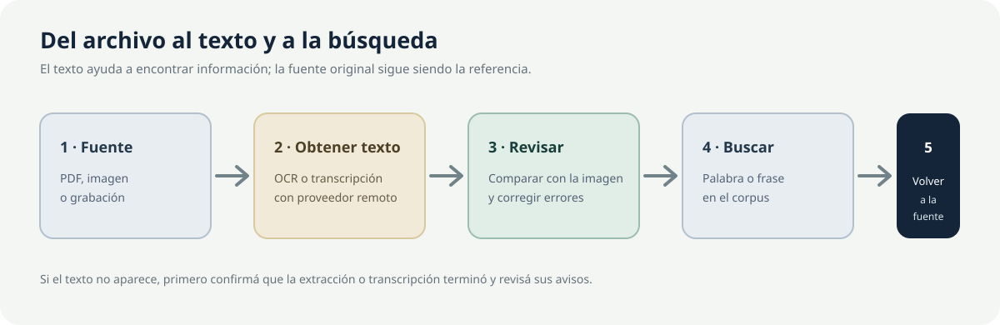

### 6.5. Si el texto no aparece

- Comprobá que abriste la página o el audio correctos y que la tarea terminó.
- Revisá el mensaje del servicio en **Texto**.
- Para buscar contenido, comprobá si hace falta **Análisis → INDEX**.
- Si el servicio no responde, revisá su clave y conexión en **Configuración → APIs remotas**.
- Si una foto está oscura, inclinada o borrosa, conservá el original y probá con una copia más clara y derecha.

---

## Capítulo 7. Buscar información

EntropIA tiene varias búsquedas. Elegí la que corresponda; no todas buscan lo mismo.

| Dónde | Qué busca | Cuándo usarla |
|---|---|---|
| **Buscar colecciones...** | Nombres de colecciones. | Encontrar un espacio de trabajo. |
| **Buscar documentos...** | Nombres, datos y contenido indexado de la colección abierta; puede incluir variantes aproximadas. | Localizar fuentes dentro de una colección. |
| **Búsqueda superior** | Hasta 20 documentos por nombre, metadatos o texto indexado del conjunto de colecciones. | Encontrar uno o varios términos y abrir un documento. |
| **Búsquedas → Buscar por texto similar (FTS)** | Hasta 10 documentos de distintas colecciones, mediante términos y posibles variantes de escritura. | Buscar contenido léxico, no formular una pregunta al modelo. |
| **Assets similares** | Hasta 5 páginas o archivos relacionados con el seleccionado, con porcentaje de semejanza y vista previa. | Explorar fuentes por contenido parecido. |
| **Chat de investigación** | Responde preguntas sobre texto reconocido en tus documentos y puede mostrar las fuentes. | Pedir una explicación que puedas comprobar en las fuentes. |
| **Investigar** | Desarrolla una pregunta de investigación a partir de colecciones seleccionadas y prepara un informe con fuentes. | Explorar una pregunta amplia paso a paso. |

### 7.1. Buscar una palabra o varios términos

1. Escribí un término en la búsqueda superior o en **Búsquedas**.
2. Revisá los títulos. En **Búsquedas** del documento, la colección se comprueba al abrir el resultado; no siempre figura en la lista.
3. Abrí el resultado y comprobá el fragmento en el documento original.
4. Si un OCR produjo una variante, probá también otras grafías o una parte distintiva de la frase.

La búsqueda léxica compara términos del título, los datos o el texto indexado y puede incluir variantes ortográficas próximas. Si no encuentra todos los términos juntos, puede ampliar a coincidencias parciales. **No equivale a buscar sinónimos ni a interpretar una pregunta.** Las comillas no garantizan una frase literal y no se ofrecen operadores booleanos avanzados. Para buscar contenido, primero obtené el texto y, si no aparece, pulsá **Análisis → INDEX**.

En **Búsquedas → Buscar por texto similar (FTS)** pueden aparecer hasta 10 documentos; esta lista es distinta de los resultados de la búsqueda superior.

### 7.2. Buscar materiales parecidos

Para encontrar páginas o archivos parecidos, seleccioná uno con texto y pulsá **EMBED** en **Análisis**. Después abrí **Búsquedas** y revisá la sección **Assets similares**, que se carga al entrar: no es un botón adicional. La herramienta compara el contenido con otros materiales preparados. En Lite, generar embeddings necesita Internet y OpenRouter.

Prepará también los otros materiales que querés comparar. Si solo una página tiene embeddings, no alcanza para encontrar otras semejantes. Para procesar varias colecciones, usá [Lotes](#capitulo-14-procesamiento-por-lotes).

La vista previa permite leer el fragmento y, cuando está disponible, volver al documento de origen. La semejanza sirve como pista para revisar; no demuestra que dos fuentes digan lo mismo.

### 7.3. Llegar desde el resultado a la fuente

Al abrir un resultado, comprobá el título, la colección y la página o archivo. Usá la ruta de navegación para volver. Si necesitás una lista de citas y fuentes, consultá [Chat de investigación](#capitulo-13-chat-y-agentes-de-entropia) o [Investigar](#capitulo-10-investigacion).

> **Importante:** FTS es una búsqueda léxica que puede incluir variantes de escritura; **Assets similares** compara representaciones del contenido. Ninguna de las dos demuestra por sí sola que una fuente respalde una afirmación.

---

## Capítulo 8. Analizar documentos y colecciones

### 8.1. Acciones de análisis por documento

Abrí **Análisis** en el panel del documento. Los indicadores muestran si una acción está pendiente, en curso, completa o con error.

| Acción | Qué hace | Cuándo usarla y resultado |
|---|---|---|
| **INDEX** | Prepara el texto reconocido para que puedas encontrar sus palabras. | Usalo si no encontrás palabras que aparecen en el texto. Compara palabras, no busca sinónimos. |
| **EMBED** | Prepara una página o archivo con texto para compararlo con materiales parecidos. | Usalo antes de **Assets similares**. En Lite requiere OpenRouter y conexión a Internet. |
| **NER** | Propone nombres de personas, lugares, instituciones y fechas. | Revisá los resultados en **Entidades**; en Lite usa un servicio por Internet. |
| **TRIPLET** | Propone relaciones entre elementos; por ejemplo, quién hizo qué. | Revisá cada relación y corregí sus partes si es necesario. En Lite requiere OpenRouter. |

**INDEX** prepara el documento; **EMBED** trabaja con la página o archivo seleccionado. **NER** y los resúmenes usan la página seleccionada, o el documento cuando no hay selección. Primero obtené y revisá el texto. Un indicador inactivo no necesariamente significa que no existan resultados guardados: revisá también las listas antes de repetir una tarea.

### 8.2. Entidades, relaciones y mapa

En **Entidades** podés crear, editar o eliminar personas, organizaciones, lugares, fechas y otros elementos. Las propuestas de baja confianza pueden no mostrarse en la lista. En **Tripletas semánticas**, completá **sujeto**, **predicado** y **objeto**; ningún campo puede quedar vacío. Guardá con el control de confirmación o Enter y cancelá la edición con X o Esc. Para borrar una tripleta, el control pide confirmar con un segundo clic. Revisá cada relación contra la fuente.

La pestaña **Mapa** muestra lugares asociados al documento. Podés seleccionar un marcador, ajustar la ubicación y guardarla, o restablecerla cuando esté disponible. Ver el mapa y buscar lugares requiere Internet. Comprobá que cada lugar corresponda a la fuente.

### 8.3. Análisis textual de una colección

Dentro de una colección, abrí el panel lateral con **Mostrar análisis textual**. Este panel cuenta palabras de textos reconocidos y transcripciones guardadas; no genera resúmenes ni interpreta los documentos.

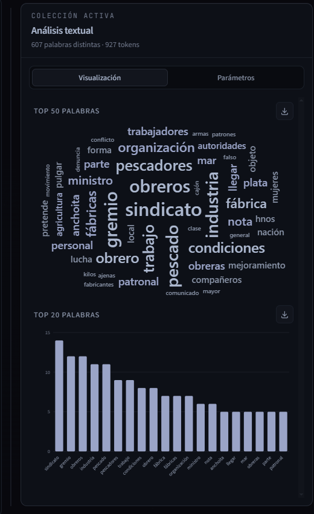

- **Visualización:** nube **Top N palabras** y gráfico **Top 20 palabras**. Cada gráfico puede descargarse como PNG.
- **Parámetros:** elegir entre 20 y 100 términos para la nube (50 inicialmente) y agregar **Stopwords personalizadas** separadas por espacios, comas o punto y coma. Estas preferencias se conservan por colección en este equipo.
- **Ocultar análisis textual:** cerrar el panel.

Si todavía no hay texto reconocido o transcripciones, la colección no tiene palabras para contar. Primero revisá el texto de sus documentos. El recuento usa los textos guardados en este equipo y no necesita una clave de IA.

**Lectura recomendada:** una palabra grande aparece muchas veces; no necesariamente es la idea más importante. Revisá **Parámetros** para excluir términos de relleno y contrastá los resultados con documentos concretos. Los errores de OCR también cuentan como palabras.

---

## Capítulo 9. Notas y tópicos

### 9.1. Clasificar con tópicos

En **Notas**, usá **Tópicos** para asignar palabras clave al documento, como `censo`, `trabajo` o `vida cotidiana`. Escribí un tópico y confirmalo con Enter o coma. Podés elegir sugerencias existentes y quitar un tópico con su control correspondiente.

### 9.2. Crear y editar notas

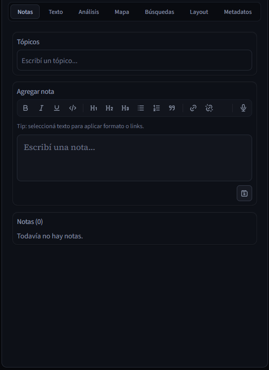

1. Abrí la página o el archivo al que se refiere tu observación.
2. En **Notas**, buscá el editor bajo el encabezado **Agregar nota**; ya está abierto, no hay que pulsar ese título.
3. Escribí en **Escribí una nota...** y usá el editor para aplicar negrita, cursiva, títulos, listas, citas o enlaces.
4. Pulsá **Guardar nota**.
5. Para leer una nota anterior, abrila en la lista. **Editar nota** permite cambiarla; **Eliminar nota** pide confirmación.

La nota nueva se asocia a la página o archivo activo; solo sin selección queda en el documento. Los tópicos clasifican el documento. Al cambiar de página, revisá sus notas. Para dictar, pulsá **Iniciar dictado**; necesitás permiso de micrófono y AssemblyAI configurado. Las notas requieren **Guardar nota**, a diferencia del guardado automático del manuscrito.

### 9.3. Reutilizar notas al escribir

En **Escritura → Notas**, buscá una nota, abrila y revisá su origen. **Insertar como texto** copia el contenido como texto independiente. **Insertar como vínculo** agrega un enlace para volver a consultarla. El panel busca notas de todos tus documentos; no permite limitar la búsqueda a las colecciones de un manuscrito.

Si la nota vinculada cambia o desaparece, Escritura muestra su estado y conserva el texto del manuscrito. Si la nota ya no existe, el vínculo no puede abrirla.

También podés seleccionar una frase del manuscrito y usar **Guardar la selección como nota**; luego elegís el documento al que corresponde. Esta acción crea una nota, no una cita bibliográfica.

---

## Capítulo 10. Investigación

**Investigar** permite plantear una pregunta, elegir colecciones y obtener un informe acompañado de fuentes. Es diferente de una búsqueda por palabra y del chat breve del capítulo 13.

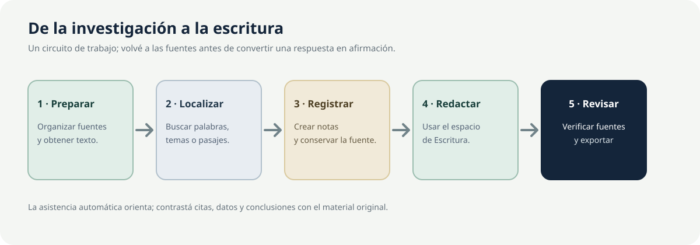

### 10.1. Crear una investigación

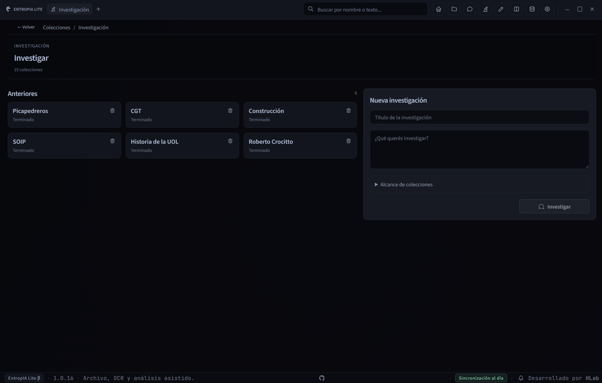

1. En la barra superior, abrí **Agente de investigación**; la página se titula **Investigar**.
2. En **Nueva investigación**, escribí una pregunta concreta y, si querés, un título.
3. Abrí **Alcance de colecciones**. EntropIA puede proponer las colecciones que ya tienen fragmentos; revisá la selección, agregá o quitá colecciones y usá **Seleccionar todas** si corresponde.
4. Seleccioná al menos una colección y pulsá **Investigar**.
5. El trabajo se abre automáticamente para seguir el proceso. Después podés retomarlo desde **Investigar → Anteriores**, seleccionando su tarjeta.

Prepará antes el texto y los fragmentos de tus documentos. El alcance debe incluir material procesado: **si todas las colecciones seleccionadas tienen cero fragmentos, la investigación no comienza**. Si solo parte del material está procesado, revisá las carencias de cobertura del informe.

### 10.2. Acompañar el proceso

Durante el trabajo, la vista puede pedir intervención:

- **Preguntas antes de armar el informe:** respondé al menos una; las vacías quedan como no respondidas. **Editar diseño** permite ajustar **Hipótesis**, **Alcance** y **Criterios de cierre**. Si editás el diseño, completá los tres apartados y al menos un criterio, uno por línea. Pulsá **Responder y seguir**.
- **Búsquedas antes de ir al corpus:** revisá por separado **Búsquedas** y **Consultas bibliográficas**. **Aprobar y buscar** acepta el plan; **Editar búsquedas** permite modificar una consulta por línea y **Guardar y buscar** inicia el plan modificado.
- **Pausar → Ajustar presupuesto:** permite cambiar **Llamadas LLM** y **Costo máximo**. No pueden ser inferiores a lo ya consumido. El costo vacío significa **Sin límite**. Pulsá **Guardar presupuesto** y luego **Continuar**.
- **Cancelar** detiene el trabajo, pero no lo borra. La pausa o cancelación puede esperar a que termine el paso en curso. Al reabrir la aplicación, los trabajos que estaban ejecutándose quedan pausados y requieren **Continuar**.

**Alcance del plan:** las búsquedas del corpus se limitan a las colecciones elegidas. Las **Consultas bibliográficas** pueden consultar Zotero local y **OpenAlex por Internet**; obtienen metadatos bibliográficos, no el texto completo de las obras. Si no querés ejecutarlas, vaciá ese campo antes de **Guardar y buscar**.

En Lite, **Investigar** necesita Internet y OpenRouter. La pregunta, respuestas de encuadre, contexto recibido del Chat y pasajes utilizados pueden enviarse al proveedor. Las consultas bibliográficas también salen hacia OpenAlex. Revisá el plan antes de aprobarlo si trabajás con material sensible.

### 10.3. Leer y comprobar el informe

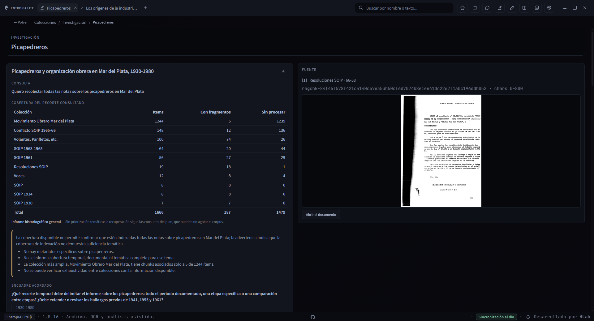

El informe puede incluir el planteo, cobertura por colección, hallazgos, limitaciones y **Fuentes citadas**. Revisá los avisos de fuentes sin texto o cobertura insuficiente.

1. Seleccioná una cita `[n]` para leer el pasaje y los datos de la fuente.
2. Usá **Abrir el documento** para regresar al material local cuando esté disponible.
3. Contrastá la afirmación con la página, el audio o el texto original. Una cita no garantiza que el informe haya interpretado bien la fuente.
4. **Editar → Guardar** cambia la sección manualmente. Queda marcada como **Editada por el historiador: el texto no pasó por la verificación**.
5. **Reescribir** abre **Indicación para el redactor**. Al enviar la instrucción, una respuesta válida sustituye la sección; no hay aceptación posterior como en el agente de Escritura. Revisá el texto resultante.

> **Atención:** una reescritura utiliza la evidencia del informe, no incorpora fuentes nuevas y **suma costo incluso si el presupuesto ya estaba agotado**. Descargá una copia antes si querés conservar la redacción anterior.

Al crear la investigación no hay un selector de proyecto, modalidad de búsqueda ni presupuesto inicial. El límite de colecciones se aplica al corpus, no debe confundirse con las consultas bibliográficas del plan.

### 10.4. Guardar o eliminar una investigación

En el encabezado del informe, pulsá **Descargar** y elegí Markdown, HTML o Word (`.docx`); no se ofrece PDF. Para volver a un trabajo, abrí su tarjeta en **Anteriores**. **Borrar la investigación → Borrar** elimina el informe y su información asociada sin deshacer; si sigue en curso, cancelalo primero. Conservá una descarga antes de borrarlo.

---

## Capítulo 11. Escritura

**Escritura** sirve para redactar un manuscrito y consultar tus documentos, las notas, Zotero y la ayuda contextual desde un mismo espacio.

### 11.1. Crear y abrir un manuscrito

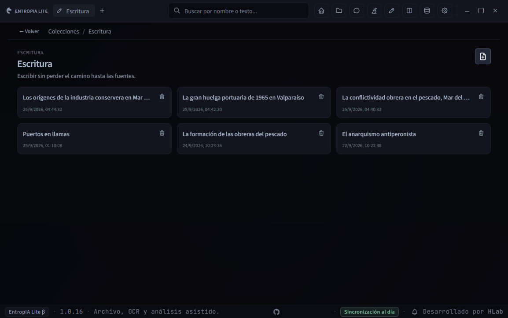

1. Abrí **Escritura** desde la barra superior. Si ya está abierta en otra pestaña, EntropIA te lleva a esa pestaña.
2. Desde la lista, pulsá **Documento nuevo** para crear y abrir un manuscrito. Para continuar uno existente, elegí su tarjeta en vez de crear otro.
3. Escribí el título en la parte superior y confirmalo con Enter o al salir del campo.

El acceso **Inicio → Escribir** puede reutilizar el manuscrito abierto si sigue vacío y con el título predeterminado. **Documento nuevo** de la lista de Escritura sí crea otro.

La vista actual no importa un DOCX o un Markdown como manuscrito. Si ya tenés texto en otro archivo, podés copiarlo y pegarlo en un documento nuevo.

### 11.2. Escribir y navegar

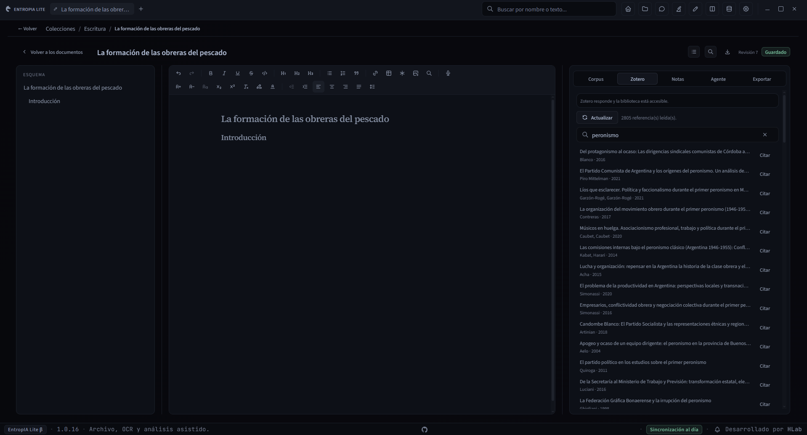

El espacio reúne **Esquema**, el manuscrito y el panel de investigación. Usá **Mostrar u ocultar el esquema** y **Mostrar u ocultar el panel de investigación**, o arrastrá sus separadores. Si falta ancho, el esquema puede cerrarse automáticamente. **Volver a los documentos** regresa a la lista y **Más herramientas** muestra opciones que no entran en la barra.

- El editor permite aplicar formato, títulos, listas, citas en bloque, notas al pie, enlaces, tablas, imágenes y alineación.
- **Buscar:** dentro del manuscrito, Ctrl+F abre o cierra la búsqueda. Enter/Shift+Enter recorren coincidencias; **Reemplazar por**, **Reemplazar** y **Reemplazar todo** permiten cambiarlas. Esc cierra.
- **Imágenes:** usá **Insertar imagen**, pegá o arrastrá un PNG, JPG/JPEG o GIF. Seleccioná la imagen para alinear, redimensionar y completar **Texto alternativo**. El **Pie de foto** es texto visible debajo, distinto de la descripción alternativa.
- **Tablas:** desde **Controles de tabla**, agregá o quitá filas y columnas, o elegí **Eliminar tabla**.
- **Esquema** muestra títulos de nivel 1 a 3. Seleccioná uno para saltar a esa sección; podés cambiar su título, moverla, agregar otra debajo o eliminarla con su contenido.
- **Dictado:** ubicá el cursor antes de iniciarlo; el resultado se inserta allí o reemplaza la selección. En Lite requiere AssemblyAI, Internet y permiso de micrófono. Se puede deshacer como una edición normal.

### 11.3. Guardado automático y revisiones

El manuscrito se guarda automáticamente; no hay un botón para guardarlo manualmente. La barra muestra **Guardado**, **Guardando**, **Cambios pendientes** o **Error de guardado**. Al cambiar de documento, salir de Escritura o cerrar su pestaña, EntropIA intenta guardar lo pendiente. Igual esperá a ver **Guardado** antes de cerrar la aplicación. El número junto a **Revisión** solo cuenta cambios; no permite abrir versiones anteriores.

La interfaz actual no ofrece una lista de versiones anteriores ni una acción para restaurarlas. Si el guardado falla, usá **Reintentar** cuando aparezca y conservá una copia del texto importante antes de cerrar.

### 11.4. Consultar tus documentos y citar una fuente

Con un manuscrito abierto, mostrá el panel de investigación y elegí **Corpus → Buscar en el corpus**. Busca localmente texto ya reconocido y transcripciones, sin ejecutar OCR ni llamar a IA por cada búsqueda. Muestra hasta 20 resultados y no tiene selector de colecciones. **Incluir coincidencias aproximadas** permite variantes de escritura.

Ubicá el cursor donde querés citar, abrí un resultado, elegí **Archivo/Archivos** o la página —si hay una sola, se abre directamente— y seleccioná el pasaje dentro del texto. Pulsá **Insertar como cita**. El botón necesita un manuscrito abierto y una selección válida. Si no se puede ubicar la selección, volvé a marcar un pasaje; no se inserta una cita a otro texto por aproximación.

La cita mantiene el vínculo con el documento y el pasaje. Si la fuente cambia, EntropIA avisa y no resalta un texto distinto como si fuera el fragmento original. Para agregar una referencia bibliográfica de Zotero, seguí el [capítulo 12](#capitulo-12-zotero).

### 11.5. Usar notas, agente y exportación

Las cinco pestañas del panel son **Corpus**, **Zotero**, **Notas**, **Agente** y **Exportar**. **Notas** permite localizar notas asociadas a tus documentos e insertarlas como texto o vínculo. **Agente** trabaja sobre una selección y se explica en el [capítulo 13](#capitulo-13-chat-y-agentes-de-entropia). **Exportar** configura el formato de las citas y la bibliografía; el botón **Descargar** está en la barra del manuscrito.

En **Exportar → Estadísticas** se muestran palabras, caracteres con y sin espacios, párrafos y notas al pie; las palabras del cuerpo no incluyen el contenido de esas notas. Para obtener el archivo, pulsá **Descargar** en la barra del manuscrito, elegí el formato y la ubicación de guardado.

El panel llamado **Investigación** dentro de Escritura contiene estas cinco pestañas; no es la pantalla independiente **Investigar**.

### 11.6. Eliminar un manuscrito

Para eliminar un manuscrito, volvé a la lista de Escritura, usá su acción **Eliminar** y confirmá. El documento sale de la lista; no hay una vista de papelera ni un control para restaurarlo. Descargá una copia antes de eliminarlo.

### 11.7. Sincronización del manuscrito

Los manuscritos de Escritura se guardan en este equipo y no forman parte de la sincronización general entre dispositivos. Exportá una copia si necesitás moverlos o conservarlos fuera de la aplicación.

---

## Capítulo 12. Zotero

Zotero aporta referencias bibliográficas al manuscrito. EntropIA consulta la biblioteca local de Zotero; no es un acceso a una cuenta web.

### 12.1. Conectar Zotero

1. Abrí Zotero en el equipo.
2. En Zotero, entrá en **Editar → Configuración → Avanzado**.
3. Activá **Permitir que otras aplicaciones se comuniquen con Zotero**.
4. Volvé a EntropIA, creá o abrí un manuscrito en **Escritura**, mostrá el panel de investigación y elegí **Zotero**. La conexión comienza al abrir esa pestaña.
5. Cuando Zotero responda, la pestaña muestra referencias de la biblioteca y habilita **Actualizar**.

Si la conexión no funciona, EntropIA indica si Zotero no permitió la conexión, no respondió a tiempo o envió una respuesta que no pudo leer. La falta de respuesta no demuestra que Zotero esté cerrado o desinstalado. Es posible que sigan apareciendo referencias consultadas antes.

Si abriste Zotero después, cambiá a otra pestaña del panel y volvé a **Zotero** para comprobar la conexión. Puede quedar visible la copia local de metadatos aunque Zotero no responda. **Actualizar** actualiza esa copia, no reescribe automáticamente las citas ya insertadas.

### 12.2. Buscar y citar

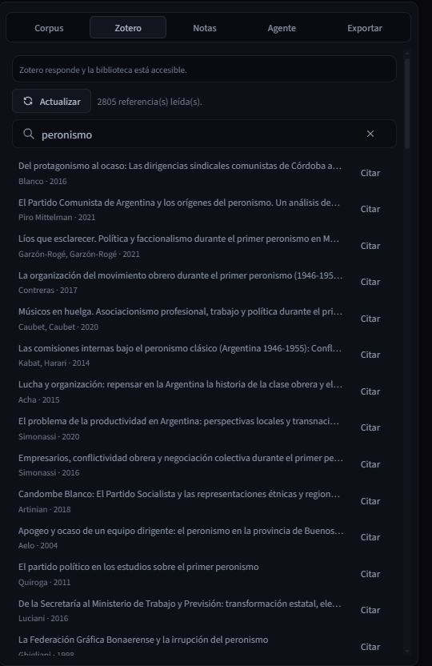

1. Situá el cursor donde querés insertar la cita. En **Buscar en tu biblioteca de Zotero**, escribí autor, título o año para filtrar la copia local.
2. Enter consulta también el buscador de Zotero, que puede encontrar obras por su texto indexado o notas. La lista muestra hasta 200 referencias; afiná consultas amplias. Esto no importa ni abre sus PDF.
3. Pulsá **Citar** junto a la obra: **la cita se inserta en ese momento**.
4. En **Ajustar la cita**, completá **Localizador** y **Tipo de localizador**: página, capítulo, sección, párrafo, volumen, línea, folio o nota. Marcá **Ya nombré al autor en mi frase** si corresponde y revisá la vista previa. Podés añadir **Antes de la cita** y **Después de la cita**.
5. Revisá **Así queda** y pulsá **Listo**. **Cancelar** descarta los ajustes pendientes, pero no elimina la cita ya insertada. Para modificarla más tarde, pulsá la cita en el manuscrito.

El formato de cita inicial es APA; no podés elegir otro estilo desde EntropIA ni administrar bibliotecas o grupos de Zotero. La referencia guarda una copia de sus datos para que siga en el manuscrito aunque Zotero no responda más adelante.

### 12.3. Incluir bibliografía

En **Escritura → Exportar**, dejá activada **Incluir bibliografía** si querés que el archivo incluya la lista de obras de Zotero citadas. La bibliografía se construye con las referencias Zotero; no convierte las citas insertadas desde tus documentos en referencias de Zotero.

---

## Capítulo 13. Chat y agentes de EntropIA

La interfaz tiene tres ayudas relacionadas, pero distintas:

| Herramienta | Cómo llegar | Resultado y control |
|---|---|---|
| **Chat de investigación** | Botón superior del mismo nombre. | Conversación; puede responder con fuentes del corpus o sin recuperación documental. No tiene selector de colecciones ni navegación web. |
| **Investigar** | **Agente de investigación**, o **Profundizar con el Agente** desde Chat. | Investigación por etapas e informe. Corpus acotado a colecciones, con consultas bibliográficas del plan a Zotero/OpenAlex. |
| **Agente de Escritura** | Abrir manuscrito → panel **Agente**. | Propuesta sobre una selección. No modifica el manuscrito hasta **Reemplazar** o **Insertar debajo**. |

Ninguna de estas herramientas sustituye la comprobación de la fuente.

### 13.1. Preguntar sobre tus documentos en el Chat

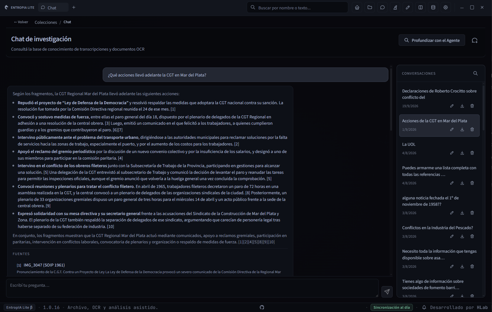

1. Abrí **Chat de investigación** desde la barra superior.
2. Escribí una pregunta de hasta 4000 caracteres sobre documentos cuyo texto ya se reconoció y preparó para la búsqueda.
3. Pulsá **Enviar**. Enter envía; Shift+Enter agrega una línea.
4. Revisá **Fuentes** debajo de la respuesta, cuando aparezca, para comprobar títulos, colecciones y fragmentos citados.
5. Pulsá una fuente para volver al documento de origen.

El Chat no permite elegir una colección ni navega la Web. En Lite utiliza OpenRouter: puede enviar la pregunta, el historial pertinente y los pasajes recuperados. Una respuesta conversacional directa puede no tener fuentes. Si una consulta documental no encuentra pasajes, aparece **No encontré contenido relevante en la base de conocimiento para esa pregunta**; revisá el texto procesado y reformulá.

### 13.2. Conversaciones e historial

- **Nueva conversación** inicia otro hilo al enviar la primera pregunta.
- **Conversaciones:** volver a un hilo o buscar por título/contenido. **Editar nombre de la conversación** permite renombrarlo; Enter guarda y Esc cancela. Eliminar pide confirmación y borra sus mensajes sin deshacer.
- **Copiar respuesta:** copia el texto y títulos de fuentes disponibles, no los archivos originales.
- **Descargar conversación en PDF:** está junto al hilo en el historial y guarda en la carpeta **Descargas**, sin selector de ubicación. Incluye preguntas, respuestas y títulos de fuentes.
- **Profundizar con el Agente:** requiere al menos una pregunta y que el Chat no esté esperando respuesta. Lleva la última pregunta y los mensajes cargados a **Investigar**, pero no inicia el trabajo. Revisá **Contexto traído desde el chat → Revisar mensajes preservados**, la pregunta y las colecciones; recién después pulsá **Investigar**. Ese contexto no es evidencia verificada.

### 13.3. Agente de Escritura

Con un manuscrito abierto, entrá en **Escritura → Agente**, seleccioná un pasaje y pulsá una acción. **Esa pulsación inicia el envío**, sin una segunda confirmación. Las opciones visibles son:

- **Ortografía**, **Redacción**, **Claridad**, **Argumentación**.
- **Acortar**, **Desarrollar**, **Resumir**, **Reformular**.
- **Reiteraciones**, **Contradicciones**.
- **Evidencia**, **Contraevidencia**, **Contraejemplos**, **Notas**.

Las acciones de revisión trabajan sobre la selección. **Evidencia**, **Contraevidencia**, **Contraejemplos** y la acción llamada **Notas** añaden pasajes relacionados del corpus. **El botón Notas del agente no recupera tus notas personales en el flujo actual**; para consultarlas e insertarlas usá la pestaña **Notas** del panel de Escritura.

En Lite se envía a OpenRouter la selección y, cuando corresponde, los pasajes recuperados. No se envía automáticamente todo el manuscrito, pero si lo seleccionás entero, ese es el texto enviado. **Esto es lo que se envió** muestra el contexto registrado después de la solicitud; no es una autorización previa.

En **Sugerencias para revisar**, leé **Texto original**, **Texto propuesto**, **Por qué** y **Sobre qué se apoya**. Vos decidís qué hacer:

- **Reemplazar** el pasaje original.
- **Insertar debajo** de la selección.
- **Descartar** la propuesta.

El agente no modifica el manuscrito automáticamente. Si el pasaje cambió, desapareció o no se puede identificar de manera única, EntropIA rechaza la aplicación; pedí otra propuesta o descartala. Sin OpenRouter podés seguir escribiendo a mano.

---

## Capítulo 14. Procesamiento por lotes

Los lotes permiten procesar varias colecciones a la vez: **OCR** para reconocer texto y **Embeddings** para preparar materiales para compararlos por semejanza. No incluyen transcripción de audio STT ni generan un resumen conjunto.

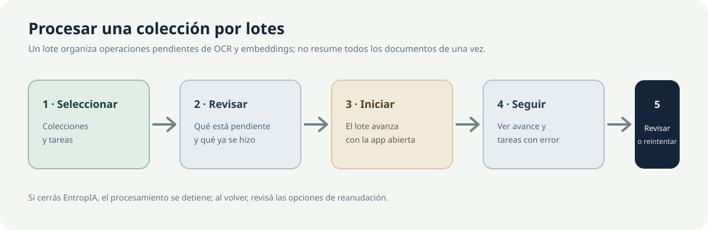

1. Abrí **Configuración → Lotes** y seleccioná una o varias colecciones. **Seleccionar todas** marca todas las disponibles.
2. Elegí **OCR** para reconocer palabras en imágenes o PDF, **Embeddings** para preparar una comparación por semejanza, o ambas tareas. Después, pulsá **Analizar selección**.
3. Revisá qué documentos y tareas incluye la propuesta. Si el alcance no es correcto, descartala.
4. Cuando termine el análisis, pulsá **Iniciar lote**.
5. Seguí el estado en la pestaña o desde el indicador de lotes de la barra inferior.

No hace falta repetir tareas completas. Los embeddings requieren texto. El lote avanza mientras EntropIA está abierta; al cerrar, se detiene. Al reabrir, el aviso de recuperación permite **Mantener pausados** o **Reanudar**. Entrá en **Lotes activos y recuperados → Ver detalle** y revisá pendientes, interrumpidos y fallidos antes de continuar.

- **Pausar / Reanudar:** controlar la ejecución cuando el estado lo permite.
- **Cancelar:** pide confirmación; conserva el trabajo ya confirmado, no deshace el OCR ni los embeddings terminados.
- **Reintentar fallidos:** repetir las tareas fallidas del lote; **Reintentar** actúa sobre una tarea.
- **Ver detalle:** consultar intentos, mensaje o código de error y filtrar por estado.
- **Cargar más:** consultar registros anteriores.

Un OCR terminado sin texto puede contar como completo. Abrí esa página y revisá el resultado; crear otro lote no garantiza que vuelva a procesarla.

En Lite, reconocer texto y comparar materiales depende de servicios por Internet y claves configuradas. Que el lote muestre avance no garantiza que el servicio esté disponible ni que cada tarea termine correctamente.

---

## Capítulo 15. Sincronización y nube

La sincronización es opcional. Si trabajás en un solo equipo, podés dejarla desactivada. Al activarla, EntropIA envía los datos incluidos en la sincronización a su servicio en la nube. Revisá qué información se sincroniza y las condiciones del servicio antes de iniciar sesión.

### 15.1. Iniciar sesión y sincronizar

1. Abrí **Configuración → Sincronización**.
2. Iniciá sesión o elegí **Registrar cuenta** si todavía no tenés una. La contraseña nueva debe tener al menos 10 caracteres. Después de registrarte, pulsá **Iniciar sesión**: el registro no inicia la sincronización.
3. Usá **Sincronizar ahora** o activá **Sincronización automática** y elegí un intervalo en minutos (mínimo 1). Esos controles se aplican desde su sección, no con el guardado de APIs.
4. Revisá los equipos conectados, el espacio y tu plan. Podés revocar otros equipos; para el actual, cerrá sesión.
5. Para dejar de usar la cuenta en este equipo, usá **Cerrar sesión**.

EntropIA Lite usa el servicio incluido; no podés cambiar su dirección ni elegir colecciones individuales para sincronizar. Si la primera sincronización incluye más de 500 MiB (unos 525 MB), EntropIA te pide confirmación antes de continuar.

### 15.2. Estados, errores y datos

El indicador inferior puede mostrar que la sincronización está al día, que hay actividad, falta de conexión, un error, diferencias entre equipos o un aviso relacionado con la hora del dispositivo. Pulsalo para abrir la configuración y leer más detalles. Si hay diferencias, revisalas antes de asumir que ambos equipos tienen el mismo contenido.

**Actualizar conflictos** vuelve a consultar los avisos; los detalles se pueden revisar en **Logs**. **Marcar vistos** reconoce el aviso: no permite elegir una versión ni resuelve manualmente la diferencia.

**Re-verificar archivos** encola su reenvío para comprobarlos; no crea una copia de respaldo. **Borrar mis datos del servidor** requiere la contraseña y confirmar **Borrar todo**. Elimina los datos remotos, pero conserva los de este equipo. No lo uses como prueba para solucionar un error.

> **Importante:** los manuscritos de **Escritura** permanecen en el equipo donde se crearon y no forman parte de la sincronización general. Exportalos aparte si necesitás pasarlos a otro dispositivo. Las notas asociadas a documentos pueden sincronizarse cuando configurás la cuenta.

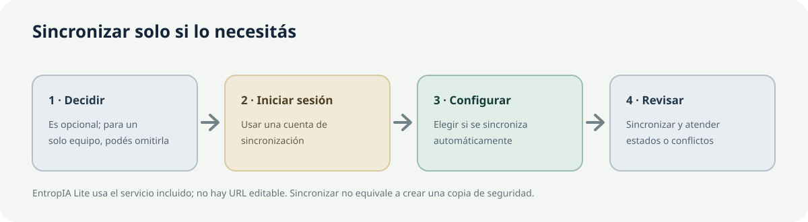

### 15.3. Solicitar otro plan de sincronización

Si necesitás otra capacidad, abrí **Solicitar cambio de plan**, elegí un plan del catálogo disponible, agregá una nota opcional y pulsá **Enviar solicitud**. **Solicitud en revisión** significa que debe revisarla un administrador: no es un pago ni un cambio inmediato. Los planes de sincronización no aportan créditos a OpenRouter, AssemblyAI ni GLM-OCR.

---

## Capítulo 16. Configuración y herramientas generales

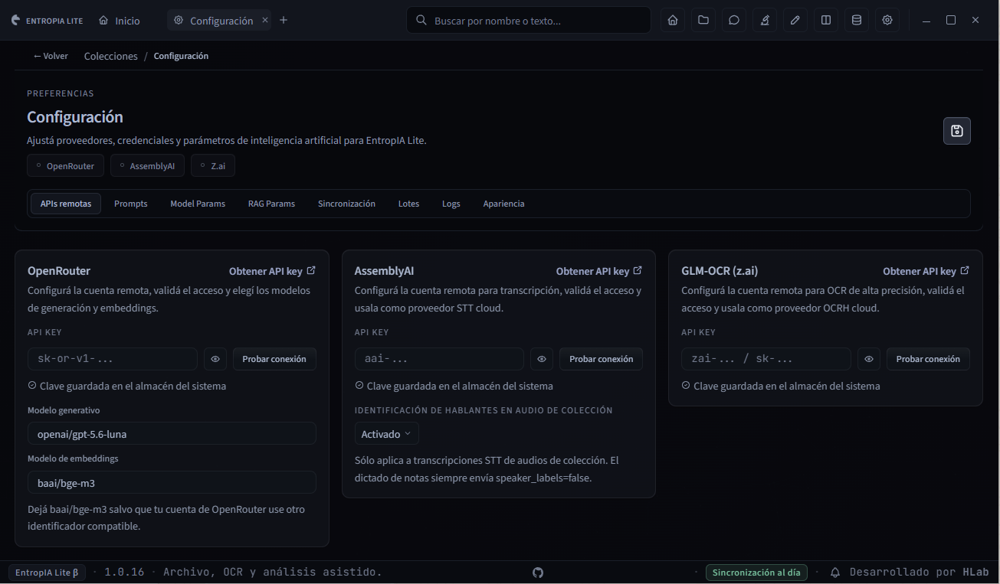

Abrí **Configuración** con el botón de engranaje de la barra superior. En Lite aparecen estas pestañas:

| Pestaña | Para qué sirve | Recomendación inicial |
|---|---|---|
| **APIs remotas** | Conectar los servicios que reconocen texto, transcriben audio y ayudan con tareas de IA. | Configurá solo los que vayas a usar; probá la conexión y guardá. |
| **Prompts** | Revisar las instrucciones que EntropIA sigue al corregir texto, resumir o proponer nombres y relaciones. | Conservá los valores iniciales si no necesitás cambiarlos. |
| **Model Params** | Ajustar el modelo y la forma en que prepara cada respuesta. | Dejá los valores predeterminados. |
| **RAG Params** | Elegir qué pasajes de tus documentos consulta el Chat, cuántos usa y cuánto de la conversación previa considera. | Dejá los valores predeterminados hasta tener una necesidad concreta. |
| **Sincronización** | Conectar la cuenta y compartir datos entre equipos. | No la actives si no necesitás usar más de un equipo. |
| **Lotes** | Reconocer texto y preparar varios documentos para compararlos. | Ejecutá primero una prueba con una colección pequeña. |
| **Logs** | Leer mensajes de actividad y error. | Anotá el mensaje visible antes de compartirlo con soporte. |
| **Apariencia** | Cambiar tema, contraste, zoom de interfaz, tipografía e idioma. | Ajustá la legibilidad antes de comenzar una sesión larga. |

La pestaña **Dependencias de IA** no aparece en Lite. Esta variante no permite elegir los motores locales incluidos en Pro.

### 16.1. Configurar proveedores

En **APIs remotas**:

1. Buscá el proveedor de la tarea que necesitás.
2. Pegá la clave de acceso en **API Key**. Usá el control para mostrarla u ocultarla al revisarla.
3. Pulsá **Probar conexión**.
4. Cuando la prueba sea correcta, pulsá **Guardar cambios**.

| Proveedor | Funciones de Lite que lo utilizan |
|---|---|
| **GLM-OCR / z.ai** | OCRH de imágenes y PDF compatibles. |
| **AssemblyAI** | Transcribe audio y permite dictar con el micrófono. El selector **Identificación de hablantes en audio de colección** controla la separación de intervenciones en STT; el dictado no usa esa identificación. |
| **OpenRouter** | Corrección, resúmenes, Chat, Investigación, agente de Escritura, entidades, relaciones y embeddings. Tiene campos separados para **Modelo generativo** y **Modelo de embeddings**. |

Una clave válida no garantiza que el servicio esté funcionando ni que tu cuenta permita más usos en ese momento. Antes de enviar material sensible, revisá cómo trata los datos el servicio. EntropIA envía el contenido necesario para reconocer, transcribir o generar una respuesta.

**Obtener API key** abre el sitio del proveedor; la cuenta y su facturación se gestionan allí. Los campos permiten mostrar u ocultar la clave y señalan cuando hay una guardada en el almacén del sistema. No la incluyas en capturas ni mensajes de soporte.

En OpenRouter, conservá un identificador válido para **Modelo generativo** y otro compatible para **Modelo de embeddings**. La interfaz recomienda `baai/bge-m3` para embeddings salvo que tu cuenta use otro identificador compatible. Un modelo que aparece en una captura es un ejemplo de esa instalación, no una recomendación ni una garantía de disponibilidad.

**Probar conexión no guarda la clave.** Después de **Guardar cambios**, el campo puede quedar vacío mientras el estado indica que hay una credencial almacenada; eso no significa que se haya borrado. Con el campo vacío, la prueba puede usar la clave guardada. Una conexión correcta tampoco garantiza cuota ni disponibilidad de todos los modelos. La prueba de GLM-OCR hace una solicitud real al proveedor sobre una imagen de prueba.

### 16.2. Prompts, Model Params y RAG Params

**Prompts** permite revisar o cambiar las instrucciones. Conservá el marcador **`{text}`**, que inserta el material a procesar. **Validar cambios** señala requisitos faltantes; **Restaurar default** recupera el texto inicial. Guardá después de restaurar. Si el guardado te lleva a otra pestaña, corregí el parámetro señalado: también se validan los ajustes de modelos y RAG.

**Model Params** organiza ajustes para tareas como corregir texto, resumir o proponer nombres y relaciones. **RAG Params** permite elegir qué pasajes de tus documentos consulta el Chat, cuántos usa y cuánto de la conversación previa conserva. Para el uso habitual, dejá estos controles como están. Si los cambiás, anotá los valores anteriores.

Referencia avanzada de **Model Params**, por proceso (corrección OCR, resumen, NER y tripletas):

| Parámetro | Rango o función |
|---|---|
| `model` | Identificador del modelo para ese proceso. |
| `temperature` | 0–2; regula variación de la respuesta, no exactitud factual. |
| `maxTokens` | 1–16000; limita la longitud de salida. |
| `topP` / `topK` | 0–1 / 0–1000; ajustan la selección de salida. |
| `presencePenalty` / `frequencyPenalty` | −2 a 2; penalizaciones de presencia y frecuencia. |
| `stopSequences` | Hasta 4 secuencias, una por línea, que detienen la salida. |

En **RAG Params**, el modelo de *reranker* reordena los pasajes recuperados y no reemplaza al modelo que redacta la respuesta. Cambiá un ajuste por vez y compará con una consulta conocida; los límites del proveedor pueden ser más restrictivos que los del formulario.

### 16.3. Apariencia, idioma y accesibilidad visual

Abrí **Configuración → Apariencia**. Los ajustes visuales ya no están en la barra superior. Se aplican al elegirlos; no cambian el contenido de los documentos.

- **Tema:** **Oscuro**, **Cálido**, **Claro** o **Lite**. «Lite» es el nombre de un tema visual; no es un cambio de producto a Pro.
- **Contraste:** **Contraste suave**, **Contraste normal** o **Contraste alto**.
- **Zoom:** pulsá **+** o **−**, o **Restablecer zoom**. El intervalo es 75 %–125 % en pasos de 5 %. En Windows podés usar **Ctrl +**, **Ctrl −** y **Ctrl 0**.
- **Tipografía:** opciones **Académica**, **Moderna**, **Editorial** y **Archivo**.
- **Idioma:** **Español** o **English**. Cambia los textos de la interfaz, no el idioma de tus documentos.

La navegación se maneja fuera de Apariencia:

- **Panel lateral:** en una sola pantalla y dentro de Colecciones, **Ctrl+B** contrae o muestra el explorador. En vista dividida, el explorador se abre como panel sobre el área activa; ver [pestañas y vista dividida](#pestanas-y-vista-dividida).
- **Pestañas y vista dividida:** permiten trabajar con hasta cuatro recorridos y ver dos a la vez desde la barra superior.

### 16.4. Base de datos, estado y avisos

El botón **Base de datos** abre **Consulta DB**, una página de solo lectura para consultar listas de datos, buscar y ordenar sus elementos y descargar una tabla como JSON o CSV. No permite recuperar documentos ni guardar una copia de seguridad completa.

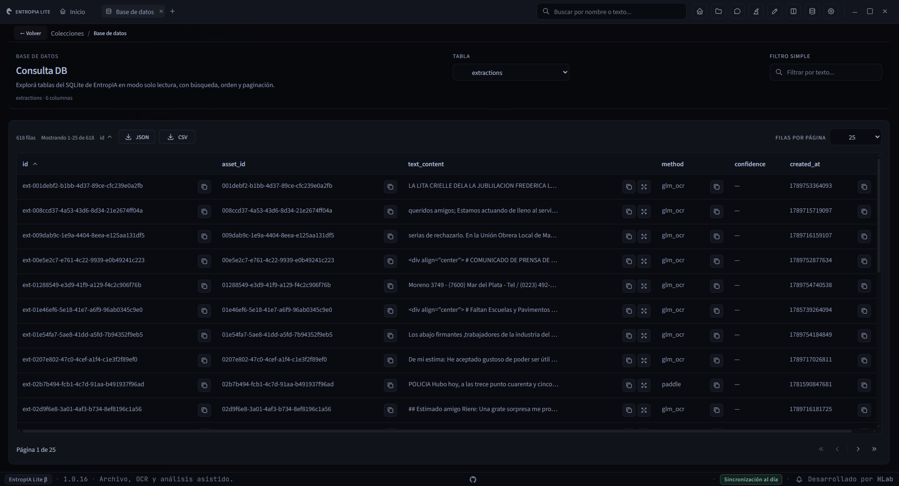

1. Elegí una **Tabla** en el selector.
2. Usá **Filtro simple** para acotar lo que ves.
3. Pulsá una cabecera para ordenar y elegí **25, 50 o 100 Filas por página**.
4. Usá los controles de copia o ampliación para leer una celda larga; Esc cierra la ampliación.
5. Si necesitás compartir datos, elegí **JSON** o **CSV** y revisá el archivo descargado antes de enviarlo: puede contener texto de tus fuentes.

La descarga respeta el filtro y el orden y contiene **todas las filas coincidentes, no solo la página visible**. Para descargar toda la tabla, limpiá **Filtro simple** antes de exportar.

No hace falta usar esta herramienta para importar, reconocer texto o escribir. Es una consulta avanzada, no un editor de base de datos ni un mecanismo de restauración.

La barra inferior también muestra los lotes, la sincronización y, cuando corresponde, la campana de notificaciones. Un aviso de actualización puede ofrecer **Ver actualización**, que abre la ficha de Microsoft Store; no instala la actualización.
El pie también incluye enlaces a GitHub y HLab.

### 16.5. Consultar registros para pedir ayuda

En **Configuración → Logs**, **Refrescar** actualiza la vista y **Copiar** copia los últimos 20 registros mostrados. **Abrir carpeta** permite acceder a los archivos de registro; **Limpiar** borra los registros correspondientes. Conservá el mensaje necesario antes de limpiar y revisá si contiene rutas o datos sensibles antes de compartirlo.

---

## Capítulo 17. Exportar y descargar

Elegí el formato según lo que quieras conservar. Los botones de exportación no son equivalentes y no todos incluyen archivos originales.

| Desde | Acción/formato | Qué guardar o tener en cuenta |
|---|---|---|
| Colección | **Exportar JSON** | Guarda datos de la colección, pero no incluye los PDF, imágenes ni audios originales. No podés usarlo para reconstruir la colección. |
| Documento → **Texto extraído sobre el visor**, en PDF/imágenes | **Copiar** y **Descargar** como Markdown, PDF o Word (`.docx`). | Texto OCR de la página seleccionada. La transcripción de audio no tiene ese menú; copiá su campo editable manualmente. |
| Chat de investigación | Descargar conversación como PDF desde el historial. | Guarda en Descargas las preguntas, respuestas y títulos de fuentes, no los archivos originales. |
| Investigación | Descargar como Markdown, HTML o Word (`.docx`). | Guarda el informe y las fuentes disponibles; no hay opción PDF en esa pantalla. |
| Escritura | **Descargar** como Markdown, HTML o Word (`.docx`). | Guarda el manuscrito actual; Escritura no ofrece descarga PDF. |
| Escritura → Exportar | Elegir cómo aparecen las citas y activar **Incluir bibliografía**. | Son preferencias de descarga, no un botón para descargar. La bibliografía incluye las obras de Zotero citadas. |
| Análisis textual de colección | Descargar gráfico como PNG. | Guarda el gráfico de frecuencias, no los documentos originales. |
| Consulta DB | Descargar JSON o CSV. | Incluye todas las filas que cumplen el filtro, en el orden elegido; no solo la página visible ni una copia de seguridad completa. |

### 17.1. Preferencias de citas en Escritura

En **Escritura → Exportar**, elegí cómo aparecen las citas de los pasajes que insertaste desde tus documentos:

- **Nota al pie**.
- **Referencia breve**.
- **Comentario**.
- **Texto citado y nota**.

También podés activar **Incluir bibliografía** para las obras de Zotero citadas. Markdown no admite comentarios; EntropIA los convierte en notas al pie y te avisa. Si Word no puede conservar un elemento del formato elegido, la descarga se detiene y explica qué se perdería.

### 17.2. Diferencia entre exportar y respaldar

El archivo JSON de la colección, el CSV de una tabla y los documentos descargados no guardan todos los archivos y datos necesarios para recuperar EntropIA. Conservá los originales y los manuscritos exportados en una copia de seguridad de tu organización. La sincronización en la nube tampoco reemplaza esa copia.

El JSON de colección puede incluir notas, tópicos, texto OCR y transcripciones, metadatos, anotaciones, layout, entidades, relaciones y resultados de IA. Las rutas o referencias a los archivos no son los PDF, imágenes ni audios. Revisá su contenido antes de compartirlo: puede contener información sensible del corpus.

---

## Capítulo 18. Ejemplos paso a paso

### 18.1. Tengo un PDF escaneado y quiero buscar su contenido

1. Creá o elegí una colección y pulsá **Importar documento**.
2. Abrí el PDF y elegí su primera página.
3. En **Texto**, ejecutá **OCRH**. Necesitás GLM-OCR configurado y conexión.
4. Compará el texto con la imagen; corregí nombres o cifras mal leídos.
5. Buscá una palabra en **Búsquedas** o en la barra superior. Si no aparece, usá **Análisis → INDEX** y repetí la búsqueda.

### 18.2. Tengo fotografías de documentos de archivo

1. Conservá originales y usá nombres que indiquen fondo, fecha o número de pieza.
2. Importá las imágenes a la colección. Cada foto será un documento separado.
3. Abrí cada foto; si hace falta, orientá o recortá una copia para facilitar la lectura.
4. En **Texto**, ejecutá OCRH sobre PNG/JPG, revisá el resultado y agregá un tópico o nota de procedencia.
5. Usá la búsqueda para localizar palabras y abrí cada coincidencia en su imagen original.

### 18.3. Quiero encontrar un tema en muchos documentos

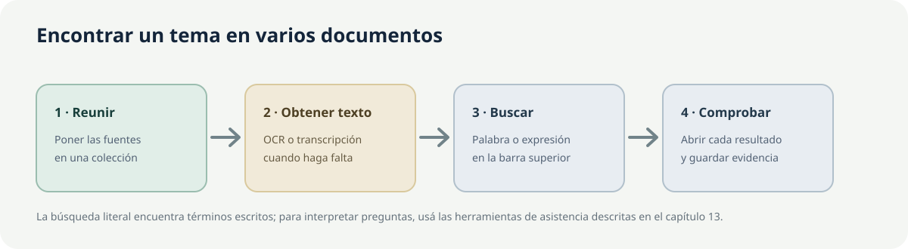

1. Reuní las fuentes de trabajo en una o más colecciones.
2. Obtené el texto que falte y corregí errores que afecten la búsqueda.
3. Buscá términos concretos desde la barra superior o **Búsquedas**; verificá cada resultado y su colección.
4. Para preguntar sobre fuentes, configurá OpenRouter y abrí **Chat de investigación**. Para un informe con alcance por colecciones, usá **Profundizar con el Agente** o **Agente de investigación** en la barra superior. Revisá la pregunta, elegí colecciones con fragmentos, pulsá **Investigar** y completá las aclaraciones y la aprobación del plan.
5. Guardá pasajes relevantes como notas con referencia a la fuente.

### 18.4. Quiero resumir y analizar varios documentos

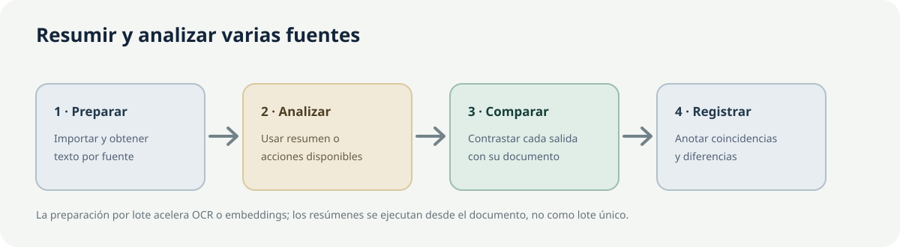

1. Importá las fuentes y obtené el texto de cada documento que lo necesite.
2. Abrí cada documento y seleccioná la página o archivo con texto. Usá **OCRR/Resumen** para resumirlo, **NER** para proponer nombres de personas o lugares o **TRIPLET** para sugerir relaciones, como quién hizo qué. Revisá el alcance de la salida; los lotes no crean un resumen general.
3. Contrastá cada salida con su texto original; usá **Análisis textual** en la colección para observar frecuencias de palabras.
4. Registrá coincidencias y diferencias en notas, citando qué documento las respalda.

### 18.5. Quiero redactar un texto académico a partir de mis documentos

1. Prepará el texto de las fuentes. En **Escritura**, creá un **Documento nuevo**, escribí el título y confirmalo.
2. Ubicá el cursor, abrí **Corpus**, buscá y abrí un resultado, elegí archivo/página y seleccioná el pasaje. Pulsá **Insertar como cita**.
3. Si usás Zotero, abrilo con la comunicación local habilitada. En la pestaña **Zotero** del manuscrito, encontrá la obra, pulsá **Citar** y completá **Ajustar la cita → Listo**.
4. Redactá el argumento y verificá citas, páginas y bibliografía. Opcionalmente seleccioná un párrafo y usá **Agente → Claridad**; esa asistencia requiere OpenRouter e Internet.
5. En **Exportar**, configurá **Citas del corpus** e **Incluir bibliografía**. Después usá **Descargar** en la barra del manuscrito, elegí Markdown, HTML o Word y la ubicación. Revisá el archivo y cualquier aviso de exportación.

### 18.6. Quiero tomar notas y usarlas más tarde al escribir

1. Abrí el documento o página y creá una nota en **Notas**; agregá un tópico si ayuda a clasificarla.
2. Abrí **Escritura**, creá o abrí un manuscrito y ubicá el cursor. En el panel, elegí **Notas**, buscá palabras de la nota o el título del documento de origen y abrí el resultado.
3. Elegí **Insertar como texto** para copiar su contenido o **Insertar como vínculo** para conservar un enlace.
4. Incorporá la nota al borrador y volvé a la fuente antes de convertirla en una cita o afirmación.

El vínculo conserva una instantánea y permite volver a consultar la nota; no actualiza automáticamente el texto del manuscrito.

### 18.7. Tengo una entrevista y quiero transcribirla

1. Conservá el audio original y comprobá que tenés autorización para enviarlo al servicio de transcripción.
2. Configurá **AssemblyAI** en **APIs remotas**, probá la conexión y guardá. Elegí si necesitás identificar intervenciones de hablantes.
3. Importá el audio en una colección, abrilo y escuchá un fragmento para comprobar el archivo.
4. En **Texto**, pulsá **STT** y esperá el resultado. Importar o reproducir no inicia la transcripción.
5. Escuchá de nuevo los pasajes que vas a citar; corregí nombres, fechas y atribuciones. Anotá en una nota los tramos dudosos.
6. Seleccioná y copiá la transcripción desde su campo editable a un archivo propio. No hay menú **Descargar** para audio; conservá también el original.

### 18.8. Quiero comprobar un informe antes de usarlo

1. En **Investigar**, definí una pregunta acotada y seleccioná las colecciones pertinentes.
2. Respondé las aclaraciones y revisá las búsquedas propuestas antes de aprobarlas.
3. Cuando aparezca el informe, leé la tabla de cobertura: distinguí materiales con fragmentos de materiales sin procesar.
4. Abrí una cita `[n]`, leé su pasaje y usá **Abrir el documento** para contrastarlo con la fuente.
5. Revisá especialmente las afirmaciones generales: ni la cantidad de documentos importados ni la presencia de una cita garantizan que toda la evidencia esté cubierta.
6. Exportá el informe revisado. Para desarrollar un manuscrito, trabajá en **Escritura** y verificá allí las citas; no confundas la descarga del informe con el guardado de un manuscrito.

---

## Capítulo 19. ¿Qué hago si…?

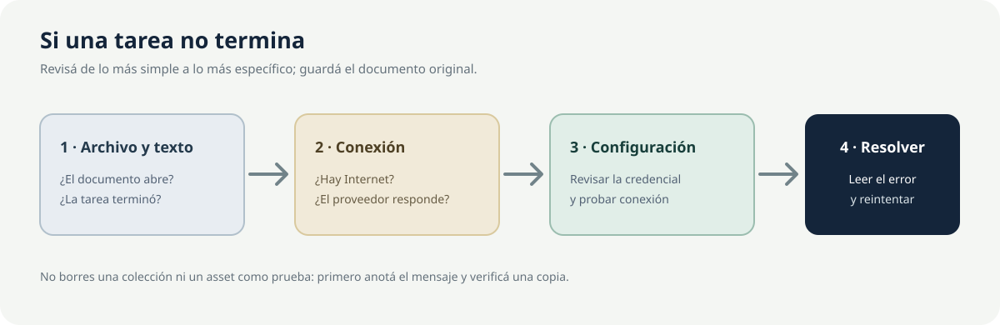

| Problema | Qué revisar |
|---|---|
| No aparece texto después de importar | La importación no reconoce texto automáticamente. Abrí **Texto** y usá **OCRH** para una imagen o PDF compatible, o **STT** para pasar el audio a texto. |
| El reconocimiento de texto produjo errores | Compará el resultado con la imagen y corregí lo necesario. Para fotos, usá PNG/JPG y revisá que la imagen no esté borrosa, inclinada u oscura. |
| OCRH no está disponible o da error | En Lite, el reconocimiento de texto necesita Internet. Revisá GLM-OCR en **Configuración → APIs remotas**, probá la conexión y guardá los cambios. |
| No encuentro un documento | Abrí la colección correcta, limpiá los filtros y buscá por nombre en **Buscar documentos...** o usá la búsqueda superior. |
| Una búsqueda no devuelve resultados | Comprobá que se haya reconocido el texto de la página correcta. En **Análisis**, pulsá **INDEX** para prepararlo y probá una palabra más breve o escrita de otra manera. |
| **Assets similares** no muestra resultados | Comprobá que la página o archivo tenga texto y que **EMBED** haya terminado. En Lite, revisá la conexión con OpenRouter. |
| Falla una operación de IA | Revisá la conexión y la clave de acceso del servicio correspondiente. Leé el mensaje antes de repetir la operación. |
| No hay un modelo disponible | Lite usa servicios de IA por Internet. Revisá qué modelo está seleccionado en OpenRouter y si está disponible para tu cuenta. |
| No puedo procesar un archivo | Confirmá que el archivo se pueda abrir y esté en un formato admitido. Para reconocer texto, probá con una copia PNG/JPG o PDF compatible. |
| Un lote muestra un error | Abrí **Configuración → Lotes**, expandí la tarea y leé el mensaje. Corregí primero el problema y después volvé a intentarla. |
| No puedo sincronizar | Revisá el estado inferior, la conexión y la sesión. En **Configuración → Sincronización** y **Logs** podés leer más detalles; no borres datos como prueba. |
| Zotero no aparece en Escritura | Abrí Zotero y habilitá **Permitir que otras aplicaciones se comuniquen con Zotero** en **Editar → Configuración → Avanzado**. Después, volvé a **Escritura → Zotero** y usá **Actualizar** si está disponible. |
| Escritura no guardó un cambio | Esperá el estado **Guardado**. Si aparece **Error de guardado**, pulsá **Reintentar** si está disponible y copiá el texto importante antes de cerrar. |
| No puedo restaurar una versión de Escritura | EntropIA muestra un número de revisión, pero no permite abrir versiones anteriores ni restaurarlas. Exportá el texto mientras esté abierto. |
| No puedo abrir otra pestaña | El máximo es 4. Cerrá una con **Cerrar pestaña** y volvé a pulsar **Abrir nueva pestaña**. |
| No veo el explorador en vista dividida | No queda fijo a la izquierda. En el panel activo, pulsá **Abrir explorador de documentos**. Esc lo cierra. |
| Escritura aparece en otra pestaña | Solo puede estar abierta en una. Elegí esa pestaña o pulsá **Ir a esa pestaña**. |
| **Inicio → Escribir** no creó otro manuscrito | Si el abierto sigue vacío y con título predeterminado, ese acceso lo reutiliza. Para crear otro, usá **Documento nuevo** desde la lista de Escritura. |
| No encuentro los controles de tema, idioma o zoom | Están en **Configuración → Apariencia**. El zoom del visor de una imagen es independiente del zoom de interfaz. |
| Inicio muestra muchos documentos pero poco texto procesado | Importar no genera OCR/STT. Revisá **Estado del corpus**, procesá una muestra y luego usá lotes para el material compatible. |
| Pulsé Recuperar y se abrió el Chat | **Recuperar** inicia una consulta nueva sobre el corpus; no recupera una copia de seguridad ni archivos eliminados. |
| La investigación no cubre todas mis fuentes | Revisá el alcance y la tabla de cobertura del informe. Un documento sin fragmentos no aporta evidencia textual; procesalo antes de repetir la investigación. |
| La imagen del manual se ve pequeña | Pulsala para abrirla a tamaño completo en otra pestaña. El texto de cada capítulo explica también los pasos sin depender de la captura. |
| Vista dividida está deshabilitada o desapareció un lado | Ampliá la ventana. Cada panel necesita al menos 480 píxeles; con poco ancho solo se muestra la pestaña activa. |
| No encuentro Descargar en una transcripción | Ese menú solo existe para OCR de imágenes/PDF en **Texto extraído** sobre el visor. Copiá manualmente el campo de transcripción. |
| OCRC cambió mi texto sin preguntarme | Aplica la corrección al terminar. Revisala y, si hace falta, usá **Texto extraído → Restaurar OCR original**, conservando antes los cambios manuales. |
| Una búsqueda devuelve otra grafía | Puede incluir variantes aproximadas. Abrí el documento y verificá el término; no es una prueba de equivalencia semántica. |
| Me registré en la nube pero no sincroniza | Después de **Registrar cuenta**, tenés que **Iniciar sesión**. |
| Guardar cambios falla después de pegar una clave | Revisá el mensaje y la pestaña señalada; también se validan Prompts, Model Params y RAG Params. |

Antes de recurrir a ayuda, anotá el nombre de la pantalla, el paso, el mensaje exacto, el formato del archivo y la versión que aparece en la barra inferior. No compartas claves de proveedor ni documentos sensibles en capturas.

---

## Capítulo 20. Consejos y buenas prácticas

> **Consejo**
>
> Nombrá colecciones y archivos con palabras que usarías para volver a encontrarlos. Guardá título, fecha y procedencia también en una nota cuando sean relevantes.

> **Consejo**
>
> Probá OCR en una página antes de procesar un lote grande. Corregí errores claros y conservá la imagen o PDF para revisar el resultado.

> **Importante**
>
> En Lite, OCR, transcripción, Chat y muchas acciones de IA envían contenido al proveedor externo que realiza la tarea. La sincronización envía datos al servicio de nube solo cuando configurás una cuenta y la activás. Revisá las condiciones del proveedor antes de usar material confidencial.

> **Importante**
>
> Una coincidencia de búsqueda, una comparación automática o una respuesta de la aplicación son pistas. Contrastá siempre el pasaje, la página y la referencia con el material original.

> **Atención**
>
> Eliminar una colección o un documento puede borrar sus datos y archivos asociados. Si eliminás una página o archivo citado, el pasaje guardado puede dejar de abrir la fuente. El archivo JSON de la colección no incluye los documentos originales ni permite reconstruirla. Conservá esos originales y exportá los manuscritos que necesites.

> **Atención**
>
> Los documentos creados en **Escritura** no se sincronizan entre dispositivos. Guardá una copia en una carpeta segura o en otro dispositivo antes de cambiar de equipo.

---

## Capítulo 21. Glosario

- **Asset:** palabra que aparece en algunos controles para referirse a una página o archivo dentro de un documento.
- **Búsqueda FTS:** búsqueda léxica de términos, con posibles variantes ortográficas próximas; no busca por significado.
- **Búsqueda aproximada:** amplía coincidencias a grafías parecidas; no demuestra que las palabras sean equivalentes.
- **Texto nativo de PDF:** texto digital que el archivo ya contiene, distinto del reconocimiento de una imagen escaneada.
- **Lote:** conjunto de tareas OCR o de embeddings con estado, avance y recuperación.
- **Colección:** grupo de documentos reunidos para un tema o proyecto.
- **Corpus:** conjunto de documentos y colecciones que reunís para trabajar.
- **Embedding:** forma de representar el texto para sugerir páginas o documentos que tratan temas parecidos.
- **Entidad:** nombre o dato identificado en un texto, como una persona, un lugar o una fecha.
- **Ítem:** palabra que algunos mensajes de EntropIA usan para referirse a un documento.
- **Layout:** herramienta que marca zonas de una página, como títulos, párrafos, tablas o figuras.
- **Metadatos:** datos que describen un archivo o documento.
- **Modelo de IA:** servicio que propone texto, resúmenes o análisis a partir de una instrucción y material relacionado.
- **OCR:** reconocimiento de palabras visibles en imágenes o PDF escaneados.
- **OpenRouter:** servicio por Internet que Lite usa para algunas tareas de texto y análisis.
- **RAG / recuperación:** opción para que el Chat consulte pasajes de tus documentos antes de responder.
- **Corpus procesado:** parte del archivo que ya tiene texto o representaciones preparadas. No equivale a todas las fuentes importadas ni garantiza cobertura temática.
- **API Key / clave de acceso:** credencial personal de un proveedor remoto; no debe compartirse.
- **Identificación de hablantes:** separación automática de intervenciones de audio; requiere revisar quién habla realmente.
- **STT:** conversión de voz o audio a texto.
- **Tópico:** etiqueta que ayuda a clasificar documentos.
- **Tripleta:** forma de registrar una relación; por ejemplo, quién realizó una acción.
- **Vista dividida:** dos pestañas visibles al mismo tiempo.
- **Pestaña:** pantalla de trabajo independiente. EntropIA permite hasta cuatro.

---

## Índice y navegación

Podés leer el manual en orden o abrir el capítulo que explica cada tarea. En la edición web, **Filtrar capítulos** busca títulos del índice, no el contenido completo: para una palabra dentro del texto usá la búsqueda del navegador (**Ctrl+F**). El botón de tema de esta página cambia solo el manual, no la aplicación. El índice se puede contraer en pantallas pequeñas y las imágenes se abren a tamaño completo en otra pestaña.

**Documento complementario:** [Inventario de funciones de EntropIA Lite](inventario-funciones-manual.md).
